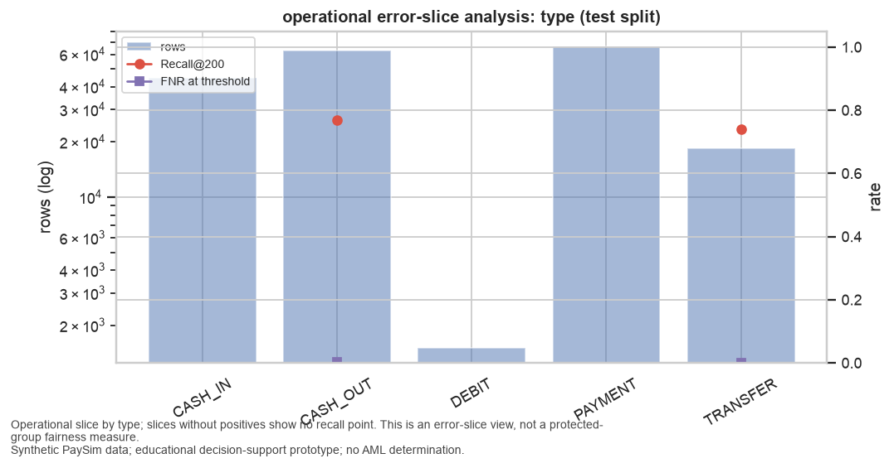
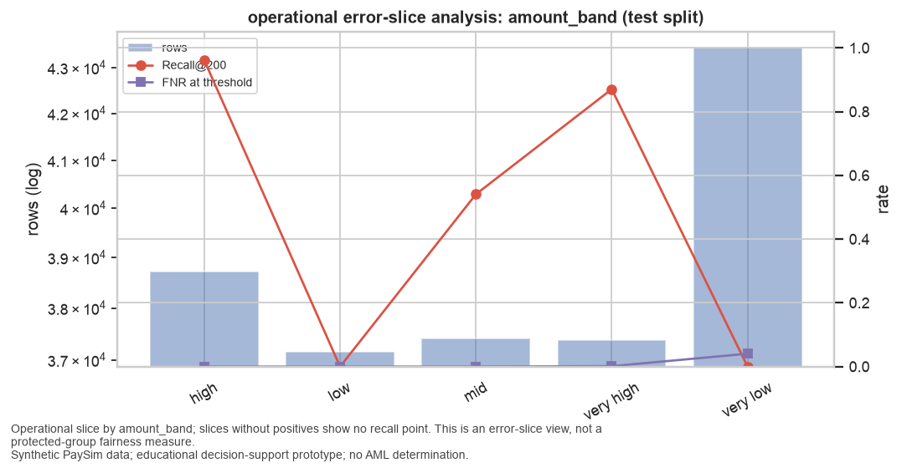
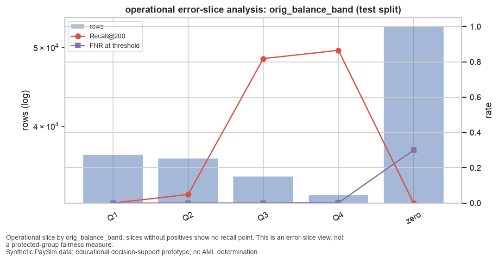
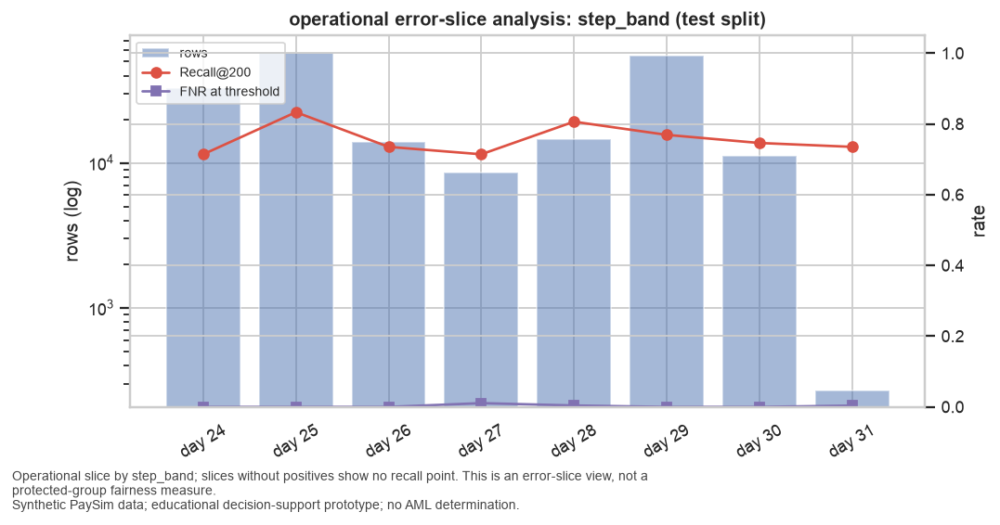

# Bias & Fairness Analysis

## Sensitive-Attribute Availability Record

Checked on 2026-09-05 against the actual raw columns of `PS_20174392719_1491204439457_log.csv`: `step`, `type`, `amount`, `nameOrig`, `oldbalanceOrg`, `newbalanceOrig`, `nameDest`, `oldbalanceDest`, `newbalanceDest`, `isFraud`, `isFlaggedFraud`. Proxy scan terms: age, birth, citizen, country, dob, education, ethnicity, gender, income, marital, nationality, occupation, postcode, race, region, religion, sex, socioeconomic, wealth, zip; matching columns: none.

| attribute | valid label present | evidence |
|---|---|---|
| age | no | no column among ['step', 'type', 'amount', 'nameOrig', 'oldbalanceOrg', 'newbalanceOrig', 'nameDest', 'oldbalanceDest', 'newbalanceDest', 'isFraud', 'isFlaggedFraud'] contains any of ['age', 'birth', 'dob'] |
| ethnicity | no | no column among ['step', 'type', 'amount', 'nameOrig', 'oldbalanceOrg', 'newbalanceOrig', 'nameDest', 'oldbalanceDest', 'newbalanceDest', 'isFraud', 'isFlaggedFraud'] contains any of ['ethnicity', 'race'] |
| gender | no | no column among ['step', 'type', 'amount', 'nameOrig', 'oldbalanceOrg', 'newbalanceOrig', 'nameDest', 'oldbalanceDest', 'newbalanceDest', 'isFraud', 'isFlaggedFraud'] contains any of ['gender', 'sex'] |
| nationality | no | no column among ['step', 'type', 'amount', 'nameOrig', 'oldbalanceOrg', 'newbalanceOrig', 'nameDest', 'oldbalanceDest', 'newbalanceDest', 'isFraud', 'isFlaggedFraud'] contains any of ['nationality', 'country', 'citizen'] |
| socioeconomic_status | no | no column among ['step', 'type', 'amount', 'nameOrig', 'oldbalanceOrg', 'newbalanceOrig', 'nameDest', 'oldbalanceDest', 'newbalanceDest', 'isFraud', 'isFlaggedFraud'] contains any of ['income', 'socioeconomic', 'wealth', 'occupation', 'education', 'region', 'zip', 'postcode'] |

**any_valid_label = false**

## Demographic Fairness

Demographic fairness metrics cannot be computed on this dataset because no valid sensitive-group labels exist. What follows is an operational error-slice analysis over non-protected partitions of the data; it is not a fairness measurement across protected groups and must not be described as one.

## Operational Error-Slice Analysis

Label: **operational error-slice analysis**. Test split; K = 200; raw-score threshold 0.971931; amount and origin-balance band edges fitted on the training split ({'amount_band': [9952.751953125, 36656.2625, 122966.15625, 247127.65625], 'orig_balance_band': [13767.0, 51415.0, 301979.0]}). Recall@K within a slice is the share of that slice's positives that fall inside their review period's top-K.

**By type**

| slice | rows | positives | prevalence | Recall@200 | Precision@200 | FNR at threshold | FPR at threshold | Brier (calibrated) |
|---|---|---|---|---|---|---|---|---|
| CASH_IN | 44,564 | 0 | 0.0000 |  |  |  | 0.0000 | 0.0000 |
| CASH_OUT | 63,155 | 1,060 | 0.0168 | 0.7689 | 1.0000 | 0.0028 | 0.0000 | 0.0000 |
| DEBIT | 1,510 | 0 | 0.0000 |  |  |  | 0.0000 | 0.0000 |
| PAYMENT | 66,334 | 0 | 0.0000 |  |  |  | 0.0000 | 0.0000 |
| TRANSFER | 18,572 | 1,060 | 0.0571 | 0.7406 | 1.0000 | 0.0019 | 0.0000 | 0.0000 |

**By amount_band**

| slice | rows | positives | prevalence | Recall@200 | Precision@200 | FNR at threshold | FPR at threshold | Brier (calibrated) |
|---|---|---|---|---|---|---|---|---|
| high | 38,717 | 260 | 0.0067 | 0.9615 | 1.0000 | 0.0000 | 0.0000 | 0.0000 |
| low | 37,166 | 106 | 0.0029 | 0.0000 |  | 0.0000 | 0.0000 | 0.0000 |
| mid | 37,413 | 342 | 0.0091 | 0.5409 | 1.0000 | 0.0000 | 0.0000 | 0.0000 |
| very high | 37,382 | 1,338 | 0.0358 | 0.8707 | 1.0000 | 0.0015 | 0.0000 | 0.0000 |
| very low | 43,457 | 74 | 0.0017 | 0.0000 |  | 0.0405 | 0.0000 | 0.0000 |

**By orig_balance_band**

| slice | rows | positives | prevalence | Recall@200 | Precision@200 | FNR at threshold | FPR at threshold | Brier (calibrated) |
|---|---|---|---|---|---|---|---|---|
| Q1 | 36,916 | 72 | 0.0020 | 0.0000 |  | 0.0000 | 0.0000 | 0.0000 |
| Q2 | 36,494 | 164 | 0.0045 | 0.0488 | 1.0000 | 0.0000 | 0.0000 | 0.0000 |
| Q3 | 34,673 | 634 | 0.0183 | 0.8186 | 1.0000 | 0.0000 | 0.0000 | 0.0000 |
| Q4 | 32,937 | 1,240 | 0.0376 | 0.8653 | 1.0000 | 0.0016 | 0.0000 | 0.0000 |
| zero | 53,115 | 10 | 0.0002 | 0.0000 |  | 0.3000 | 0.0000 | 0.0000 |

**By step_band**

| slice | rows | positives | prevalence | Recall@200 | Precision@200 | FNR at threshold | FPR at threshold | Brier (calibrated) |
|---|---|---|---|---|---|---|---|---|
| day 24 | 32,709 | 280 | 0.0086 | 0.7143 | 1.0000 | 0.0000 | 0.0000 | 0.0000 |
| day 25 | 57,853 | 240 | 0.0041 | 0.8333 | 1.0000 | 0.0000 | 0.0000 | 0.0000 |
| day 26 | 13,885 | 272 | 0.0196 | 0.7353 | 1.0000 | 0.0000 | 0.0000 | 0.0000 |
| day 27 | 8,578 | 280 | 0.0326 | 0.7143 | 1.0000 | 0.0107 | 0.0000 | 0.0001 |
| day 28 | 14,661 | 248 | 0.0169 | 0.8065 | 1.0000 | 0.0040 | 0.0000 | 0.0000 |
| day 29 | 54,890 | 260 | 0.0047 | 0.7692 | 1.0000 | 0.0000 | 0.0000 | 0.0000 |
| day 30 | 11,287 | 268 | 0.0237 | 0.7463 | 1.0000 | 0.0000 | 0.0000 | 0.0000 |
| day 31 | 272 | 272 | 1.0000 | 0.7353 | 1.0000 | 0.0037 |  | 0.0000 |

**Observations (task T078)**

Observations from the tables above (test split, K = 200, raw-score threshold 0.9719). These describe
where the ranking's capacity constraint lands; they are not fairness measurements across protected
groups, because the dataset has none.

- **Type.** Positives exist only in CASH_OUT (1,060) and TRANSFER (1,060). Recall@200 is 0.77 and
  0.74 respectively with Precision@200 = 1.0 in both; FNR at threshold is 0.28% and 0.19%. CASH_IN,
  DEBIT and PAYMENT contain no positives and produce zero false positives at threshold.
- **Amount band (edges fitted on training).** The queue's capacity is consumed by the largest
  transactions: Recall@200 is 0.96 in the `high` band and 0.87 in `very high`, 0.54 in `mid`, and
  **0.00 in `low` (106 positives) and `very low` (74 positives)**. Threshold FNR in those two bands is
  0.0% and 4.1%, so the model does flag most of them; they lose the ranking contest for the 200
  daily slots to larger transactions with slightly higher scores and wait unreviewed.
- **Origin balance band.** The same pattern: Recall@200 rises from 0.00 (Q1, 72 positives) and 0.05
  (Q2) to 0.82 (Q3) and 0.87 (Q4). The `zero` band has 10 positives with FNR 0.30: the three
  zero-amount, zero-balance CASH_OUT rows below threshold.
- **Simulated day.** Recall@200 varies only with the positive count (0.71–0.83); FNR is at most 1.1%
  (day 27). Day 31 is a partial day of 272 rows, all positives.

The operational consequence is that a fixed daily capacity ranked by this model systematically
defers small-value and low-balance positives. That is a property of ranking under capacity, not of
any person or group, and the mitigations below address it as such.

## Limitations

- **No demographic fairness measurement is possible.** PaySim carries no age, gender, ethnicity,
  nationality or socioeconomic attributes and no proxy columns (availability record above). Nothing
  in this analysis speaks to disparate treatment of people; the slices are transaction properties.
- **Class imbalance handling.** Training prevalence is 0.077%; the model uses class weighting only,
  no resampling. Validation (0.83%) and test (1.09%) prevalence are more than ten times higher because
  the simulator injects positives at a constant rate (DQ-10), so probabilities calibrated on
  validation are not calibrated for the training regime.
- **Leakage controls.** Every fitted transform and estimator was fitted on training rows only
  (fit-scope records); aggregates are causal; the test split was scored once after the operating
  point was frozen. Post-transaction fields are used deliberately under the batch-triage framing and
  are labelled batch-only.
- **Overfitting evidence.** Validation PR-AUC 1.0000 and test PR-AUC 1.0000 [1.0000, 1.0000]; the
  validation-to-test gap is nil for the released model. This reflects separability of the generator
  rather than generalisation to new behaviour.
- **Synthetic-label validity and simulator artifacts.** The label is produced by simulator rules.
  The model's two dominant features (balance-arithmetic reconciliation and account emptied to zero)
  are bookkeeping artifacts of those rules (DQ-03, DQ-05, DQ-06); permutation importance shows nothing
  else matters to it.
- **Transferability.** Perfect precision at capacity and near-total dependence on two artifact
  features would not survive contact with real transaction data. Results cannot establish actual
  fraud or AML detection effectiveness, fairness, or regulatory suitability.

## Mitigations

Concrete, feasible for this prototype's context; each names the mechanism, the owner role and the
trigger that would invoke it.

- **Capacity-aware slot reservation** (mechanism: reserve a configurable share of the daily K, e.g.
  20%, for the highest-scored transactions in under-reviewed amount and balance bands; owner:
  financial-crime operations lead; trigger: any band's Recall@K falls below half of the overall
  Recall@K for two consecutive weeks, as it does here for `low`, `very low`, Q1 and Q2).
- **Threshold adjustment by review of misses** (mechanism: lower the medium-priority threshold so the
  five kinds of edge case seen here are labelled medium rather than low; owner: model owner; trigger:
  FNR at threshold above 1% in any slice, as on day 27 and in the `zero` balance band).
- **Feature governance for artifact reliance** (mechanism: retrain on the `strict_pretx` set, which
  reached PR-AUC 0.9995 on test without post-transaction fields, and monitor the permutation
  importance of any single feature; owner: model owner; trigger: one feature's permutation drop
  exceeds 0.3, as both bookkeeping flags do today).
- **Reweighting or resampling** (mechanism: per-band sample weights during training so small-value
  positives are not ranked below large-value ones by default; owner: model owner; trigger: the slot
  reservation above proves insufficient after one review cycle).
- **Post-processing audit of the queue** (mechanism: weekly report of Recall@K and FNR by slice with
  the tables above regenerated; owner: model risk reviewer; trigger: scheduled).
- **Monitoring plan** (mechanism: score distribution drift, prevalence per period, Recall@K on
  labelled batches, and slice tables; owner: model owner; trigger: scheduled weekly, and on any
  change of data source).

## Governance-Controlled Fairness Audit Plan

Required before any use on real transaction data; none of it can be performed on PaySim.

| Element | Requirement |
|---|---|
| Data | Customer records with lawfully obtainable, consented sensitive attributes (or validated proxies) joined to transactions under data-protection review; a documented sampling frame for reviewer decisions and outcomes. |
| Metrics | Demographic parity difference, equalized odds difference, disparate impact ratio (functions implemented in `aml_triage.fairness.demographic`) at the operating point and at K; per-group Recall@K, FNR and FPR; calibration by group. |
| Owners | Model owner (produces metrics), model risk reviewer (independent challenge), compliance/financial-crime lead (accepts or rejects), data-protection officer (attribute handling). |
| Cadence | Before deployment; then quarterly and after any retraining, threshold change or data-source change; ad hoc on complaint or regulator request. |
| Human-in-the-loop | Investigators retain the decision and override right; the audit reviews override rates by group as an additional signal. |
| Outputs | Signed audit record, mitigation decisions with triggers, and a re-run of this report's slice tables on the real data. |

---

_Educational decision-support prototype trained on synthetic PaySim data. Outputs are risk scores and review priorities that help human investigators decide what to review first. This system makes no fraud or AML determination and performs no automatic blocking, account closure, customer risk rating, or regulatory reporting. Results on synthetic data do not establish real-world detection effectiveness, fairness, or regulatory suitability._
