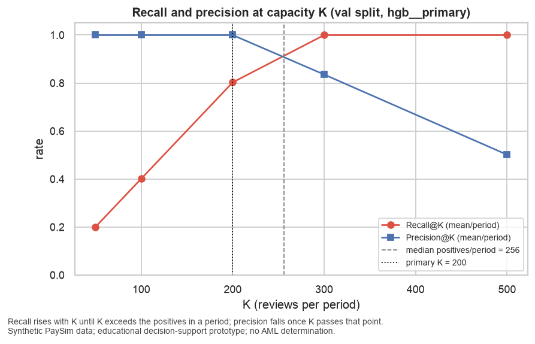
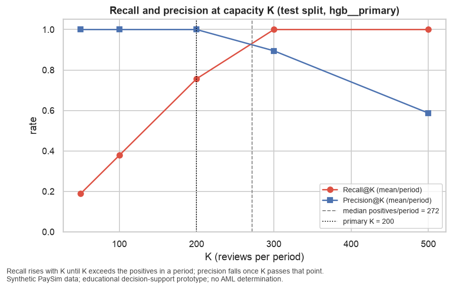

# Capacity Analysis

## Scope

Selected run `hgb__primary`; review period = 24 steps (one simulated day); capacity K = 200 with sensitivity grid [50, 100, 200, 300, 500]. Recall@K = share of a period's positives inside the top-K; Precision@K = share of the top-K that are positives. Business figures are **illustrative counts** on synthetic data.

## val: Recall@K and Precision@K across the capacity grid

| K | Recall@K mean/period | Recall@K pooled | Precision@K mean/period | Precision@K pooled |
|---|---|---|---|---|
| 50 | 0.2007 | 0.1995 | 1.0000 | 1.0000 |
| 100 | 0.4015 | 0.3989 | 1.0000 | 1.0000 |
| 200 | 0.8029 | 0.7979 | 1.0000 | 1.0000 |
| 300 | 1.0000 | 1.0000 | 0.8356 | 0.8356 |
| 500 | 1.0000 | 1.0000 | 0.5013 | 0.5013 |

## val: per review period at K = 200

| day | steps | transactions | positives | reviewed (k_eff) | positives caught | positives missed (FN) | reviews spent on normals (FP) | Recall@K | Precision@K |
|---|---|---|---|---|---|---|---|---|---|
| 18 | 409–432 | 20,999 | 268 | 200 | 200 | 68 | 0 | 0.7463 | 1.0000 |
| 19 | 433–456 | 11,300 | 256 | 200 | 200 | 56 | 0 | 0.7812 | 1.0000 |
| 20 | 457–480 | 19,727 | 236 | 200 | 200 | 36 | 0 | 0.8475 | 1.0000 |
| 21 | 481–504 | 24,593 | 272 | 200 | 200 | 72 | 0 | 0.7353 | 1.0000 |
| 22 | 505–528 | 53,437 | 256 | 200 | 200 | 56 | 0 | 0.7812 | 1.0000 |
| 23 | 529–552 | 51,012 | 216 | 200 | 200 | 16 | 0 | 0.9259 | 1.0000 |

## val: illustrative KPI — positives surfaced per review period at K = 200

| ranking | illustrative positives surfaced per day | improvement factor vs selected | Recall@200 |
|---|---|---|---|
| hgb [primary] (selected) | 200.0000 | 1.0000 | 0.8029 |
| rule comparator (flag, then amount) | 50.0000 | 4.0000 | 0.1965 |
| random ranking | 2.7000 | 75.0000 | 0.0104 |
| dummy (chronological order) | 16.7000 | 12.0000 | 0.0650 |

_Illustrative counts on synthetic data; not a real-world estimate and never expressed in currency._

## test: Recall@K and Precision@K across the capacity grid

| K | Recall@K mean/period | Recall@K pooled | Precision@K mean/period | Precision@K pooled |
|---|---|---|---|---|
| 50 | 0.1892 | 0.1887 | 1.0000 | 1.0000 |
| 100 | 0.3784 | 0.3774 | 1.0000 | 1.0000 |
| 200 | 0.7568 | 0.7547 | 1.0000 | 1.0000 |
| 300 | 1.0000 | 1.0000 | 0.8950 | 0.8938 |
| 500 | 1.0000 | 1.0000 | 0.5870 | 0.5620 |

## test: per review period at K = 200

| day | steps | transactions | positives | reviewed (k_eff) | positives caught | positives missed (FN) | reviews spent on normals (FP) | Recall@K | Precision@K |
|---|---|---|---|---|---|---|---|---|---|
| 24 | 553–576 | 32,709 | 280 | 200 | 200 | 80 | 0 | 0.7143 | 1.0000 |
| 25 | 577–600 | 57,853 | 240 | 200 | 200 | 40 | 0 | 0.8333 | 1.0000 |
| 26 | 601–624 | 13,885 | 272 | 200 | 200 | 72 | 0 | 0.7353 | 1.0000 |
| 27 | 625–648 | 8,578 | 280 | 200 | 200 | 80 | 0 | 0.7143 | 1.0000 |
| 28 | 649–672 | 14,661 | 248 | 200 | 200 | 48 | 0 | 0.8065 | 1.0000 |
| 29 | 673–696 | 54,890 | 260 | 200 | 200 | 60 | 0 | 0.7692 | 1.0000 |
| 30 | 697–720 | 11,287 | 268 | 200 | 200 | 68 | 0 | 0.7463 | 1.0000 |
| 31 | 721–743 | 272 | 272 | 200 | 200 | 72 | 0 | 0.7353 | 1.0000 |

## test: illustrative KPI — positives surfaced per review period at K = 200

| ranking | illustrative positives surfaced per day | improvement factor vs selected | Recall@200 |
|---|---|---|---|
| hgb [primary] (selected) | 200.0000 | 1.0000 | 0.7568 |
| rule comparator (flag, then amount) | 83.2000 | 2.4000 | 0.3101 |
| random ranking | 27.5000 | 7.3000 | 0.1012 |
| dummy (chronological order) | 56.5000 | 3.5000 | 0.2076 |

_Illustrative counts on synthetic data; not a real-world estimate and never expressed in currency._

## Figures

## Reading the capacity tables (task T059, written 2026-09-05 after reviewing the tables above)

**Recall@K is a ceiling set by K, on test as on validation.** Every test review period (days 24–31)
holds between 240 and 280 positives, all above K = 200. With Precision@200 = 1.0000 in all eight
periods, the selected model catches exactly 200 positives per period and misses the rest:
Recall@200 = mean(200 / positives) = 0.7568 (pooled 0.7547, 95% bootstrap CI [0.7252, 0.7866]).
At K = 300 every positive is caught (Recall 1.0000) and Precision@300 falls to 0.8950 because the
remaining reviews land on normals; at K = 500 precision is 0.5870. The capacity curve crosses near the
median of 272 positives per period. Recall@50 and Recall@100 are exactly 50 and 100 divided by the
positives per period (0.1892 and 0.3784).

**Validation to test.** Recall@200 drops from 0.8029 on validation to 0.7568 on test only because test
periods contain more positives (240–280 versus 216–272); the model's ranking is perfect in both.
Prevalence rises from 0.83% to 1.09%; PR-AUC stays at 1.0000.

**False positives and false negatives at K = 200.** In every period the 200 reviewed transactions are
all positives (0 reviews spent on normals) and 40–80 positives per day are not reviewed (FN),
totalling 520 unreviewed positives over the eight test days. With this model, the trade-off is not
between reviewing normals and missing positives; it is purely a capacity question. Raising K from
200 to 300 would clear the backlog at the cost of about 30 reviews per day spent on normals.

**Threshold-based operating point.** At the frozen raw-score threshold of 0.9719 the selected model
flags 2,115 of 2,120 test positives with 0 false positives across 192,015 normals (recall 0.9976, FPR
0.0000). The 5 positives below threshold are still ranked above every normal, so the ranked queue
loses nothing; the threshold only governs the medium/low priority labels.

**Illustrative KPI (synthetic counts, never currency).** At K = 200 the selected model surfaces 200
positives per day. The rule comparator (flag, then amount) surfaces 83.2 (2.4× fewer), chronological
order 56.5 (3.5× fewer) and random ranking 27.5 (7.3× fewer). Chronological order looks better than
random only because day 31 contains 272 transactions that are all positives, so any ordering scores
0.735 there.

**Success criteria.** SC-001: Recall@200 of 0.7568 exceeds random ranking (0.1012) and the dummy
baseline (0.2076), and PR-AUC 1.0000 exceeds the no-skill value of 0.0109. SC-002: the rule
comparator reaches 0.3101; the selected model exceeds it. Both criteria are met on the single-touch
test evaluation.

**What these numbers do not mean.** PaySim positives are generated by a rule the features reproduce
exactly. Perfect precision at capacity says the generator is easy to invert, not that a real AML queue
would look like this. Real transaction data would show far lower precision, positives that do not
share one signature, and drifting prevalence; the capacity analysis method carries over, the figures
do not.

---

_Educational decision-support prototype trained on synthetic PaySim data. Outputs are risk scores and review priorities that help human investigators decide what to review first. This system makes no fraud or AML determination and performs no automatic blocking, account closure, customer risk rating, or regulatory reporting. Results on synthetic data do not establish real-world detection effectiveness, fairness, or regulatory suitability._
