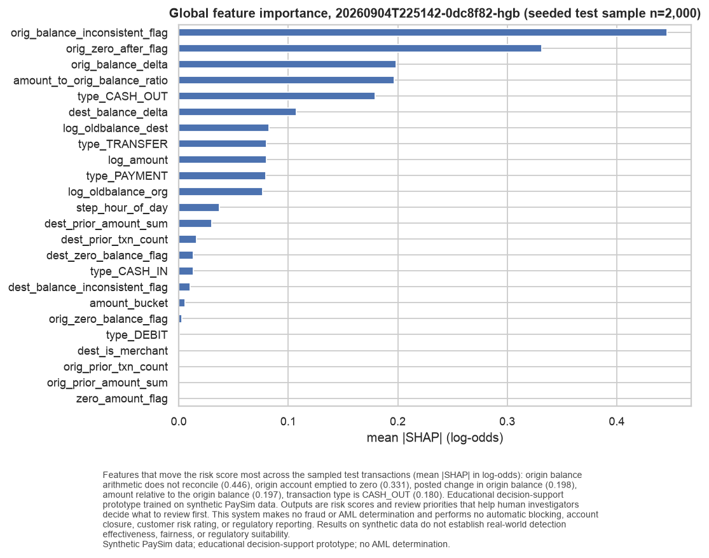
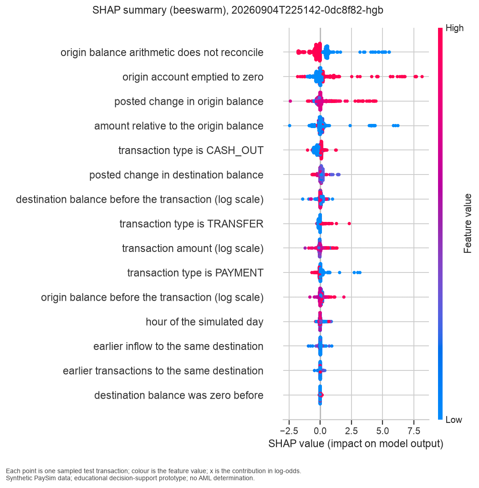
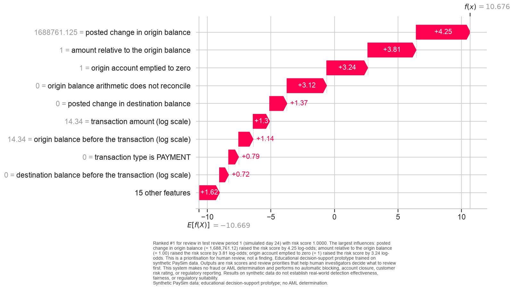
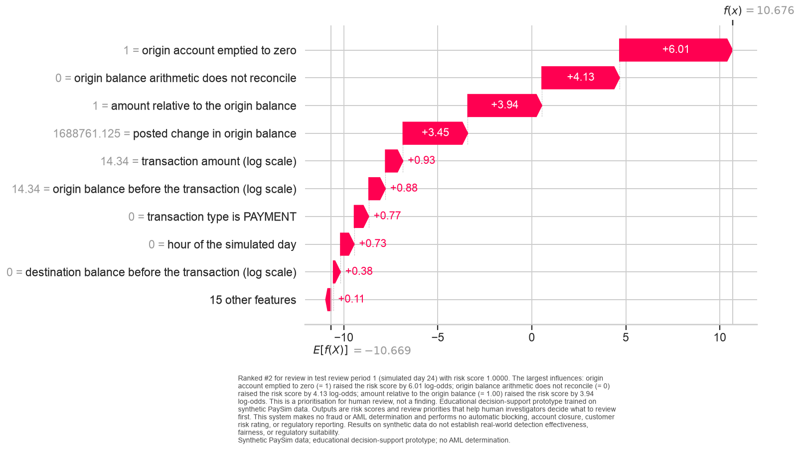
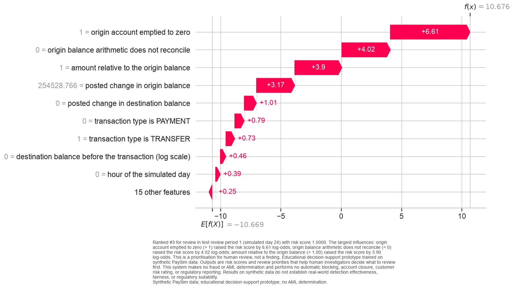
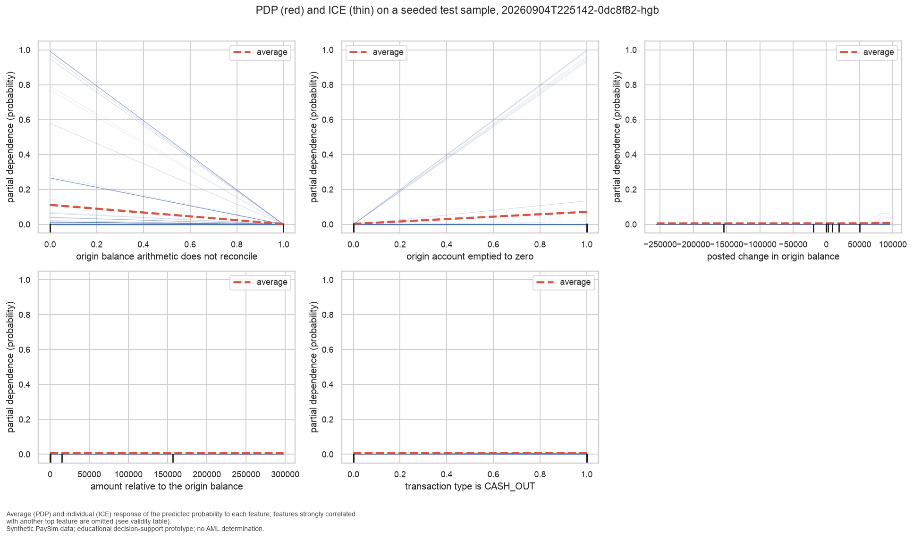
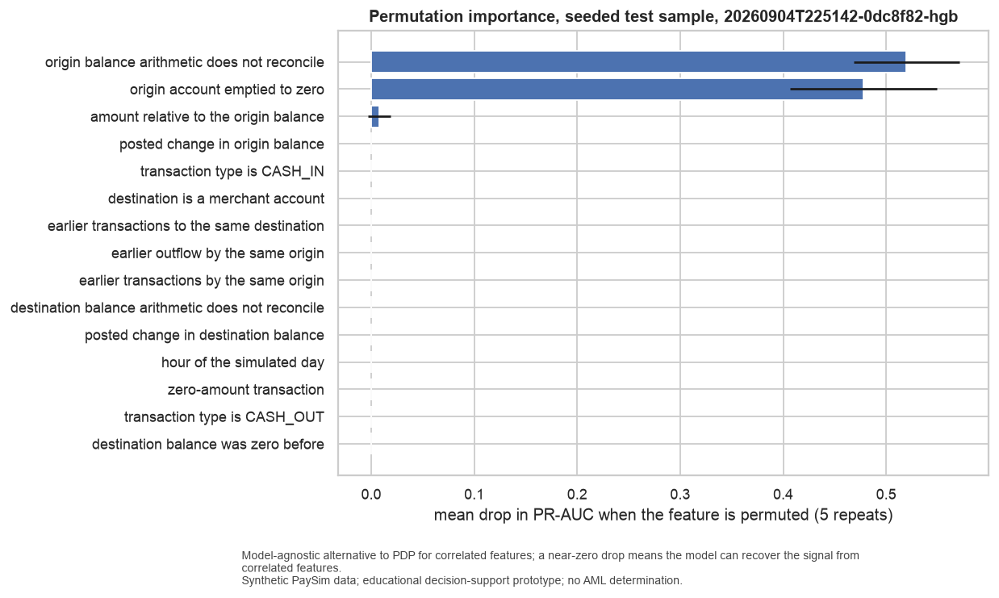

# Explainability

## Scope

Released bundle `20260904T225142-0dc8f82-hgb` (`hgb` on `primary`). Explainer: TreeExplainer (exact), contributions in log-odds. Background: 1,000 seeded training rows; global sample: 2,000 seeded test rows; local examples: the top-ranked transactions of the first test review period. Explanations describe the model, not the transactions' true nature.

## Global

| feature | mean |SHAP| (log-odds) | registry rationale |
|---|---|---|
| orig_balance_inconsistent_flag | 0.4458 | Direction-aware arithmetic gap on the origin side is inconsistent for most CASH_OUT/TRANSFER rows (DQ-05); a simulator behaviour that correlates with the label. |
| orig_zero_after_flag | 0.3313 | Account emptied to exactly zero after the transaction (DQ-05); a strong mule pattern in the simulator. |
| orig_balance_delta | 0.1984 | Posted change in origin balance; in batch triage the posted state is available and its mismatch with amount is informative (DQ-05). |
| amount_to_orig_balance_ratio | 0.1966 | Emptying an account (ratio near 1) is a classic mule-account pattern; the +1 guard handles zero balances. |
| type_CASH_OUT | 0.1795 | Simulated fraud occurs only in TRANSFER and CASH_OUT (DQ-09); type is the first-order signal. |
| dest_balance_delta | 0.1075 | Posted change in destination balance (DQ-06). |
| log_oldbalance_dest | 0.0826 | Destination balance before the transaction; merchants carry zero (DQ-06), customers vary widely. |
| type_TRANSFER | 0.0802 | Simulated fraud occurs only in TRANSFER and CASH_OUT (DQ-09); type is the first-order signal. |
| log_amount | 0.0798 | Amounts are heavy-tailed (DQ-07); log scale stabilises linear models and keeps tree splits interpretable. |
| type_PAYMENT | 0.0796 | Simulated fraud occurs only in TRANSFER and CASH_OUT (DQ-09); type is the first-order signal. |
| log_oldbalance_org | 0.0768 | Origin balance before the transaction is heavy-tailed with a mass at zero (DQ-07); log scale plus a zero flag captures both. |
| step_hour_of_day | 0.0372 | Hourly position within the simulated day may carry volume seasonality; cyclic and in-range for every split. |
| dest_prior_amount_sum | 0.0304 | Cumulative earlier inflow to the same destination (DQ-11). |
| dest_prior_txn_count | 0.0161 | Destinations repeat (16.9% appear more than once, max 113; DQ-11); accumulation into one destination is a laundering-style pattern. |
| dest_zero_balance_flag | 0.0134 | Zero destination balance before the transaction marks merchants and fresh accounts (DQ-06). |

## Local Examples

**Rank 1** (row 6,168,485, step 553, TRANSFER, score 1.0000)

Ranked #1 for review in test review period 1 (simulated day 24) with risk score 1.0000. The largest influences: posted change in origin balance (= 1,688,761.12) raised the risk score by 4.25 log-odds; amount relative to the origin balance (= 1.00) raised the risk score by 3.81 log-odds; origin account emptied to zero (= 1) raised the risk score by 3.24 log-odds. This is a prioritisation for human review, not a finding. Educational decision-support prototype trained on synthetic PaySim data. Outputs are risk scores and review priorities that help human investigators decide what to review first. This system makes no fraud or AML determination and performs no automatic blocking, account closure, customer risk rating, or regulatory reporting. Results on synthetic data do not establish real-world detection effectiveness, fairness, or regulatory suitability.

**Rank 2** (row 6,168,486, step 553, CASH_OUT, score 1.0000)

Ranked #2 for review in test review period 1 (simulated day 24) with risk score 1.0000. The largest influences: origin account emptied to zero (= 1) raised the risk score by 6.01 log-odds; origin balance arithmetic does not reconcile (= 0) raised the risk score by 4.13 log-odds; amount relative to the origin balance (= 1.00) raised the risk score by 3.94 log-odds. This is a prioritisation for human review, not a finding. Educational decision-support prototype trained on synthetic PaySim data. Outputs are risk scores and review priorities that help human investigators decide what to review first. This system makes no fraud or AML determination and performs no automatic blocking, account closure, customer risk rating, or regulatory reporting. Results on synthetic data do not establish real-world detection effectiveness, fairness, or regulatory suitability.

**Rank 3** (row 6,168,487, step 553, TRANSFER, score 1.0000)

Ranked #3 for review in test review period 1 (simulated day 24) with risk score 1.0000. The largest influences: origin account emptied to zero (= 1) raised the risk score by 6.61 log-odds; origin balance arithmetic does not reconcile (= 0) raised the risk score by 4.02 log-odds; amount relative to the origin balance (= 1.00) raised the risk score by 3.90 log-odds. This is a prioritisation for human review, not a finding. Educational decision-support prototype trained on synthetic PaySim data. Outputs are risk scores and review priorities that help human investigators decide what to review first. This system makes no fraud or AML determination and performs no automatic blocking, account closure, customer risk rating, or regulatory reporting. Results on synthetic data do not establish real-world detection effectiveness, fairness, or regulatory suitability.

## PDP/ICE Validity

| feature | status | reason | alternative |
|---|---|---|---|
| orig_balance_inconsistent_flag | produced | binary flag: the curve has two points |  |
| orig_zero_after_flag | produced | binary flag: the curve has two points |  |
| orig_balance_delta | produced | max |Spearman ρ| with other top features = 0.58 |  |
| amount_to_orig_balance_ratio | produced | max |Spearman ρ| with other top features = 0.47 |  |
| type_CASH_OUT | produced | binary flag: the curve has two points |  |

## Permutation importance (alternative / cross-check)

| feature | mean drop in PR-AUC | std |
|---|---|---|
| orig_balance_inconsistent_flag | 0.5195 | 0.0513 |
| orig_zero_after_flag | 0.4781 | 0.0711 |
| amount_to_orig_balance_ratio | 0.0078 | 0.0111 |
| orig_balance_delta | 0.0000 | 0.0000 |
| type_CASH_IN | 0.0000 | 0.0000 |
| dest_is_merchant | 0.0000 | 0.0000 |
| dest_prior_txn_count | 0.0000 | 0.0000 |
| orig_prior_amount_sum | 0.0000 | 0.0000 |
| orig_prior_txn_count | 0.0000 | 0.0000 |
| dest_balance_inconsistent_flag | 0.0000 | 0.0000 |
| dest_balance_delta | 0.0000 | 0.0000 |
| step_hour_of_day | 0.0000 | 0.0000 |
| zero_amount_flag | 0.0000 | 0.0000 |
| type_CASH_OUT | 0.0000 | 0.0000 |
| dest_zero_balance_flag | 0.0000 | 0.0000 |

## Consistency Notes (task T071, written 2026-09-05 after reviewing the figures and tables above)

**Agreement with EDA, feature by feature (top five by mean |SHAP|).**

- `orig_balance_inconsistent_flag` (0.446, rank 1). Beeswarm: the flag at 0 (blue) pushes the
  score up, at 1 (red) pulls it down; the PDP falls from about 0.11 to 0 as the flag goes 0 → 1.
  This matches `eda_08`: positives have exact origin bookkeeping (positive rate 0.27% when the
  arithmetic reconciles versus 0.0016% when it does not). It is the simulator artifact DQ-05, and
  the model's single most important input.
- `orig_zero_after_flag` (0.331, rank 2). Value 1 raises the score; some ICE lines go from 0 to 1.
  Matches `eda_08` (positive rate 0.32% versus 0.002%) and the diagonal in `eda_09`.
- `orig_balance_delta` (0.198, rank 3). Large posted changes raise the score (local example 1:
  a delta of 1,688,761 contributes +4.25 log-odds). Consistent with `eda_07`, where positives carry a
  long right tail. Its PDP is flat because the effect only appears jointly with the two flags above;
  the ICE spread shows that interaction.
- `amount_to_orig_balance_ratio` (0.197, rank 4). Ratios near 1 raise the score (all three local
  examples sit at exactly 1.00). Matches `eda_07` and `eda_09` (the "empty the account" diagonal).
  The PDP grid is dominated by extreme ratios from near-zero balances and shows nothing in the
  informative region near 1; this is a limitation of the grid, not evidence of no effect.
- `type_CASH_OUT` (0.180, rank 5). Consistent with `eda_01`: positives exist only in CASH_OUT and
  TRANSFER.

**Surprises, not omitted.**

- `dest_is_merchant`, `zero_amount_flag`, `type_DEBIT` and both origin aggregates have mean |SHAP|
  of 0.000. For `dest_is_merchant` this is redundancy with `type_PAYMENT`, not irrelevance. For
  `zero_amount_flag` it is scarcity: 4 training rows.
- Permutation importance shows the model depends on exactly two features. Permuting
  `orig_balance_inconsistent_flag` drops PR-AUC by 0.52 and `orig_zero_after_flag` by 0.48; every
  other feature permutes to a drop of 0.008 or less because the remaining signal is recoverable
  from correlated columns. The released model is, in effect, the rule "origin bookkeeping reconciles
  and the origin account was emptied".
- Three of the top four features are post-transaction (batch-only) fields. This is the artifact
  dominance anticipated in research R-06. The `strict_pretx` run reached the same PR-AUC without
  them, so the behavioural signal exists, but the released model prefers the bookkeeping shortcut.

**The five test positives below the operating-point threshold.** Three are zero-amount CASH_OUT rows
with zero balances (raw scores 0.80–0.92); two are TRANSFERs whose posted origin balance did not
change (10,399,045 → 10,399,045 and 5,674,548 → 5,674,548; scores 0.52 and 0.97). All five are
generator edge cases rather than behavioural misses, and all five still rank above every normal
transaction in their period.

## Plain-language summary for a business audience

The model ranks a transaction near the top when the sending account is emptied by the transaction
and the posted balances reconcile exactly, especially for transfers and cash-outs of large amounts
relative to the balance. On this synthetic data that pattern identifies almost every simulated
positive. A real bank's data would not hand the model such a clean bookkeeping signature, so the
explanation method transfers; the specific features that dominate here do not. Investigators see, for
each queued transaction, the three factors that moved its score most and can override the ranking.

---

_Educational decision-support prototype trained on synthetic PaySim data. Outputs are risk scores and review priorities that help human investigators decide what to review first. This system makes no fraud or AML determination and performs no automatic blocking, account closure, customer risk rating, or regulatory reporting. Results on synthetic data do not establish real-world detection effectiveness, fairness, or regulatory suitability._
