# Explainable AML Transaction-Risk Triage for SME and Corporate Banking

**Final report — Pillar 5 Capstone Project**

Author: Julius Pabular · Date: 2026-09-06 · Released model: `20260904T225142-0dc8f82-hgb` · Repository: https://github.com/joopabs/aml-risk-triage-capstone

> Educational decision-support prototype trained on synthetic PaySim data. Outputs are risk scores and review priorities that help human investigators decide what to review first. This system makes no fraud or AML determination and performs no automatic blocking, account closure, customer risk rating, or regulatory reporting. Results on synthetic data do not establish real-world detection effectiveness, fairness, or regulatory suitability.
>
> PaySim is synthetic mobile-money transaction data. It is not real SME, corporate, or Philippine banking data.

## Contents

1. [Problem Statement](#1-problem-statement)
2. [Dataset Overview and Data Dictionary](#2-dataset-overview-and-data-dictionary)
3. [EDA and Feature Engineering Report](#3-eda-and-feature-engineering-report)
4. [Model Comparison and Selection](#4-model-comparison-and-selection)
5. [Explainability](#5-explainability)
6. [Bias & Fairness Analysis](#6-bias-fairness-analysis)
7. [Limitations](#7-limitations)
8. [Reproducibility](#8-reproducibility)

## 1. Problem Statement

#### Business context

Banks serving small-and-medium enterprise (SME) and corporate clients monitor large volumes of
payment transactions for possible money-laundering or fraud indicators. Investigator capacity is
fixed and far smaller than transaction volume, so most alerts are never reviewed in depth and many
reviewed alerts are false positives. This capstone builds an **educational decision-support
prototype** that assigns each transaction a risk score and ranks transactions so that a limited
number of daily investigator reviews is spent on the transactions most worth a human look.

The prototype is trained and evaluated on **PaySim**, a public synthetic mobile-money dataset with a
simulated fraud label (Kaggle `ealaxi/paysim1`, CC BY-SA 4.0). PaySim stands in because real
SME/corporate transaction data with labels is not publicly available. Every result is therefore about
simulated fraud in synthetic data and is described as such throughout.

#### Intended decision, use, and non-use

**Decision supported:** which transactions, out of all transactions in a review period, should an
investigator look at first, given a fixed capacity of K reviews? The system outputs a ranked list. A
human decides what, if anything, to do with each reviewed transaction.

**Human review workflow (FR-083).** Each simulated day the system produces a queue of the K highest
ranked transactions with a risk score, a review priority (high / medium / low), the three factors that
moved the score most, the model version, and the disclaimer. An investigator works the queue, records
a decision for each item, and may override the ranking or pull any transaction into review. Nothing
happens to a transaction or an account unless a person acts. Override and decision records feed the
monitoring plan and, in any real deployment, the fairness audit.

**Explicit non-use.** The system does not and must not: automatically block, hold or reverse
transactions; close, freeze or restrict accounts; assign a customer- or entity-level risk rating;
generate or file suspicious-activity or regulatory reports; make an actual AML or fraud determination;
or be used on real customer data without a governance-controlled validation and fairness audit.
The positive label is "simulated fraud"; model outputs are "risk scores" and "review priorities".

#### Task definition and success metrics

| Item | Definition |
|---|---|
| Unit of analysis | One synthetic financial transaction (one PaySim row) |
| Task type | Binary classification producing a probability-like risk score used for ranking |
| Target | `isFraud` (1 = simulated fraud, 0 = simulated normal) |
| Prediction time | End-of-period batch triage: the transaction's own fields and posted balances are available; aggregates use only strictly earlier transactions |
| Primary technical metric | PR-AUC on the held-out temporal test split |
| Operational metric | Recall@K per review period, K = 200 (about 1% of median daily volume in the validation and test periods, and below the median of 265 positives per test day, so capacity binds) |
| Review period | 24 steps (one simulated day) |
| Secondary metrics | Precision@K, precision, recall, F1, ROC-AUC, confusion matrix at the operating point, PR and calibration curves, Brier, ECE, false-positive rate |
| Business KPI (illustrative) | Positives surfaced within K daily reviews, and the improvement factor versus random selection and a simple rule ranking. Never expressed in currency. |

#### Results against the success criteria (single-touch test evaluation, model `20260904T225142-0dc8f82-hgb`)

- SC-001: Recall@200 = **0.7568** (mean over review periods; pooled 95% bootstrap CI [0.7252, 0.7866]) exceeds random ranking (0.1012) and the chronological dummy (0.2076); PR-AUC = **1.0000** exceeds the no-skill value of 0.0109.
- SC-002: the rule comparator (flag, then amount) reaches Recall@200 = 0.3101; the selected model exceeds it.
- Illustrative KPI: 200 positives surfaced per simulated day at K = 200, versus 82 for the rule ranking and 27 for random selection (illustrative counts on synthetic data).

Recall@K is a ceiling set by capacity: every test period holds more than K positives and the top K are
all positives. The near-perfect separability is a property of the PaySim generator (Sections 4–7),
not evidence of real-world AML capability.

## 2. Dataset Overview and Data Dictionary

### Data Quality Report

#### Scope

Source: `data/raw/PS_20174392719_1491204439457_log.csv`. Rows: 6,362,620. Columns: 11. All figures below are aggregates; no row-level data is shown.

#### Columns and nulls

| column | dtype | nulls |
|---|---|---|
| step | int32 | 0 |
| type | category | 0 |
| amount | float32 | 0 |
| nameOrig | string | 0 |
| oldbalanceOrg | float32 | 0 |
| newbalanceOrig | float32 | 0 |
| nameDest | string | 0 |
| oldbalanceDest | float32 | 0 |
| newbalanceDest | float32 | 0 |
| isFraud | int8 | 0 |
| isFlaggedFraud | int8 | 0 |

#### Duplicates

| kind | count |
|---|---|
| exact duplicate rows | 0 |
| near-duplicates ignoring identifiers | 543 |

#### Numeric summary and outliers (IQR rule)

| column | min | p50 | p95 | p99 | p99.9 | max | zeros | negatives | IQR outliers |
|---|---|---|---|---|---|---|---|---|---|
| amount | 0.0000 | 74,871.94 | 518,634.19 | 1,615,979.50 | 8,956,797.63 | 92,445,520.00 | 16 | 0 | 338,078 |
| oldbalanceOrg | 0.0000 | 14,208.00 | 5,823,702.10 | 16,027,256.35 | 26,825,930.48 | 59,585,040.00 | 2,102,449 | 0 | 1,112,507 |
| newbalanceOrig | 0.0000 | 0.0000 | 5,980,262.37 | 16,176,160.39 | 26,971,659.15 | 49,585,040.00 | 3,609,566 | 0 | 1,053,391 |
| oldbalanceDest | 0.0000 | 132,705.66 | 5,147,229.70 | 12,371,819.49 | 34,392,787.85 | 356,015,904.00 | 2,704,388 | 0 | 786,135 |
| newbalanceDest | 0.0000 | 214,661.45 | 5,515,715.97 | 13,137,866.93 | 39,531,570.22 | 356,179,264.00 | 2,439,433 | 0 | 738,527 |

#### Amount quantiles by transaction type

| type | p50 | p95 | p99 | p99.9 | max |
|---|---|---|---|---|---|
| CASH_IN | 143,427.71 | 412,005.12 | 550,870.85 | 727,791.33 | 1,915,267.88 |
| CASH_OUT | 147,072.19 | 427,877.16 | 579,654.09 | 864,676.47 | 10,000,000.00 |
| DEBIT | 3,048.99 | 14,795.35 | 50,817.98 | 179,208.45 | 569,077.50 |
| PAYMENT | 9,482.19 | 37,835.66 | 59,500.11 | 89,701.44 | 238,637.98 |
| TRANSFER | 486,308.38 | 2,674,586.95 | 10,000,000.00 | 24,840,512.69 | 92,445,520.00 |

#### Invalid values

| check | count |
|---|---|
| zero amount | 16 |
| negative amount | 0 |
| negative oldbalanceOrg | 0 |
| negative newbalanceOrig | 0 |
| negative oldbalanceDest | 0 |
| negative newbalanceDest | 0 |
| origin balance arithmetic inconsistent (tol 0.01) | 3,953,846 |
| destination balance arithmetic inconsistent (tol 0.01) | 5,229,368 |

#### Balance arithmetic by type

| type | n | orig inconsistent | rate | dest inconsistent | rate | orig zero after | dest both zero |
|---|---|---|---|---|---|---|---|
| CASH_IN | 1,399,284 | 234,237 | 0.1674 | 1,399,284 | 1.0000 | 0 | 160,005 |
| CASH_OUT | 2,237,500 | 2,007,949 | 0.8974 | 1,324,750 | 0.5921 | 959,412 | 1,608 |
| DEBIT | 41,432 | 12,660 | 0.3056 | 23,467 | 0.5664 | 5,628 | 0 |
| PAYMENT | 2,151,495 | 1,187,615 | 0.5520 | 2,151,495 | 1.0000 | 326,879 | 2,151,495 |
| TRANSFER | 532,909 | 511,385 | 0.9596 | 330,372 | 0.6199 | 228,662 | 4,174 |

#### Class imbalance

| metric | value |
|---|---|
| positives (simulated fraud) | 8,213 |
| negatives | 6,354,407 |
| prevalence | 0.0013 |
| negatives per positive | 773.7011 |

| type | n | positives | rate |
|---|---|---|---|
| CASH_IN | 1,399,284 | 0 | 0.0000 |
| CASH_OUT | 2,237,500 | 4,116 | 0.0018 |
| DEBIT | 41,432 | 0 | 0.0000 |
| PAYMENT | 2,151,495 | 0 | 0.0000 |
| TRANSFER | 532,909 | 4,097 | 0.0077 |

#### Time steps

| metric | value |
|---|---|
| steps observed | 743 |
| step range | 1–743 |
| transactions per step (min / median / max) | 2 / 529 / 51,352 |
| positives per step (min / median / max) | 0 / 10 / 40 |
| steps with zero positives | 2 |
| first / last step with a positive | 1 / 743 |

Per-step counts are in `data_quality.json` under `steps.transactions_by_step` and `steps.cumulative_positives_by_step` (used to choose split bounds, V9).

#### Identifiers

| column | unique | share appearing >1 | max occurrences |
|---|---|---|---|
| nameOrig | 6,353,307 | 0.0015 | 3 |
| nameDest | 2,722,362 | 0.1688 | 113 |

#### Rule flag column

| column | flagged | rate | flagged and positive | precision as rule | recall as rule |
|---|---|---|---|---|---|
| isFlaggedFraud | 16 | 0.0000 | 16 | 1.0000 | 0.0019 |

#### Sensitive-attribute pre-scan

Column names checked against: age, gender, sex, ethnicity, race, nationality, income, socioeconomic, region, zip, postcode, birth, religion, marital.

No column name matches a sensitive-attribute pattern. The formal availability record is produced in Milestone 7 (FR-070).

#### Findings and handling decisions

Written after reviewing the generated tables (task T022, 2026-09-05). Every number below is copied
from `reports/data_quality.json`. Decisions are one of keep, correct, flag as feature, exclude.

| ID | Finding (from the tables above) | Decision | Justification |
|----|--------------------------------|----------|---------------|
| DQ-01 | 6,362,620 rows, 11 columns, 0 nulls in every column. | keep | Nothing to impute; the imputation step in the pipeline is a no-op guard only. |
| DQ-02 | 0 exact duplicate rows; 543 near-duplicate pairs when identifiers are ignored (1,081 rows, 27 of them positives). | keep | Identical amounts and balances with different accounts are distinct transactions in a simulator with coarse value grids; dropping them would delete real positives. |
| DQ-03 | 16 zero-amount rows, all CASH_OUT, and all 16 are positives. | flag as feature, treat as artifact | A zero-amount transaction has no economic meaning; a perfect label correlation on 16 rows is a simulator artifact. `zero_amount_flag` is kept as a feature but the report must state that it contributes leakage-like lift, and the strict feature set is evaluated with and without it (research R-06). |
| DQ-04 | No negative amounts or balances. | keep | Hard minimums hold; soft minimums record zero violations. |
| DQ-05 | Origin balance arithmetic (direction-aware, tolerance 0.01) is inconsistent for 89.7% of CASH_OUT, 96.0% of TRANSFER, 55.2% of PAYMENT, 30.6% of DEBIT and 16.7% of CASH_IN rows. | flag as feature | Inconsistency is simulator behavior, not an error to correct. `orig_balance_inconsistent_flag` and the signed gap become batch-only features; their importance is reported as artifact evidence. |
| DQ-06 | Destination balance arithmetic is inconsistent for 100% of PAYMENT and CASH_IN rows and 59–62% of CASH_OUT/TRANSFER rows. All 2,151,495 PAYMENT destinations are merchants (identifier prefix M), all with both destination balances equal to zero, and none of them is a positive. | flag as feature | Merchants carry no balance state in PaySim. `dest_is_merchant` (derived from the identifier prefix, not the identifier itself) and `dest_balance_inconsistent_flag` are batch-only features. FR-033 is respected because account identity is never used. |
| DQ-07 | Heavy tails: amount p50 74,872 vs max 92,445,520; 338,078 IQR outliers; TRANSFER p99 is exactly 10,000,000. 5,650 rows at or above 10,000,000 contain 287 positives and only 3 rule flags. | keep, transform | Positives live in the tails, so no removal. Use `log1p(amount)` and training-fitted amount buckets; report per-type quantiles. |
| DQ-08 | 8,213 positives, prevalence 0.129%, 774 negatives per positive. | keep, handle in training | Class weighting or in-fold undersampling only (FR-036); PR-AUC primary; accuracy never a headline (FR-007). |
| DQ-09 | Positives occur only in CASH_OUT (4,116) and TRANSFER (4,097). CASH_IN, DEBIT and PAYMENT have zero positives across 3.59 million rows. | keep all types | The model must score every type; type is a first-order feature. Ablations on TRANSFER/CASH_OUT only are reported as a sensitivity check, not as the primary result. |
| DQ-10 | Steps 1–743 are contiguous. Transaction volume is highly non-stationary: 574,255 transactions in day 1 and 455,238 in day 2, then 1,070 in day 3; days 6–17 carry roughly 350,000–450,000 each; days 18–31 carry 272 to 57,853. Positives are almost constant at 216–320 per day regardless of volume; day 31 (steps 721–743) has 272 transactions, all positive. | keep, constrain split design | Simulated fraud is injected at a near-constant rate independent of volume, so prevalence in late steps is orders of magnitude above early steps. The temporal split (T025) must be chosen so validation and test periods contain enough transactions per review period for Recall@K to mean anything, and the report must present validation-vs-test shift explicitly. |
| DQ-11 | Origin identifiers are almost never reused (6,353,307 unique; 0.15% appear more than once; max 3). Destination identifiers are reused (2,722,362 unique; 16.9% appear more than once; max 113). | keep, guide features | Prior-transaction aggregates per origin are expected to be uninformative; destination aggregates are the causal-aggregate candidates (V10 decides). Identifiers themselves are dropped after aggregation. |
| DQ-12 | Rule flag `isFlaggedFraud` fires 16 times, all on positives: precision 1.000, recall 0.0019. | keep as comparator only | Too sparse to rank a queue on its own; the rule comparator ranks flagged rows first then by amount descending (research R-10). Never a model feature. |
| DQ-13 | No column name matches a sensitive-attribute pattern. | record | The formal availability record (FR-070) is produced in Milestone 7; the expected path is the operational error-slice analysis. |

#### Source-data limitations

- **Synthetic origin.** PaySim is generated by an agent-based simulator seeded with aggregate
  statistics from a mobile-money service. Nothing here is real SME, corporate, or Philippine banking
  data, and no result can establish real-world detection effectiveness, fairness, or regulatory
  suitability.
- **Constant fraud injection (DQ-10).** Positives arrive at a near-constant daily rate while
  legitimate volume swings by three orders of magnitude. Late-period prevalence is therefore
  artificially high, and any temporal test split inherits that shift. This is the single largest
  threat to interpreting Recall@K as an operational figure.
- **Label-correlated artifacts (DQ-03, DQ-05, DQ-06).** Zero amounts, balance-arithmetic gaps and
  zero-balance destinations correlate with the label because of how the simulator writes state,
  not because of transferable behavior. Features built from them are kept for the batch-triage
  framing but must be reported as artifact-driven lift, with a strict feature set as the
  comparison.
- **Merchant state is absent (DQ-06).** Merchant destinations have no balances, so destination
  features are uninformative for PAYMENT and only meaningful for customer-to-customer types.
- **Two positive types only (DQ-09).** Results say nothing about detecting simulated fraud in
  CASH_IN, DEBIT or PAYMENT, because none exists in the data.
- **Coarse time index.** `step` is an hourly index with no calendar, weekday or intraday
  semantics beyond position; period boundaries for Recall@K are an analytical convention
  (24 steps), not an observed business day.
- **No demographics (DQ-13).** Demographic fairness cannot be measured; only operational
  error slices can be reported, and they must not be described as fairness across protected groups.

#### Split summary (validation task V9)

Strategy: **temporal** by `step`; config hash `sha256:cac2e0e01afa…`; review period 24 steps;
no rows excluded (every DQ finding was keep or flag). Figures copied from `data/processed/split_manifest.json`.

| split | steps | days | rows | positives | prevalence |
|---|---|---|---|---|---|
| train | 1–408 | 1–17 | 5,987,417 | 4,589 | 0.0766% |
| val | 409–552 | 18–23 | 181,068 | 1,504 | 0.8306% |
| test | 553–743 | 24–31 | 194,135 | 2,120 | 1.0920% |

Why these bounds: validation and test both sit in the low-volume regime (DQ-10), so the operating
point chosen on validation applies to a test period with the same volume and prevalence character.
Training spans both regimes (days 3–5 are also low-volume). Each split keeps at least 1,500 positives,
three times the `min_positives_per_split` guard of 500. The prevalence jump from 0.08% in training to
about 1% in validation and test is a property of the simulator, not of the split, and the report must
present validation-versus-test shift explicitly (FR-045).

Review capacity K = 200 is about 1% of the median daily volume across the validation and test days
(20,363) and below the median positives per day (264), so capacity binds and Recall@K is a real
constraint rather than a formality. The k_grid [50, 100, 200, 300, 500] shows sensitivity.

### Data Dictionary

#### Conventions

`availability`: `realtime` = known when the transaction is observed; `batch_only` = known in end-of-period batch triage (post-transaction state, research R-06); `label` = target, never an input. Identifiers are never model features (FR-033). Observed ranges come from `reports/data_quality.json`; `[PROFILE]` means profiling has not run yet.

#### Raw variables

| variable | type | unit | range / allowed values | role | prediction-time availability | description |
|---|---|---|---|---|---|---|
| step | int32 | hours since simulation start (expected; V8 confirms) | 1 – 743 | time_index | realtime | Simulation time step; one unit is expected to represent one hour. |
| type | category | category | CASH_IN, CASH_OUT, DEBIT, PAYMENT, TRANSFER | feature | realtime | Transaction type (expected values include CASH_IN, CASH_OUT, DEBIT, PAYMENT, TRANSFER; V2 confirms). |
| amount | float32 | currency units (simulated) | 0.00 – 92,445,520.00 | feature | realtime | Transaction amount in the simulator's currency units. |
| nameOrig | string | identifier | 6,353,307 unique | identifier | realtime | Origin account identifier. Never a model feature; used only for causal aggregates. |
| oldbalanceOrg | float32 | currency units (simulated) | 0.00 – 59,585,040.00 | feature | realtime | Origin account balance before the transaction. |
| newbalanceOrig | float32 | currency units (simulated) | 0.00 – 49,585,040.00 | feature | batch_only | Origin account balance after the transaction (post-transaction state). |
| nameDest | string | identifier | 2,722,362 unique | identifier | realtime | Destination account identifier. Never a model feature; used only for causal aggregates. |
| oldbalanceDest | float32 | currency units (simulated) | 0.00 – 356,015,904.00 | feature | realtime | Destination account balance before the transaction. |
| newbalanceDest | float32 | currency units (simulated) | 0.00 – 356,179,264.00 | feature | batch_only | Destination account balance after the transaction (post-transaction state). |
| isFraud | int8 | binary flag | 0, 1 | target | label | Simulated fraud label; 1 = simulated fraud, 0 = simulated normal transaction. |
| isFlaggedFraud | int8 | binary flag | 0, 1 | rule_comparator | batch_only | Simulator rule flag. Never a model feature; defines the rule comparator ranking. |

#### Engineered features

| variable | type | unit | range / allowed values | role | prediction-time availability | description |
|---|---|---|---|---|---|---|
| type_onehot | one-hot (5 columns) | indicator | 0/1 per observed type | categorical | realtime | One column per transaction type observed in training; unknown types map to all zeros. Rationale: Simulated fraud occurs only in TRANSFER and CASH_OUT (DQ-09); type is the first-order signal. |
| log_amount | float | log(currency units + 1) | >= 0 | numeric | realtime | log1p(amount). Rationale: Amounts are heavy-tailed (DQ-07); log scale stabilises linear models and keeps tree splits interpretable. |
| amount_bucket | int | bucket index | 0..n_bins-1 (n_bins=10) | numeric | realtime | Amount decile bucket; edges fitted on the training split only. Rationale: Quantile buckets fitted on training data give a monotone, outlier-robust view of amount for slice analysis and linear models. |
| log_oldbalance_org | float | log(currency units + 1) | >= 0 | numeric | realtime | log1p(oldbalanceOrg). Rationale: Origin balance before the transaction is heavy-tailed with a mass at zero (DQ-07); log scale plus a zero flag captures both. |
| log_oldbalance_dest | float | log(currency units + 1) | >= 0 | numeric | realtime | log1p(oldbalanceDest). Rationale: Destination balance before the transaction; merchants carry zero (DQ-06), customers vary widely. |
| amount_to_orig_balance_ratio | float | ratio | >= 0 | numeric | realtime | amount / (oldbalanceOrg + 1). Rationale: Emptying an account (ratio near 1) is a classic mule-account pattern; the +1 guard handles zero balances. |
| orig_zero_balance_flag | int | indicator | 0/1 | flag | realtime | oldbalanceOrg == 0. Rationale: 2.1M rows start from a zero origin balance (DQ-07); the flag separates this mass from the continuous scale. |
| dest_zero_balance_flag | int | indicator | 0/1 | flag | realtime | oldbalanceDest == 0. Rationale: Zero destination balance before the transaction marks merchants and fresh accounts (DQ-06). |
| zero_amount_flag | int | indicator | 0/1 | flag | realtime | amount == 0. Simulator artifact (DQ-03). Rationale: All 16 zero-amount rows are positives (DQ-03); kept as a feature but reported as a simulator artifact, never as transferable signal. |
| dest_is_merchant | int | indicator | 0/1 | flag | realtime | nameDest starts with 'M'. Derived account type; the identifier itself is dropped (FR-033). Rationale: Merchant destinations (identifier prefix M) receive only PAYMENT and carry no positives or balance state (DQ-06); this is account type, not identity. |
| step_hour_of_day | int | hour | 0..23 | numeric | realtime | (step - 1) mod 24. Rationale: Hourly position within the simulated day may carry volume seasonality; cyclic and in-range for every split. |
| step_day_index | int | day | 0..30 | numeric | realtime | (step - 1) // 24. Excluded from every modeling set. Rationale: Diagnostic only. Under a temporal split the test days are out of the training range, so using it would encode regime rather than behaviour (DQ-10). |
| orig_balance_delta | float | currency units | any | numeric | batch_only | oldbalanceOrg - newbalanceOrig. Rationale: Posted change in origin balance; in batch triage the posted state is available and its mismatch with amount is informative (DQ-05). |
| dest_balance_delta | float | currency units | any | numeric | batch_only | newbalanceDest - oldbalanceDest. Rationale: Posted change in destination balance (DQ-06). |
| orig_balance_inconsistent_flag | int | indicator | 0/1 | flag | batch_only | |newbalanceOrig - expected| > 0.01 where expected = old + amount for CASH_IN, old - amount otherwise. Rationale: Direction-aware arithmetic gap on the origin side is inconsistent for most CASH_OUT/TRANSFER rows (DQ-05); a simulator behaviour that correlates with the label. |
| dest_balance_inconsistent_flag | int | indicator | 0/1 | flag | batch_only | |newbalanceDest - oldbalanceDest - amount| > 0.01. Rationale: Destination arithmetic gap (DQ-06); always inconsistent for merchant destinations. |
| orig_zero_after_flag | int | indicator | 0/1 | flag | batch_only | oldbalanceOrg > 0 and newbalanceOrig == 0. Rationale: Account emptied to exactly zero after the transaction (DQ-05); a strong mule pattern in the simulator. |
| orig_prior_txn_count | int | count | >= 0 | aggregate | realtime | Count of earlier transactions with the same nameOrig (strictly earlier step, or earlier file position within the same step). Rationale: Number of strictly earlier transactions by the same origin; expected near zero because origins rarely repeat (DQ-11), kept to let V10 confirm. |
| orig_prior_amount_sum | float | currency units | >= 0 | aggregate | realtime | Sum of amount over earlier transactions with the same nameOrig. Rationale: Cumulative earlier outflow by the same origin (DQ-11). |
| dest_prior_txn_count | int | count | >= 0 | aggregate | realtime | Count of earlier transactions with the same nameDest. Rationale: Destinations repeat (16.9% appear more than once, max 113; DQ-11); accumulation into one destination is a laundering-style pattern. |
| dest_prior_amount_sum | float | currency units | >= 0 | aggregate | realtime | Sum of amount over earlier transactions with the same nameDest. Rationale: Cumulative earlier inflow to the same destination (DQ-11). |

## 3. EDA and Feature Engineering Report

### EDA Summary

#### Scope

Figures below use the **training split** (steps 1–408) unless labeled descriptive; class-conditional plots use all training positives plus a seeded sample of negatives. No modeling decision here uses validation or test rows. Observations are written by a human in `reports/eda_narrative.md` after viewing each figure (task T036).

#### Training split: rows and positives by type

| type | normal | positive | positive rate |
|---|---|---|---|
| CASH_IN | 1,313,389 | 0 | 0.0000 |
| CASH_OUT | 2,115,988 | 2,304 | 0.0011 |
| DEBIT | 38,489 | 0 | 0.0000 |
| PAYMENT | 2,019,717 | 0 | 0.0000 |
| TRANSFER | 495,245 | 2,285 | 0.0046 |

#### Flag features: positive rate by value (training split)

| flag | value | n | positive rate |
|---|---|---|---|
| orig_zero_balance_flag | 0 | 3,990,733 | 0.0011 |
| orig_zero_balance_flag | 1 | 1,996,684 | 0.0000 |
| dest_zero_balance_flag | 0 | 3,452,391 | 0.0005 |
| dest_zero_balance_flag | 1 | 2,535,026 | 0.0012 |
| zero_amount_flag | 0 | 5,987,413 | 0.0008 |
| zero_amount_flag | 1 | 4 | 1.0000 |
| dest_is_merchant | 0 | 3,967,700 | 0.0012 |
| dest_is_merchant | 1 | 2,019,717 | 0.0000 |
| orig_balance_inconsistent_flag | 0 | 1,682,688 | 0.0027 |
| orig_balance_inconsistent_flag | 1 | 4,304,729 | 0.0000 |
| dest_balance_inconsistent_flag | 0 | 1,038,716 | 0.0011 |
| dest_balance_inconsistent_flag | 1 | 4,948,701 | 0.0007 |
| orig_zero_after_flag | 0 | 4,564,614 | 0.0000 |
| orig_zero_after_flag | 1 | 1,422,803 | 0.0032 |

#### Class balance by type

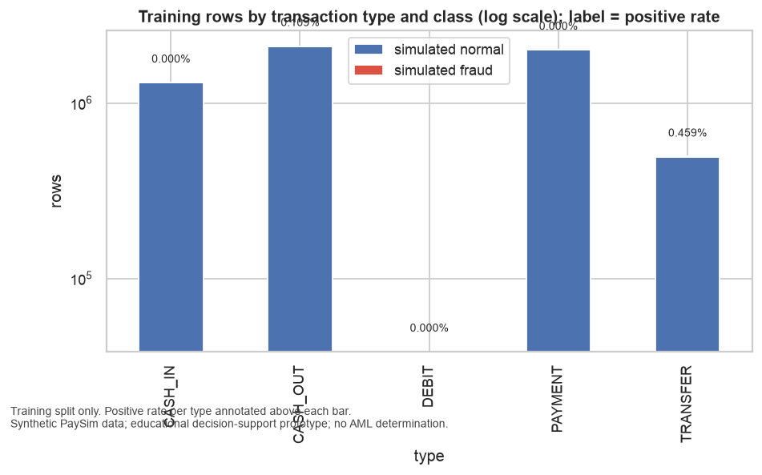

Figure: `eda_01_class_by_type.png`

Observation: Training positives exist only in CASH_OUT (2,304 of 2,118,292 rows, 0.109%) and TRANSFER (2,285 of
497,530, 0.459%). CASH_IN, DEBIT and PAYMENT carry zero positives across 3.37 million rows. Type is
therefore the first-order feature, and TRANSFER has about four times the positive rate of CASH_OUT.
Any model must still score the three positive-free types, which will dominate the low end of the
ranking.

#### Amount by class

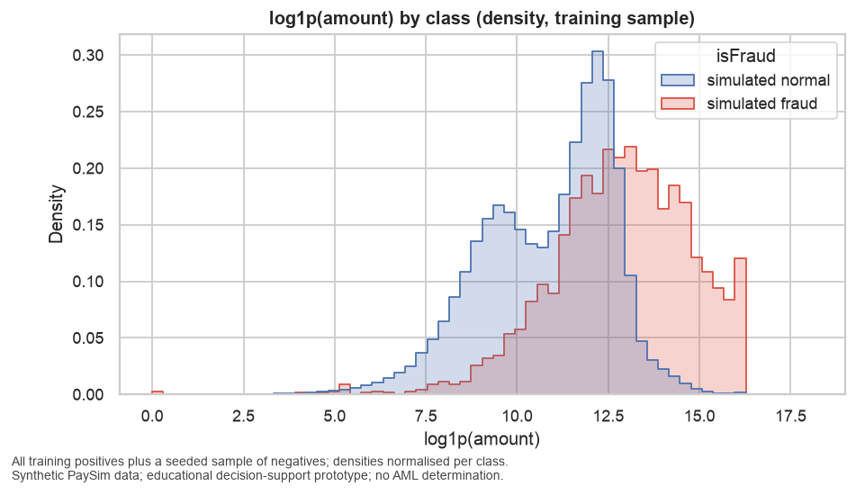

Figure: `eda_02_amount_by_class.png`

Observation: Positives sit to the right of normals on log1p(amount): their mode is around 13–14 versus a bimodal
normal distribution peaking near 9.5 and 12.3. Two spikes are artifacts rather than behaviour: a
narrow spike at about 16.1, which is log1p of the 10,000,000 cap seen in the TRANSFER quantiles
(DQ-07), and a small spike at 0 from the zero-amount rows (DQ-03). `log_amount` is informative but
its extreme values are simulator boundaries.

#### Amount by type and class

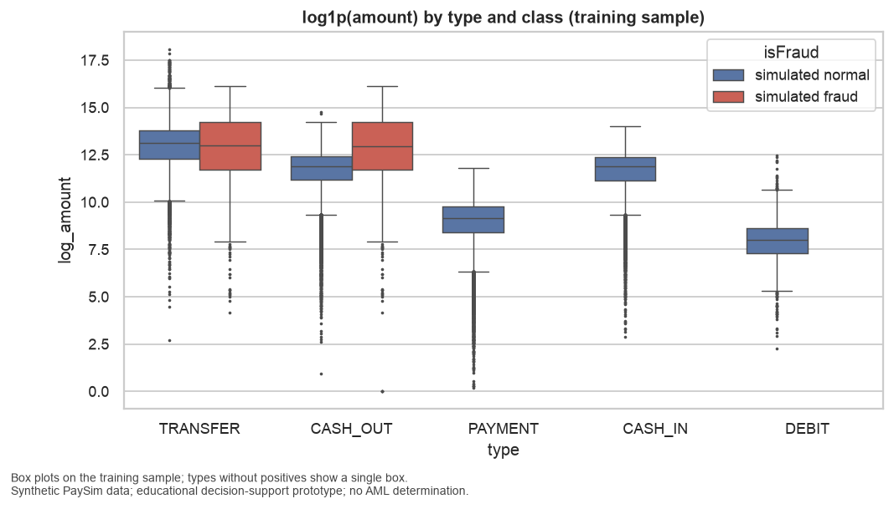

Figure: `eda_03_amount_by_type_class.png`

Observation: Within CASH_OUT the positive median amount (about 13 on the log scale) is a full log unit above the
normal median (about 12). Within TRANSFER the medians are similar, near 13, but positives have a wider
interquartile range and their maximum stops at the 16.1 cap while normal TRANSFER amounts reach about
18. Amount separates classes inside CASH_OUT much better than inside TRANSFER.

#### Volume and positives over time

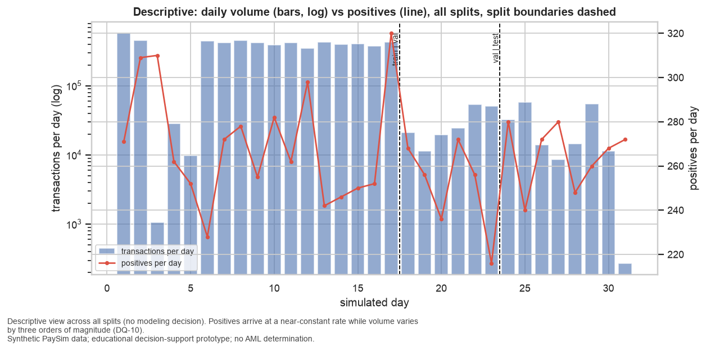

Figure: `eda_04_volume_positives_over_time.png`

Observation: Daily volume runs at roughly 400,000–575,000 transactions on days 1–2 and 6–17 and collapses to
about 1,000–58,000 on days 3–5 and 18–31, a change of nearly three orders of magnitude. Positives per
day stay between 216 and 320 throughout. This confirms DQ-10: simulated fraud is injected at a
near-constant rate independent of volume. The split boundaries (dashed) place validation and test in
the low-volume regime.

#### Prevalence by day

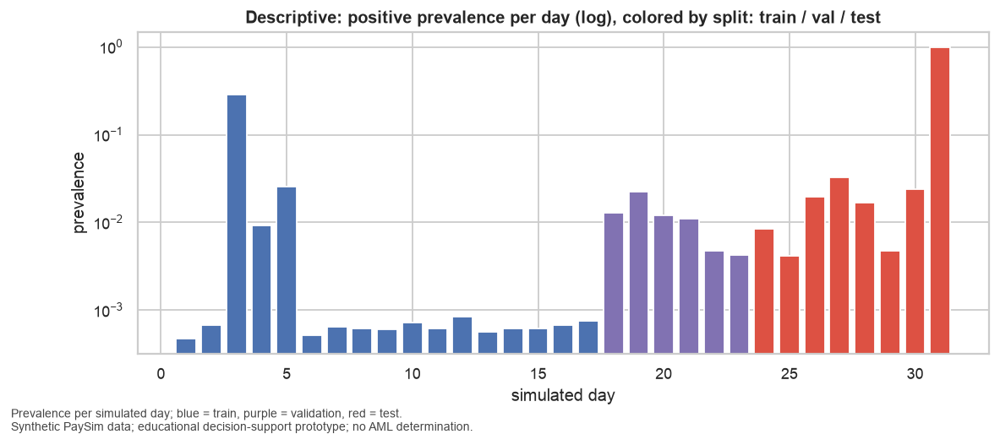

Figure: `eda_05_prevalence_by_day.png`

Observation: Prevalence on high-volume training days is 0.05%–0.07%. It jumps to about 29% on day 3 and 2.5% on
day 5 (low-volume training days), sits between 0.4% and 2.3% across validation days, and between 0.4%
and 3.3% across test days, with day 31 at 100% because only 272 transactions exist and all are
positive. Validation and test prevalence are more than ten times training prevalence. Probability
calibration fitted on training will be off in validation and test; this is why the operating point
and any calibration are fitted on validation (FR-044, research R-09).

#### Correlation heatmap

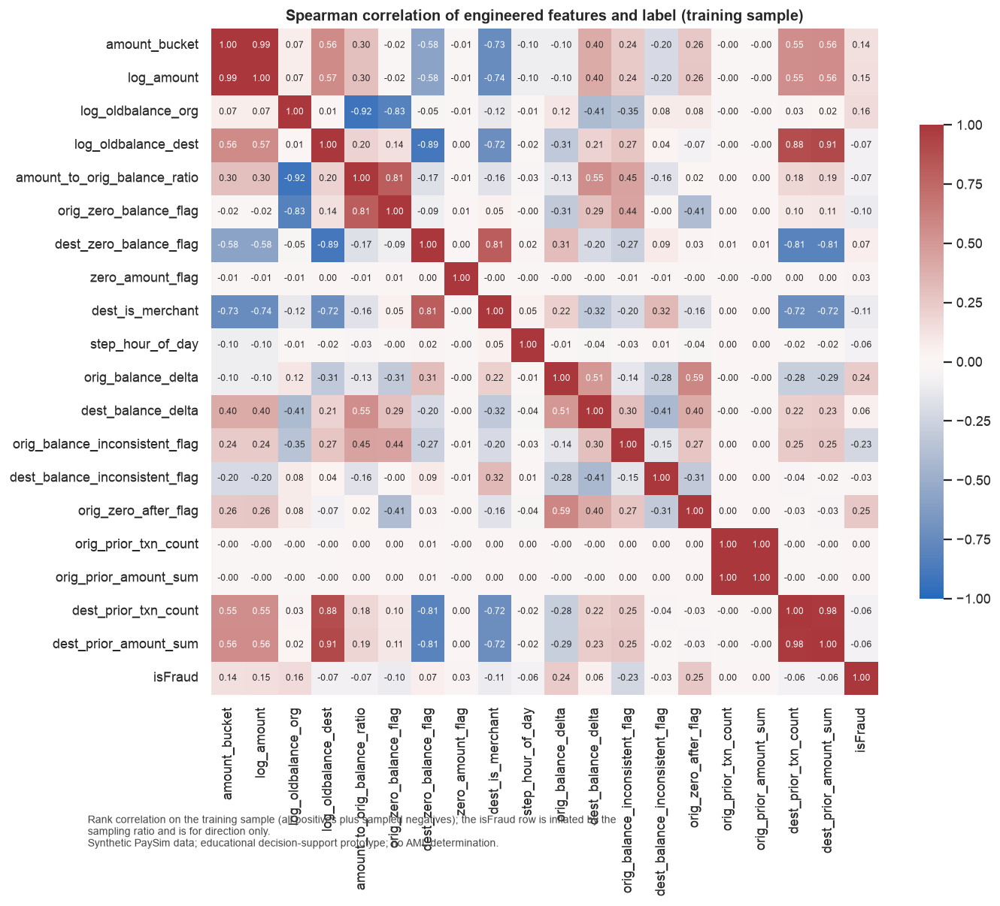

Figure: `eda_06_correlation_heatmap.png`

Observation: Rank correlations with the label (inflated by the positive-enriched sample, direction only): highest
positive are `orig_zero_after_flag` (0.25), `orig_balance_delta` (0.24), `log_oldbalance_org` (0.16),
`log_amount` (0.15); highest negative are `orig_balance_inconsistent_flag` (−0.23), `dest_is_merchant`
(−0.11), `orig_zero_balance_flag` (−0.10). Origin aggregates correlate with nothing (0.00 everywhere),
confirming DQ-11 that origins do not repeat. Strong collinearity to remember for feature selection:
`amount_bucket`/`log_amount` (0.99), `dest_prior_txn_count`/`dest_prior_amount_sum` (0.98),
`log_oldbalance_dest` with the destination aggregates (0.88–0.91) and with `dest_zero_balance_flag`
(−0.89), `amount_to_orig_balance_ratio` with `log_oldbalance_org` (−0.92), and `dest_is_merchant` with
`dest_zero_balance_flag` (0.81). PDP/ICE for these pairs will need caveats (FR-062).

#### Feature distributions by class

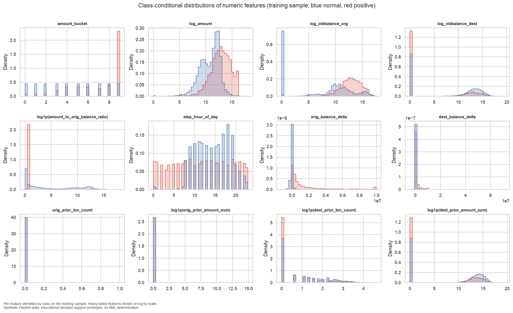

Figure: `eda_07_feature_distributions.png`

Observation: Positives concentrate in the top amount decile (bucket 9) at roughly five times the normal density.
Normals have a large mass at zero origin balance while positives are centred near log 13, so
positives come from funded accounts. `log1p(amount_to_orig_balance_ratio)` for positives spikes at
about 0.69, which is a ratio of 1: the transaction empties the account. Positives are spread almost
uniformly over the 24 hours while normals concentrate in hours 8–20. `orig_balance_delta` for
positives has a long right tail to 10,000,000. `orig_prior_txn_count` and `orig_prior_amount_sum` are
degenerate at zero for both classes and carry no information (candidates to drop in Milestone 4).
Destination aggregates show positives more often going to a destination with no prior activity.

#### Flag positive rates

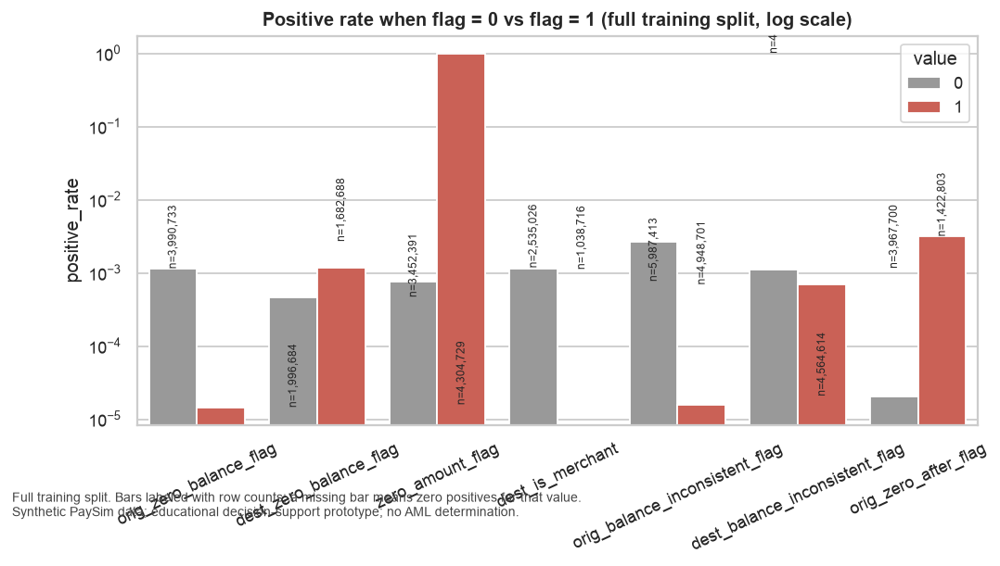

Figure: `eda_08_flag_positive_rates.png`

Observation: From the flag table: `zero_amount_flag` = 1 has 4 training rows, all positive (DQ-03 artifact).
`dest_is_merchant` = 1 (2,019,717 rows) has zero positives. `orig_zero_balance_flag` = 1 (1,996,684
rows) has a positive rate of 0.0015%, about 70 times lower than when the balance is non-zero.
`orig_zero_after_flag` = 1 has a rate of 0.32% versus 0.002% when 0, a factor of about 160.
`orig_balance_inconsistent_flag` = 1 (4,304,729 rows) has a rate of 0.0016% versus 0.27% when the
arithmetic is consistent: simulated fraud rows have exact bookkeeping while most normal rows do not.
This is the clearest simulator artifact among the batch-only features and the reason the strict
pre-transaction set is evaluated alongside the primary set (research R-06). `dest_zero_balance_flag`
and `dest_balance_inconsistent_flag` move the rate by less than a factor of three.

#### Amount vs origin balance

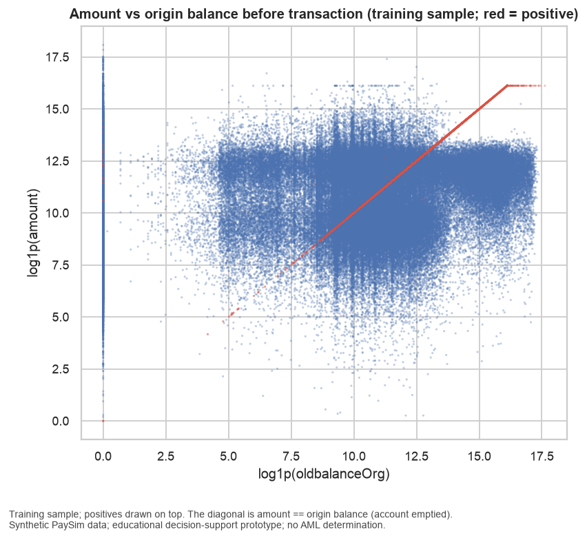

Figure: `eda_09_amount_vs_origbalance.png`

Observation: Positives lie almost exactly on the diagonal amount = oldbalanceOrg from about log 5 to log 16.1, then
form a horizontal plateau at 16.1 where the 10,000,000 cap binds. Normals form a broad cloud plus a
vertical band at zero balance. The "empty the account" pattern is the dominant visual signature of
simulated fraud and is captured by `amount_to_orig_balance_ratio` and `orig_zero_after_flag`.

#### Hour of day

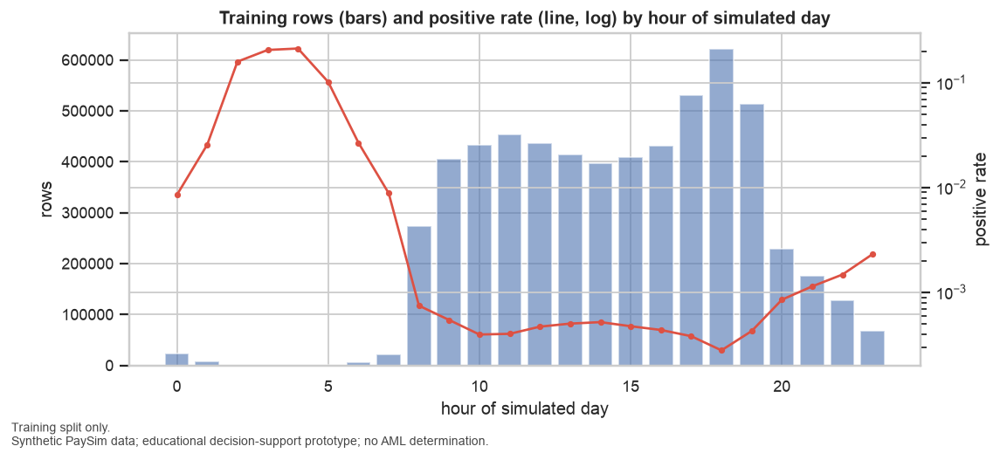

Figure: `eda_10_hour_of_day.png`

Observation: Hours 0–7 carry very few training rows (tens of thousands or fewer) but positive rates between 1% and
20%; hours 8–19 carry 270,000–620,000 rows each with rates of 0.03%–0.1%; rates rise again after hour
20. Because positives are injected uniformly across the day while normal volume follows a daytime
schedule, `step_hour_of_day` is informative, but the mechanism is the simulator's clock rather than
behaviour, and this must be said in the report.

#### Destination prior count

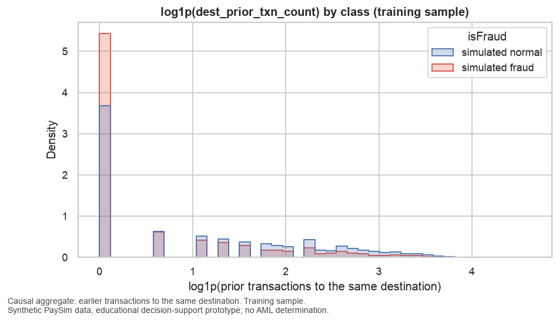

Figure: `eda_11_dest_prior_count.png`

Observation: Positives more often target a destination with zero prior transactions (density about 5.4 versus 3.7
for normals) and are under-represented at higher prior counts. The destination aggregates carry
modest signal in the expected direction; the origin aggregates do not (see eda_07) and are flagged
for removal in feature selection (validation task V10).

### Feature Selection

#### Scope

Feature set `primary`, training split only, seeded stratified subsample of 1,000,000 rows with 766 positives (research R-08). Fit scope: MI ['train'], L1 ['train'].

#### Before

24 columns: `type_CASH_IN`, `type_CASH_OUT`, `type_DEBIT`, `type_PAYMENT`, `type_TRANSFER`, `amount_bucket`, `log_amount`, `log_oldbalance_org`, `log_oldbalance_dest`, `amount_to_orig_balance_ratio`, `orig_zero_balance_flag`, `dest_zero_balance_flag`, `zero_amount_flag`, `dest_is_merchant`, `step_hour_of_day`, `orig_balance_delta`, `dest_balance_delta`, `orig_balance_inconsistent_flag`, `dest_balance_inconsistent_flag`, `orig_zero_after_flag`, `orig_prior_txn_count`, `orig_prior_amount_sum`, `dest_prior_txn_count`, `dest_prior_amount_sum`

Constant columns (no information on the subsample): none

#### Filter method: mutual information (top 12)

| column | MI score | selected |
|---|---|---|
| dest_balance_inconsistent_flag | 0.1872 | yes |
| orig_balance_inconsistent_flag | 0.1831 | yes |
| dest_zero_balance_flag | 0.1031 | yes |
| type_CASH_OUT | 0.0760 | yes |
| dest_is_merchant | 0.0711 | yes |
| type_PAYMENT | 0.0708 | yes |
| orig_zero_balance_flag | 0.0690 | yes |
| orig_zero_after_flag | 0.0379 | yes |
| type_CASH_IN | 0.0319 | yes |
| amount_bucket | 0.0247 | yes |
| step_hour_of_day | 0.0189 | yes |
| amount_to_orig_balance_ratio | 0.0059 | yes |
| type_TRANSFER | 0.0048 |  |
| orig_balance_delta | 0.0032 |  |
| dest_prior_txn_count | 0.0028 |  |
| log_amount | 0.0008 |  |
| log_oldbalance_org | 0.0008 |  |
| dest_balance_delta | 0.0004 |  |
| type_DEBIT | 0.0001 |  |
| log_oldbalance_dest | 0.0001 |  |
| dest_prior_amount_sum | 0.0001 |  |
| orig_prior_txn_count | 0.0000 |  |
| orig_prior_amount_sum | 0.0000 |  |
| zero_amount_flag | 0.0000 |  |

#### Embedded method: L1 logistic regression (C = 0.1, standardised inputs, balanced class weight)

| column | coefficient | non-zero |
|---|---|---|
| orig_zero_balance_flag | 8.8216 | yes |
| orig_balance_inconsistent_flag | -5.6202 | yes |
| orig_zero_after_flag | 5.2283 | yes |
| log_oldbalance_dest | -4.3553 | yes |
| type_CASH_OUT | 4.0187 | yes |
| dest_balance_delta | -3.5508 | yes |
| log_oldbalance_org | 3.2417 | yes |
| type_TRANSFER | 2.8905 | yes |
| dest_zero_balance_flag | -2.7713 | yes |
| type_CASH_IN | -2.6181 | yes |
| amount_to_orig_balance_ratio | 2.2877 | yes |
| step_hour_of_day | -1.0616 | yes |
| log_amount | 1.0095 | yes |
| dest_balance_inconsistent_flag | 0.7384 | yes |
| amount_bucket | -0.6153 | yes |
| orig_balance_delta | 0.5111 | yes |
| dest_prior_txn_count | -0.1582 | yes |
| orig_prior_txn_count | -0.0329 | yes |
| zero_amount_flag | 0.0096 | yes |
| dest_is_merchant | 0.0000 |  |
| dest_prior_amount_sum | 0.0000 |  |
| orig_prior_amount_sum | 0.0000 |  |
| type_DEBIT | 0.0000 |  |
| type_PAYMENT | 0.0000 |  |

#### After

Intersection (10): `type_CASH_IN`, `type_CASH_OUT`, `amount_bucket`, `amount_to_orig_balance_ratio`, `orig_zero_balance_flag`, `dest_zero_balance_flag`, `step_hour_of_day`, `orig_balance_inconsistent_flag`, `dest_balance_inconsistent_flag`, `orig_zero_after_flag`

Combine rule `intersection_or_union_if_lt` → **intersection (10 >= min_size 6)**.

**Selected columns (10)**: `type_CASH_IN`, `type_CASH_OUT`, `amount_bucket`, `amount_to_orig_balance_ratio`, `orig_zero_balance_flag`, `dest_zero_balance_flag`, `step_hour_of_day`, `orig_balance_inconsistent_flag`, `dest_balance_inconsistent_flag`, `orig_zero_after_flag`

**Dropped columns (14)**: `type_DEBIT`, `type_PAYMENT`, `type_TRANSFER`, `log_amount`, `log_oldbalance_org`, `log_oldbalance_dest`, `zero_amount_flag`, `dest_is_merchant`, `orig_balance_delta`, `dest_balance_delta`, `orig_prior_txn_count`, `orig_prior_amount_sum`, `dest_prior_txn_count`, `dest_prior_amount_sum`

**Registry `selected` set (9 features)**: `type_onehot`, `amount_bucket`, `amount_to_orig_balance_ratio`, `orig_zero_balance_flag`, `dest_zero_balance_flag`, `step_hour_of_day`, `orig_balance_inconsistent_flag`, `dest_balance_inconsistent_flag`, `orig_zero_after_flag`

#### Why this combined set (task T041, written 2026-09-05 after reviewing the tables above)

Both methods were fitted on the same seeded stratified subsample of 1,000,000 training rows
(about 770 positives). Their intersection has 10 columns, above the `min_size` of 6, so the
intersection rule applied and no union fallback was needed. At registry level that is 9 features,
because `type_onehot` is kept whole: a one-hot block cannot be partially selected, so the `selected`
matrix carries all five type columns (13 columns in total).

The two methods agree on the account-state signals seen in EDA: `orig_zero_balance_flag`,
`orig_zero_after_flag`, `amount_to_orig_balance_ratio`, `dest_zero_balance_flag`, the two
balance-inconsistency flags, `amount_bucket`, `step_hour_of_day`, and the CASH_IN / CASH_OUT type
indicators.

Two readings of the tables matter for later milestones:

- **Mutual information ranks the two balance-inconsistency flags first (0.187 and 0.183)**, ahead of
  transaction type. Those flags are simulator artifacts (DQ-05, eda_08). The `selected` set therefore
  contains four of the five batch-only features and is not a prediction-time-safe set. It is a
  statistical selection, not a deployment recommendation; `strict_pretx` remains the honest
  comparison in Milestone 5.
- **L1 coefficient signs are not individually interpretable.** `orig_zero_balance_flag` receives the
  largest coefficient (+8.8) although EDA shows zero-balance origins almost never positive. The
  feature is strongly collinear with `amount_to_orig_balance_ratio` (ρ = 0.81) and
  `log_oldbalance_org` (ρ = −0.83), so the signs offset each other. Only non-zero magnitude was used
  for selection.

#### Features dropped and why

| Dropped column | Reason from the tables |
|---|---|
| `log_amount` | Redundant with `amount_bucket` (ρ = 0.99); MI prefers the training-fitted deciles (0.025 vs 0.001). L1 kept it, so it fails the intersection only. |
| `log_oldbalance_org`, `log_oldbalance_dest` | Large L1 coefficients but MI below 0.001; their information is carried by the zero-balance flags and the ratio. |
| `dest_is_merchant` | MI 0.071 (informative) but L1 coefficient exactly zero because `type_PAYMENT` and `dest_zero_balance_flag` (ρ = 0.81) encode the same rows. |
| `zero_amount_flag` | MI 0.000: only 4 training rows carry the flag, too few for a density estimate; L1 coefficient 0.01. Kept in the `primary` set as a documented artifact (DQ-03). |
| `orig_prior_txn_count`, `orig_prior_amount_sum` | MI 0.000 and near-zero coefficients: origins do not repeat (DQ-11, eda_07). Confirms the EDA recommendation to drop. |
| `dest_prior_txn_count`, `dest_prior_amount_sum` | Weak on both methods (MI ≤ 0.003; L1 ≤ 0.16 in magnitude). |
| `orig_balance_delta`, `dest_balance_delta` | Their information is captured by the inconsistency and zero-after flags; MI ≤ 0.003. |
| `type_TRANSFER`, `type_PAYMENT`, `type_DEBIT` (columns) | Dropped at column level (one-hot redundancy: with two type columns present the others are implied) but retained in the matrix because `type_onehot` is one registry feature. |

#### Caveats

- MI was estimated on a subsample with about 770 positives; the ranking of features below 0.01 is
  noisy and should not be over-read.
- The `selected` set will be evaluated as one candidate feature set in Milestone 5 alongside
  `primary`, `strict_pretx` and `posttx_ablation`; selection here makes no claim about model
  performance.
- Fit scope was training-only for both selectors (`fitted_on: ['train']`), enforced by the
  fit-scope recorder and `tests/test_features.py`.

### PCA Report

#### Role

Configured role: **diagnostic_and_visualization**. Components are a diagnostic of feature redundancy and a visualisation aid. They do not enter the primary model candidates. A `pca_variant` matrix (9 components plus type one-hot) is written for one documented experiment in Milestone 5.

#### Inputs

12 standardised numeric/aggregate training features: `amount_bucket`, `log_amount`, `log_oldbalance_org`, `log_oldbalance_dest`, `amount_to_orig_balance_ratio`, `step_hour_of_day`, `orig_balance_delta`, `dest_balance_delta`, `orig_prior_txn_count`, `orig_prior_amount_sum`, `dest_prior_txn_count`, `dest_prior_amount_sum`

Fit scope: ['train'] (scaler and PCA fitted on training rows only).

#### Explained variance (9 components reach the 0.95 target)

| component | variance ratio | cumulative |
|---|---|---|
| PC1 | 0.2803 | 0.2803 |
| PC2 | 0.1423 | 0.4226 |
| PC3 | 0.1017 | 0.5243 |
| PC4 | 0.1009 | 0.6253 |
| PC5 | 0.0839 | 0.7092 |
| PC6 | 0.0789 | 0.7881 |
| PC7 | 0.0689 | 0.8570 |
| PC8 | 0.0650 | 0.9220 |
| PC9 | 0.0327 | 0.9546 |

#### Top loadings per component

| component | largest absolute loadings |
|---|---|
| PC1 | log_amount (+0.46), amount_bucket (+0.45), log_oldbalance_dest (+0.44), dest_prior_txn_count (+0.40) |
| PC2 | dest_balance_delta (+0.59), amount_to_orig_balance_ratio (+0.57), orig_balance_delta (+0.36), log_oldbalance_org (-0.34) |
| PC3 | orig_prior_txn_count (+0.69), orig_prior_amount_sum (+0.69), dest_prior_amount_sum (+0.10), dest_prior_txn_count (+0.09) |
| PC4 | dest_prior_amount_sum (+0.53), dest_prior_txn_count (+0.48), log_amount (-0.38), amount_bucket (-0.37) |
| PC5 | step_hour_of_day (+0.66), log_oldbalance_org (+0.49), orig_balance_delta (-0.43), amount_to_orig_balance_ratio (+0.27) |
| PC6 | step_hour_of_day (+0.69), log_oldbalance_org (-0.40), orig_balance_delta (+0.33), dest_prior_amount_sum (-0.25) |
| PC7 | orig_balance_delta (+0.72), log_oldbalance_org (+0.65), amount_to_orig_balance_ratio (-0.16), dest_balance_delta (+0.12) |
| PC8 | orig_prior_txn_count (+0.71), orig_prior_amount_sum (-0.71), log_oldbalance_org (-0.00), step_hour_of_day (-0.00) |
| PC9 | log_oldbalance_dest (+0.80), dest_prior_amount_sum (-0.44), amount_bucket (-0.27), log_amount (-0.26) |

#### Figures


#### Interpretation (task T041, written 2026-09-05 after reviewing the tables and figures above)

Nine components are needed to reach 95% of the variance of the 12 standardised numeric and
aggregate features, and the first two explain only 28.0% and 14.2%. Variance is spread evenly, so
the numeric block is not highly redundant apart from three known pairs: `log_amount`/`amount_bucket`
(both load +0.45 on PC1), the two destination aggregates (PC4), and the two origin aggregates, which
form components PC3 and PC8 on their own. Those origin aggregates are near-constant in raw units;
standardisation inflates them to unit variance, which is why they earn two components while
carrying no information (eda_07). This is a diagnostic confirmation that they belong out of the
model.

In the projection (`pca_02_projection.png`) positives concentrate along a narrow ray with negative
PC1 and PC2 rising to about 30. PC2 loads on `dest_balance_delta` (+0.59), `amount_to_orig_balance_ratio`
(+0.57) and `orig_balance_delta` (+0.36) against `log_oldbalance_org` (−0.34): it is the
"amount moves the whole origin balance to the destination" direction seen in `eda_09`. Normals spread
along positive PC1 (large amounts, funded destinations with prior activity). The classes overlap near
the origin, so two components separate only the extreme positives.

#### Do components enter any model?

No. The configured role is diagnostic and visualisation. The primary candidates use raw engineered
features because:

- the artifact ablation (research R-06) needs artifact-driven and behavioural features kept separate,
  and every component mixes both (PC2 blends the balance deltas with the ratio);
- SHAP and PDP explanations on raw features are readable by investigators; explanations on
  components are not;
- tree ensembles gain nothing from an orthogonal rotation of inputs.

A `pca_variant` matrix (9 components plus the type one-hot; fit scope `['train']`) is written so
Milestone 5 can run one documented experiment and report whether the rotation costs or gains
anything. No performance claim is made here.

## 4. Model Comparison and Selection

### Model Comparison

#### Method

Every candidate is trained on the training split of its feature set and scored on the split named in each section; comparators need no training. Review period = 24 steps; primary K = 200; k_grid = [50, 100, 200, 300, 500]. Threshold metrics use 0.5 until the operating point is chosen on validation (Milestone 6). Accuracy appears last, next to the majority-class baseline, and is never a selection criterion (FR-007). PR-AUC is primary; the no-skill PR-AUC equals prevalence.

#### Validation: headline metrics

| candidate [feature set] | PR-AUC | ROC-AUC | Recall@200 (mean/period) | Recall@200 (pooled) | Precision@200 (mean/period) | Brier | ECE | degenerate |
|---|---|---|---|---|---|---|---|---|
| balanced_rf [primary] | 1.0000 | 1.0000 | 0.8029 | 0.7979 | 1.0000 | 0.0004 | 0.0046 |  |
| hgb [posttx_ablation] | 1.0000 | 1.0000 | 0.8029 | 0.7979 | 1.0000 | 0.0007 | 0.0024 |  |
| hgb [primary] | 1.0000 | 1.0000 | 0.8029 | 0.7979 | 1.0000 | 0.0000 | 0.0000 |  |
| hgb [strict_pretx] | 1.0000 | 1.0000 | 0.8029 | 0.7979 | 1.0000 | 0.0000 | 0.0000 |  |
| balanced_rf [strict_pretx] | 1.0000 | 1.0000 | 0.8029 | 0.7979 | 1.0000 | 0.0008 | 0.0048 |  |
| hgb [selected] | 0.9990 | 0.9994 | 0.8029 | 0.7979 | 1.0000 | 0.0003 | 0.0006 |  |
| logreg [primary] | 0.9987 | 0.9992 | 0.8029 | 0.7979 | 1.0000 | 0.0003 | 0.0065 |  |
| hgb [pca_variant] | 0.9069 | 0.9972 | 0.7526 | 0.7500 | 0.9400 | 0.0070 | 0.0113 |  |
| logreg [strict_pretx] | 0.2776 | 0.9824 | 0.3117 | 0.3145 | 0.3942 | 0.0589 | 0.0893 |  |
| rule comparator (flag, then amount) | 0.1555 | 0.8142 | 0.1965 | 0.1995 | 0.2500 | 0.0077 | 0.0024 |  |
| random ranking | 0.0084 | 0.5050 | 0.0104 | 0.0106 | 0.0133 | 0.3335 | 0.4919 |  |
| dummy (chronological order) [primary] | 0.0083 | 0.5000 | 0.0650 | 0.0665 | 0.0833 | 0.0083 | 0.0075 | yes |
| dummy [strict_pretx] | 0.0083 | 0.5000 | 0.0650 | 0.0665 | 0.0833 | 0.0083 | 0.0075 | yes |

#### Validation: Recall@K across the capacity grid (mean over review periods)

| candidate [feature set] | Recall@50 | Recall@100 | Recall@200 | Recall@300 | Recall@500 |
|---|---|---|---|---|---|
| balanced_rf [primary] | 0.2007 | 0.4015 | 0.8029 | 1.0000 | 1.0000 |
| hgb [posttx_ablation] | 0.2007 | 0.4015 | 0.8029 | 1.0000 | 1.0000 |
| hgb [primary] | 0.2007 | 0.4015 | 0.8029 | 1.0000 | 1.0000 |
| hgb [strict_pretx] | 0.2007 | 0.4015 | 0.8029 | 1.0000 | 1.0000 |
| balanced_rf [strict_pretx] | 0.2007 | 0.4015 | 0.8029 | 1.0000 | 1.0000 |
| hgb [selected] | 0.2007 | 0.4015 | 0.8029 | 0.9987 | 0.9993 |
| logreg [primary] | 0.2007 | 0.4015 | 0.8029 | 0.9988 | 0.9988 |
| hgb [pca_variant] | 0.2007 | 0.4007 | 0.7526 | 0.8720 | 0.9300 |
| logreg [strict_pretx] | 0.0719 | 0.1617 | 0.3117 | 0.4220 | 0.5787 |
| rule comparator (flag, then amount) | 0.0927 | 0.1352 | 0.1965 | 0.2351 | 0.3102 |
| random ranking | 0.0013 | 0.0026 | 0.0104 | 0.0130 | 0.0220 |
| dummy (chronological order) [primary] | 0.0457 | 0.0528 | 0.0650 | 0.0925 | 0.1513 |
| dummy [strict_pretx] | 0.0457 | 0.0528 | 0.0650 | 0.0925 | 0.1513 |

#### Validation: Precision@K across the capacity grid (mean over review periods)

| candidate [feature set] | Precision@50 | Precision@100 | Precision@200 | Precision@300 | Precision@500 |
|---|---|---|---|---|---|
| balanced_rf [primary] | 1.0000 | 1.0000 | 1.0000 | 0.8356 | 0.5013 |
| hgb [posttx_ablation] | 1.0000 | 1.0000 | 1.0000 | 0.8356 | 0.5013 |
| hgb [primary] | 1.0000 | 1.0000 | 1.0000 | 0.8356 | 0.5013 |
| hgb [strict_pretx] | 1.0000 | 1.0000 | 1.0000 | 0.8356 | 0.5013 |
| balanced_rf [strict_pretx] | 1.0000 | 1.0000 | 1.0000 | 0.8356 | 0.5013 |
| hgb [selected] | 1.0000 | 1.0000 | 1.0000 | 0.8344 | 0.5010 |
| logreg [primary] | 1.0000 | 1.0000 | 1.0000 | 0.8344 | 0.5007 |
| hgb [pca_variant] | 1.0000 | 0.9983 | 0.9400 | 0.7289 | 0.4670 |
| logreg [strict_pretx] | 0.3667 | 0.4100 | 0.3942 | 0.3556 | 0.2923 |
| rule comparator (flag, then amount) | 0.4733 | 0.3433 | 0.2500 | 0.1989 | 0.1567 |
| random ranking | 0.0067 | 0.0067 | 0.0133 | 0.0111 | 0.0113 |
| dummy (chronological order) [primary] | 0.2333 | 0.1350 | 0.0833 | 0.0789 | 0.0770 |
| dummy [strict_pretx] | 0.2333 | 0.1350 | 0.0833 | 0.0789 | 0.0770 |

#### Validation: threshold metrics at 0.5

| candidate [feature set] | threshold | precision | recall | F1 | FPR | TP | FP | FN | TN |
|---|---|---|---|---|---|---|---|---|---|
| balanced_rf [primary] | 0.5000 | 0.9967 | 1.0000 | 0.9983 | 0.0000 | 1,504 | 5 | 0 | 179,559 |
| hgb [posttx_ablation] | 0.5000 | 0.9477 | 1.0000 | 0.9731 | 0.0005 | 1,504 | 83 | 0 | 179,481 |
| hgb [primary] | 0.5000 | 1.0000 | 1.0000 | 1.0000 | 0.0000 | 1,504 | 0 | 0 | 179,564 |
| hgb [strict_pretx] | 0.5000 | 1.0000 | 0.9993 | 0.9997 | 0.0000 | 1,503 | 0 | 1 | 179,564 |
| balanced_rf [strict_pretx] | 0.5000 | 0.9284 | 1.0000 | 0.9629 | 0.0006 | 1,504 | 116 | 0 | 179,448 |
| hgb [selected] | 0.5000 | 0.9671 | 0.9973 | 0.9820 | 0.0003 | 1,500 | 51 | 4 | 179,513 |
| logreg [primary] | 0.5000 | 0.9967 | 0.9987 | 0.9977 | 0.0000 | 1,502 | 5 | 2 | 179,559 |
| hgb [pca_variant] | 0.5000 | 0.4764 | 0.9242 | 0.6287 | 0.0085 | 1,390 | 1,528 | 114 | 178,036 |
| logreg [strict_pretx] | 0.5000 | 0.0906 | 0.9820 | 0.1658 | 0.0826 | 1,477 | 14,834 | 27 | 164,730 |
| rule comparator (flag, then amount) | 0.5000 | 1.0000 | 0.0013 | 0.0027 | 0.0000 | 2 | 0 | 1,502 | 179,564 |
| random ranking | 0.5000 | 0.0084 | 0.5073 | 0.0166 | 0.5006 | 763 | 89,883 | 741 | 89,681 |
| dummy (chronological order) [primary] | 0.5000 | 0.0000 | 0.0000 | 0.0000 | 0.0000 | 0 | 0 | 1,504 | 179,564 |
| dummy [strict_pretx] | 0.5000 | 0.0000 | 0.0000 | 0.0000 | 0.0000 | 0 | 0 | 1,504 | 179,564 |

#### Validation: accuracy (reported last, with prevalence)

| candidate [feature set] | accuracy | prevalence | majority-class accuracy (1 - prevalence) |
|---|---|---|---|
| balanced_rf [primary] | 1.0000 | 0.0083 | 0.9917 |
| hgb [posttx_ablation] | 0.9995 | 0.0083 | 0.9917 |
| hgb [primary] | 1.0000 | 0.0083 | 0.9917 |
| hgb [strict_pretx] | 1.0000 | 0.0083 | 0.9917 |
| balanced_rf [strict_pretx] | 0.9994 | 0.0083 | 0.9917 |
| hgb [selected] | 0.9997 | 0.0083 | 0.9917 |
| logreg [primary] | 1.0000 | 0.0083 | 0.9917 |
| hgb [pca_variant] | 0.9909 | 0.0083 | 0.9917 |
| logreg [strict_pretx] | 0.9179 | 0.0083 | 0.9917 |
| rule comparator (flag, then amount) | 0.9917 | 0.0083 | 0.9917 |
| random ranking | 0.4995 | 0.0083 | 0.9917 |
| dummy (chronological order) [primary] | 0.9917 | 0.0083 | 0.9917 |
| dummy [strict_pretx] | 0.9917 | 0.0083 | 0.9917 |

#### Validation: curves


#### Test (single-touch evaluation): headline metrics

| candidate [feature set] | PR-AUC | ROC-AUC | Recall@200 (mean/period) | Recall@200 (pooled) | Precision@200 (mean/period) | Brier | ECE | degenerate |
|---|---|---|---|---|---|---|---|---|
| hgb [primary] | 1.0000 | 1.0000 | 0.7568 | 0.7547 | 1.0000 | 0.0000 | 0.0000 |  |
| hgb [posttx_ablation] | 1.0000 | 1.0000 | 0.7568 | 0.7547 | 1.0000 | 0.0007 | 0.0023 |  |
| balanced_rf [strict_pretx] | 0.9997 | 1.0000 | 0.7568 | 0.7547 | 1.0000 | 0.0007 | 0.0043 |  |
| balanced_rf [primary] | 0.9997 | 1.0000 | 0.7568 | 0.7547 | 1.0000 | 0.0003 | 0.0038 |  |
| hgb [selected] | 0.9996 | 1.0000 | 0.7568 | 0.7547 | 1.0000 | 0.0004 | 0.0007 |  |
| hgb [strict_pretx] | 0.9995 | 0.9995 | 0.7568 | 0.7547 | 1.0000 | 0.0000 | 0.0000 |  |
| logreg [primary] | 0.9954 | 0.9971 | 0.7568 | 0.7547 | 1.0000 | 0.0004 | 0.0070 |  |
| hgb [pca_variant] | 0.9025 | 0.9971 | 0.7313 | 0.7302 | 0.9675 | 0.0080 | 0.0127 |  |
| logreg [strict_pretx] | 0.2908 | 0.9788 | 0.3539 | 0.3575 | 0.4738 | 0.0687 | 0.1022 |  |
| rule comparator (flag, then amount) | 0.1856 | 0.7998 | 0.3101 | 0.3142 | 0.4163 | 0.0101 | 0.0054 |  |
| random ranking | 0.0109 | 0.4990 | 0.1012 | 0.1038 | 0.1375 | 0.3334 | 0.4891 |  |
| dummy (chronological order) [primary] | 0.0109 | 0.5000 | 0.2076 | 0.2132 | 0.2825 | 0.0109 | 0.0102 | yes |
| dummy [strict_pretx] | 0.0109 | 0.5000 | 0.2076 | 0.2132 | 0.2825 | 0.0109 | 0.0102 | yes |

#### Test (single-touch evaluation): Recall@K across the capacity grid (mean over review periods)

| candidate [feature set] | Recall@50 | Recall@100 | Recall@200 | Recall@300 | Recall@500 |
|---|---|---|---|---|---|
| hgb [primary] | 0.1892 | 0.3784 | 0.7568 | 1.0000 | 1.0000 |
| hgb [posttx_ablation] | 0.1892 | 0.3784 | 0.7568 | 1.0000 | 1.0000 |
| balanced_rf [strict_pretx] | 0.1892 | 0.3784 | 0.7568 | 0.9996 | 1.0000 |
| balanced_rf [primary] | 0.1892 | 0.3784 | 0.7568 | 0.9990 | 0.9995 |
| hgb [selected] | 0.1892 | 0.3784 | 0.7568 | 0.9995 | 1.0000 |
| hgb [strict_pretx] | 0.1892 | 0.3784 | 0.7568 | 0.9995 | 0.9995 |
| logreg [primary] | 0.1892 | 0.3784 | 0.7568 | 0.9967 | 0.9967 |
| hgb [pca_variant] | 0.1892 | 0.3784 | 0.7313 | 0.8815 | 0.9384 |
| logreg [strict_pretx] | 0.0876 | 0.1781 | 0.3539 | 0.4835 | 0.6324 |
| rule comparator (flag, then amount) | 0.1119 | 0.1993 | 0.3101 | 0.3869 | 0.4451 |
| random ranking | 0.0258 | 0.0507 | 0.1012 | 0.1385 | 0.1476 |
| dummy (chronological order) [primary] | 0.0701 | 0.1099 | 0.2076 | 0.3188 | 0.3600 |
| dummy [strict_pretx] | 0.0701 | 0.1099 | 0.2076 | 0.3188 | 0.3600 |

#### Test (single-touch evaluation): Precision@K across the capacity grid (mean over review periods)

| candidate [feature set] | Precision@50 | Precision@100 | Precision@200 | Precision@300 | Precision@500 |
|---|---|---|---|---|---|
| hgb [primary] | 1.0000 | 1.0000 | 1.0000 | 0.8950 | 0.5870 |
| hgb [posttx_ablation] | 1.0000 | 1.0000 | 1.0000 | 0.8950 | 0.5870 |
| balanced_rf [strict_pretx] | 1.0000 | 1.0000 | 1.0000 | 0.8946 | 0.5870 |
| balanced_rf [primary] | 1.0000 | 1.0000 | 1.0000 | 0.8942 | 0.5868 |
| hgb [selected] | 1.0000 | 1.0000 | 1.0000 | 0.8946 | 0.5870 |
| hgb [strict_pretx] | 1.0000 | 1.0000 | 1.0000 | 0.8946 | 0.5867 |
| logreg [primary] | 1.0000 | 1.0000 | 1.0000 | 0.8921 | 0.5853 |
| hgb [pca_variant] | 1.0000 | 1.0000 | 0.9675 | 0.7904 | 0.5547 |
| logreg [strict_pretx] | 0.4700 | 0.4775 | 0.4738 | 0.4425 | 0.3942 |
| rule comparator (flag, then amount) | 0.6000 | 0.5350 | 0.4163 | 0.3575 | 0.2953 |
| random ranking | 0.1400 | 0.1375 | 0.1375 | 0.1371 | 0.1373 |
| dummy (chronological order) [primary] | 0.3850 | 0.3000 | 0.2825 | 0.3004 | 0.2512 |
| dummy [strict_pretx] | 0.3850 | 0.3000 | 0.2825 | 0.3004 | 0.2512 |

#### Test (single-touch evaluation): threshold metrics at 0.5

| candidate [feature set] | threshold | precision | recall | F1 | FPR | TP | FP | FN | TN |
|---|---|---|---|---|---|---|---|---|---|
| hgb [primary] | 0.5000 | 1.0000 | 1.0000 | 1.0000 | 0.0000 | 2,120 | 0 | 0 | 192,015 |
| hgb [posttx_ablation] | 0.5000 | 0.9532 | 1.0000 | 0.9761 | 0.0005 | 2,120 | 104 | 0 | 191,911 |
| balanced_rf [strict_pretx] | 0.5000 | 0.9405 | 0.9995 | 0.9691 | 0.0007 | 2,119 | 134 | 1 | 191,881 |
| balanced_rf [primary] | 0.5000 | 0.9972 | 0.9991 | 0.9981 | 0.0000 | 2,118 | 6 | 2 | 192,009 |
| hgb [selected] | 0.5000 | 0.9751 | 0.9972 | 0.9860 | 0.0003 | 2,114 | 54 | 6 | 191,961 |
| hgb [strict_pretx] | 0.5000 | 1.0000 | 0.9991 | 0.9995 | 0.0000 | 2,118 | 0 | 2 | 192,015 |
| logreg [primary] | 0.5000 | 0.9943 | 0.9953 | 0.9948 | 0.0001 | 2,110 | 12 | 10 | 192,003 |
| hgb [pca_variant] | 0.5000 | 0.4994 | 0.9075 | 0.6442 | 0.0100 | 1,924 | 1,929 | 196 | 190,086 |
| logreg [strict_pretx] | 0.5000 | 0.1012 | 0.9844 | 0.1836 | 0.0965 | 2,087 | 18,529 | 33 | 173,486 |
| rule comparator (flag, then amount) | 0.5000 | 1.0000 | 0.0047 | 0.0094 | 0.0000 | 10 | 0 | 2,110 | 192,015 |
| random ranking | 0.5000 | 0.0107 | 0.4906 | 0.0210 | 0.5002 | 1,040 | 96,037 | 1,080 | 95,978 |
| dummy (chronological order) [primary] | 0.5000 | 0.0000 | 0.0000 | 0.0000 | 0.0000 | 0 | 0 | 2,120 | 192,015 |
| dummy [strict_pretx] | 0.5000 | 0.0000 | 0.0000 | 0.0000 | 0.0000 | 0 | 0 | 2,120 | 192,015 |

#### Test (single-touch evaluation): accuracy (reported last, with prevalence)

| candidate [feature set] | accuracy | prevalence | majority-class accuracy (1 - prevalence) |
|---|---|---|---|
| hgb [primary] | 1.0000 | 0.0109 | 0.9891 |
| hgb [posttx_ablation] | 0.9995 | 0.0109 | 0.9891 |
| balanced_rf [strict_pretx] | 0.9993 | 0.0109 | 0.9891 |
| balanced_rf [primary] | 1.0000 | 0.0109 | 0.9891 |
| hgb [selected] | 0.9997 | 0.0109 | 0.9891 |
| hgb [strict_pretx] | 1.0000 | 0.0109 | 0.9891 |
| logreg [primary] | 0.9999 | 0.0109 | 0.9891 |
| hgb [pca_variant] | 0.9891 | 0.0109 | 0.9891 |
| logreg [strict_pretx] | 0.9044 | 0.0109 | 0.9891 |
| rule comparator (flag, then amount) | 0.9891 | 0.0109 | 0.9891 |
| random ranking | 0.4997 | 0.0109 | 0.9891 |
| dummy (chronological order) [primary] | 0.9891 | 0.0109 | 0.9891 |
| dummy [strict_pretx] | 0.9891 | 0.0109 | 0.9891 |

#### Test (single-touch evaluation): curves


#### Validation discussion (task T050, written 2026-09-05 after reviewing the tables and curves above)

All numbers below are validation-split figures (steps 409–552, 181,068 rows, 1,504 positives, six
review periods). No test-split number appears here; the test split stays locked until the operating
point is frozen (Milestone 6).

##### 1. The simulator is almost perfectly separable, and that is the main finding

Every tree model on every non-PCA feature set reaches PR-AUC 1.0000 and ROC-AUC 1.0000:
`hgb` on `primary`, `strict_pretx`, `selected` and `posttx_ablation`, and `balanced_rf` on `primary`
(`balanced_rf` on `strict_pretx` is 0.9997). At the default 0.5 threshold, `hgb [primary]` makes one
false positive and zero false negatives across 181,068 validation rows. Logistic regression on the
`primary` set is close behind at 0.9987.

This is not evidence of AML capability. PaySim generates its positives from a small set of agent
rules (an account is drained by TRANSFER and CASH_OUT), so a handful of engineered features
reproduce the generator's own rule almost exactly: `amount_to_orig_balance_ratio` near 1,
`orig_zero_after_flag`, and the balance-arithmetic flags (eda_08, eda_09). Any model that can express
"ratio ≈ 1 and type ∈ {TRANSFER, CASH_OUT}" recovers the label. The comparison therefore says a lot
about the dataset and little about which learner would be best on real transactions.

##### 2. The artifact ablation (research R-06) reads differently for trees and for the linear model

- For tree models the expected gap between `primary` and `strict_pretx` does **not** appear: `hgb`
  scores 1.0000 on both. The post-transaction artifact features are sufficient on their own
  (`posttx_ablation`, which contains only type plus the five batch-only features, also reaches
  1.0000) but they are not necessary: the pre-transaction interaction between type and the
  amount-to-balance ratio carries the same information for a non-linear learner.
- For logistic regression the gap is large: 0.9987 on `primary` versus 0.2599 on `strict_pretx`,
  with its `strict_pretx` PR curve peaking near 0.36 precision. A linear model cannot express the
  type-by-ratio interaction additively, so it needs the post-transaction flags to do the work.
- `hgb [pca_variant]` reaches 0.8998: rotating the numeric block into nine components mixes the
  ratio with unrelated variance and costs about 0.10 of PR-AUC and 0.07 of Recall@200. Components
  do not enter any further candidate (see `reports/pca_report.md`).

##### 3. Recall@K is bounded by K on validation, not by the models

Validation periods hold between 216 and 272 positives, all above K = 200. The best possible mean
Recall@200 is therefore the mean of 200 / positives over the six periods, which is 0.8029; every
strong model hits exactly that ceiling with Precision@200 = 1.0000, meaning all 200 reviewed
transactions in every period are positives. The per-period recall for `hgb [primary]` ranges from
0.735 (272 positives) to 0.926 (216 positives) purely because of the positive count. At K = 300 and
K = 500 the strong models reach 1.0000 because K exceeds the positives; at K = 50 and K = 100 they
all sit at K / positives (0.2007 and 0.4015). Recall@K cannot separate the strong candidates on this
split; it does show that K = 200 binds, which is the intended operational reading.

##### 4. Comparators

The rule comparator (flag, then amount) reaches PR-AUC 0.1555 and Recall@200 of 0.1965: amount
alone puts about one positive in five into the daily top 200, and its threshold row shows only two
flagged rows in the whole validation split (precision 1.0, recall 0.0013). Random ranking gives
PR-AUC 0.0084, equal to prevalence (0.0083), and Recall@200 of 0.0104. The dummy candidate's
constant scores rank as chronological order and give Recall@200 of 0.0650. Every learner except
`logreg [strict_pretx]` beats all three comparators by a wide margin; `logreg [strict_pretx]` still
beats them (0.2945 versus 0.1965 at K = 200).

##### 5. Calibration

The reliability curves lie below the diagonal in the middle of the score range for every model:
class weighting inflates mid-range scores, as expected. Because the strong models push almost every
row to a score near 0 or 1, their Brier scores are tiny (`hgb [primary]` 0.0000, `logreg [primary]`
0.0003, `balanced_rf [primary]` 0.0005) and ECE is below 0.01 for all of them. `balanced_rf [primary]`
is the least calibrated of the strong models (ECE 0.0090; its 0.55–0.70 bins show observed rates of
0.66–1.00). Whether isotonic calibration fitted on validation helps is decided in Milestone 6 under
the configured tolerance (research R-09); ranking metrics are unaffected by a monotone map.

##### 6. What this means for selection (Milestone 6)

PR-AUC and Recall@K cannot discriminate between `hgb` (any set), `balanced_rf [primary]` and
`logreg [primary]` on validation. The selection matrix must therefore lean on the other columns the
spec requires: calibration quality, explainability, inference and maintenance cost (fit times 31 s,
72 s and 18 s respectively on 5.99 million rows), feature-set honesty (`hgb [strict_pretx]` is
prediction-time safe and equally strong), and behaviour under the validation-to-test regime shift,
which only the single-touch test evaluation can show. The headline feature set remains `primary`
by project decision; the report will show `strict_pretx` beside it.

##### 7. Caveats

- Six review periods is a small sample; per-period recall varies with the positive count alone.
- Perfect validation separability is a property of PaySim's generator and will not transfer to real
  banking data. Nothing here establishes real-world detection effectiveness.
- Threshold metrics use 0.5 pending the validation-chosen operating point.

#### Test discussion (task T059, single-touch evaluation, written 2026-09-05 after the tables above)

The test split (steps 553–743, 194,135 rows, 2,120 positives, prevalence 1.09%) was scored exactly
once after the operating point was frozen; `data/processed/test_access.json` records the state and
would record any re-evaluation with a reason. Every run was refitted on the full training split with
its tuned parameters before scoring.

**Validation-to-test shift.** Prevalence rises from 0.83% to 1.09% and daily volume stays in the
low-volume regime. Rankings are stable: `hgb [primary]` and `hgb [posttx_ablation]` keep PR-AUC
1.0000 (95% CI [1.0000, 1.0000]); `balanced_rf` on both sets holds at 0.9997; `hgb [strict_pretx]`
moves from 1.0000 to 0.9995 [0.9986, 1.0000]; `hgb [selected]` from 0.9990 to 0.9996;
`logreg [primary]` from 0.9987 to 0.9954 [0.9922, 0.9977]. The linear model on the strict set
improves slightly (0.2776 → 0.2908) and the rule comparator improves from 0.1555 to 0.1856, both
because higher prevalence makes precision easier. No candidate degrades materially, so the regime
shift the split was designed to expose does not hurt tree models on this data.

**Recall@200 is again a K ceiling.** All strong models score 0.7568 (mean) / 0.7547 (pooled) with
Precision@200 = 1.0000, because every test period holds 240–280 positives. The dummy (chronological)
comparator rises to 0.2076 and random to 0.1012 only because day 31 contains 272 rows, all positives,
where any order scores 0.735. See `capacity_analysis.md`.

**Calibration on test.** The reliability curves keep the class-weighting signature (observed rate
below the diagonal in the middle bins), but the strong models place nearly all rows at scores near 0
or 1, so Brier stays tiny: `hgb [primary]` 0.0000 (3 × 10⁻⁶), `hgb [strict_pretx]` 0.0000,
`balanced_rf [primary]` 0.0003, `logreg [primary]` 0.0004. The validation-fitted isotonic
calibrator, used only for the displayed probability, gives Brier 2.8 × 10⁻⁶ and ECE 6 × 10⁻⁶ on test.

**Selected model at its operating point.** `hgb [primary]` at the frozen raw-score threshold 0.9719:
2,115 true positives, 5 false negatives, 0 false positives across 192,015 normals (recall 0.9976,
precision 1.0000). At the default 0.5 threshold it makes 0 errors of either kind on 194,135 rows.

**Caveats carried forward.** Eight review periods; one of them (day 31) is a partial day with 272
transactions. Perfect separation is a property of PaySim, not a transferable result. Bootstrap CIs
resample rows and therefore understate uncertainty about future periods.

### Model Selection Matrix

#### Method

Headline feature set: **primary** (project decision). Eligible rows are learners on the headline set; the verdict is decided from **validation** numbers only with the deterministic key `val PR-AUC desc → val Recall@K desc → val Brier asc → explainability → fit time`. Test numbers (single-touch evaluation with 95% bootstrap CIs) are reported beside the verdict and never used to choose it. Comparators and the dummy baseline appear in `model_comparison.md`, not here.

#### Matrix

| candidate [set] | eligible | val PR-AUC | val Recall@200 | val Precision@200 | val Brier | val ECE | test PR-AUC | test PR-AUC 95% CI | test Recall@200 | test pooled Recall@200 95% CI | explainability | fit s | investigator workload | verdict |
|---|---|---|---|---|---|---|---|---|---|---|---|---|---|---|
| hgb [primary] | yes | 1.0000 | 0.8029 | 1.0000 | 0.0000 | 0.0000 | 1.0000 | [1.0000, 1.0000] | 0.7568 | [0.7252, 0.7866] | medium: SHAP TreeExplainer exact; PDP/ICE valid on raw features | 20.9200 | val FP at 0.5 = 0; Precision@200 = 1.000 | **selected** |
| balanced_rf [primary] | yes | 1.0000 | 0.8029 | 1.0000 | 0.0004 | 0.0046 | 0.9997 | [0.9992, 1.0000] | 0.7568 | [0.7252, 0.7866] | medium: SHAP TreeExplainer over 300 trees; slower to explain locally | 135.7400 | val FP at 0.5 = 5; Precision@200 = 1.000 | eligible |
| logreg [primary] | yes | 0.9987 | 0.8029 | 1.0000 | 0.0003 | 0.0065 | 0.9954 | [0.9922, 0.9977] | 0.7568 | [0.7252, 0.7866] | high: linear coefficients on standardised features; SHAP linear explainer exact | 18.6400 | val FP at 0.5 = 5; Precision@200 = 1.000 | eligible |
| hgb [posttx_ablation] |  | 1.0000 | 0.8029 | 1.0000 | 0.0007 | 0.0024 | 1.0000 | [1.0000, 1.0000] | 0.7568 | [0.7252, 0.7866] | medium: SHAP TreeExplainer exact; PDP/ICE valid on raw features | 12.2500 | val FP at 0.5 = 83; Precision@200 = 1.000 | comparison only |
| hgb [strict_pretx] |  | 1.0000 | 0.8029 | 1.0000 | 0.0000 | 0.0000 | 0.9995 | [0.9986, 1.0000] | 0.7568 | [0.7252, 0.7866] | medium: SHAP TreeExplainer exact; PDP/ICE valid on raw features | 23.6700 | val FP at 0.5 = 0; Precision@200 = 1.000 | comparison only |
| balanced_rf [strict_pretx] |  | 1.0000 | 0.8029 | 1.0000 | 0.0008 | 0.0048 | 0.9997 | [0.9994, 0.9999] | 0.7568 | [0.7252, 0.7866] | medium: SHAP TreeExplainer over 300 trees; slower to explain locally | 152.6800 | val FP at 0.5 = 116; Precision@200 = 1.000 | comparison only |
| hgb [selected] |  | 0.9990 | 0.8029 | 1.0000 | 0.0003 | 0.0006 | 0.9996 | [0.9992, 0.9999] | 0.7568 | [0.7252, 0.7866] | medium: SHAP TreeExplainer exact; PDP/ICE valid on raw features | 12.8600 | val FP at 0.5 = 51; Precision@200 = 1.000 | comparison only |
| hgb [pca_variant] |  | 0.9069 | 0.7526 | 0.9400 | 0.0070 | 0.0113 | 0.9025 | [0.8931, 0.9118] | 0.7313 | [0.7035, 0.7508] | medium: SHAP TreeExplainer exact; PDP/ICE valid on raw features | 14.4800 | val FP at 0.5 = 1,528; Precision@200 = 0.940 | comparison only |
| logreg [strict_pretx] |  | 0.2776 | 0.3117 | 0.3942 | 0.0589 | 0.0893 | 0.2908 | [0.2729, 0.3072] | 0.3539 | [0.3426, 0.3743] | high: linear coefficients on standardised features; SHAP linear explainer exact | 19.8300 | val FP at 0.5 = 14,834; Precision@200 = 0.394 | comparison only |

#### Verdict reasoning (task T059, written 2026-09-05 after reviewing the matrix above)

**Selected: `hgb [primary]`** (histogram gradient boosting, tuned, on the headline `primary` set). The
verdict was fixed on validation before the test split was unlocked and did not change afterwards.

Reading the matrix column by column:

- **PR-AUC (primary metric).** Three eligible candidates tie or nearly tie on validation:
  `hgb [primary]` 1.0000, `balanced_rf [primary]` 1.0000, `logreg [primary]` 0.9987. The
  deterministic key therefore moves to the next columns for the first two and drops the linear
  model on the primary metric alone. On test the order holds: 1.0000 [1.0000, 1.0000],
  0.9997 [0.9992, 1.0000], 0.9954 [0.9922, 0.9977].
- **Recall@200 and Precision@200.** Identical for every eligible candidate on both splits
  (0.8029 on validation, 0.7568 on test, Precision@200 = 1.0000). Both are ceilings set by K (see
  `capacity_analysis.md`); this column cannot separate the strong candidates.
- **Calibration.** `hgb [primary]` has the lowest validation Brier and ECE (both rounding to 0.0000)
  versus 0.0004 / 0.0046 for `balanced_rf [primary]` and 0.0003 / 0.0065 for `logreg [primary]`.
  This is the column that decides between the two tied tree models.
- **Explainability.** The matrix ranks logistic regression higher (exact linear coefficients).
  Gradient boosting is rated medium: SHAP TreeExplainer is exact and PDP/ICE are valid on raw
  features, so investigator-facing explanations remain feasible (Milestone 7). Explainability was
  not reached by the key because calibration already separated the tied models; had it been reached
  it would have favoured the linear model over the forest.
- **Inference and maintenance cost.** Full-train fit time 20.9 s for `hgb`, 18.6 s for `logreg`,
  135.7 s for `balanced_rf` (506 tuned trees). The forest is the most expensive to retrain and to
  explain locally.
- **Investigator workload.** At the 0.5 threshold on validation `hgb [primary]` produces 0 false
  positives; the forest and the linear model produce 5 each. All three fill the top 200 with positives.

**Why not the strict pre-transaction set.** `hgb [strict_pretx]` (comparison only) equals the selected
model on validation (PR-AUC 1.0000, Brier 0.0000) and is within noise on test (0.9995
[0.9986, 1.0000]). It is prediction-time safe, which `primary` is not. The headline set is `primary`
by project decision (batch triage framing, research R-06); the report presents the strict run beside
the selected one, and a real-time deployment would be better served by it.

**Feature-set honesty.** `hgb [posttx_ablation]`, built only from type plus the five post-transaction
fields, also reaches 1.0000 on both splits. Together with `strict_pretx` at 0.9995 this shows that
both the artifact features and the behavioural features are individually sufficient to reproduce
PaySim's label; the selected model's performance is not evidence of transferable AML skill.

**Process notes.** The operating point was frozen twice before any test access: the first freeze
used a threshold of 1.0 produced by isotonic calibration collapsing validation scores to 0/1; the
rule was corrected to threshold and rank on raw scores and the split was re-frozen (recorded under
`refreezes` in `data/processed/test_access.json`). Two evaluation attempts were killed by the
operating system for memory before any run finished the protocol; the state never reached
`evaluated` until the successful single run, and no test result was seen before the operating point
was final.

### Capacity Analysis

#### Scope

Selected run `hgb__primary`; review period = 24 steps (one simulated day); capacity K = 200 with sensitivity grid [50, 100, 200, 300, 500]. Recall@K = share of a period's positives inside the top-K; Precision@K = share of the top-K that are positives. Business figures are **illustrative counts** on synthetic data.

#### val: Recall@K and Precision@K across the capacity grid

| K | Recall@K mean/period | Recall@K pooled | Precision@K mean/period | Precision@K pooled |
|---|---|---|---|---|
| 50 | 0.2007 | 0.1995 | 1.0000 | 1.0000 |
| 100 | 0.4015 | 0.3989 | 1.0000 | 1.0000 |
| 200 | 0.8029 | 0.7979 | 1.0000 | 1.0000 |
| 300 | 1.0000 | 1.0000 | 0.8356 | 0.8356 |
| 500 | 1.0000 | 1.0000 | 0.5013 | 0.5013 |

#### val: per review period at K = 200

| day | steps | transactions | positives | reviewed (k_eff) | positives caught | positives missed (FN) | reviews spent on normals (FP) | Recall@K | Precision@K |
|---|---|---|---|---|---|---|---|---|---|
| 18 | 409–432 | 20,999 | 268 | 200 | 200 | 68 | 0 | 0.7463 | 1.0000 |
| 19 | 433–456 | 11,300 | 256 | 200 | 200 | 56 | 0 | 0.7812 | 1.0000 |
| 20 | 457–480 | 19,727 | 236 | 200 | 200 | 36 | 0 | 0.8475 | 1.0000 |
| 21 | 481–504 | 24,593 | 272 | 200 | 200 | 72 | 0 | 0.7353 | 1.0000 |
| 22 | 505–528 | 53,437 | 256 | 200 | 200 | 56 | 0 | 0.7812 | 1.0000 |
| 23 | 529–552 | 51,012 | 216 | 200 | 200 | 16 | 0 | 0.9259 | 1.0000 |

#### val: illustrative KPI — positives surfaced per review period at K = 200

| ranking | illustrative positives surfaced per day | improvement factor vs selected | Recall@200 |
|---|---|---|---|
| hgb [primary] (selected) | 200.0000 | 1.0000 | 0.8029 |
| rule comparator (flag, then amount) | 50.0000 | 4.0000 | 0.1965 |
| random ranking | 2.7000 | 75.0000 | 0.0104 |
| dummy (chronological order) | 16.7000 | 12.0000 | 0.0650 |

_Illustrative counts on synthetic data; not a real-world estimate and never expressed in currency._

#### test: Recall@K and Precision@K across the capacity grid

| K | Recall@K mean/period | Recall@K pooled | Precision@K mean/period | Precision@K pooled |
|---|---|---|---|---|
| 50 | 0.1892 | 0.1887 | 1.0000 | 1.0000 |
| 100 | 0.3784 | 0.3774 | 1.0000 | 1.0000 |
| 200 | 0.7568 | 0.7547 | 1.0000 | 1.0000 |
| 300 | 1.0000 | 1.0000 | 0.8950 | 0.8938 |
| 500 | 1.0000 | 1.0000 | 0.5870 | 0.5620 |

#### test: per review period at K = 200

| day | steps | transactions | positives | reviewed (k_eff) | positives caught | positives missed (FN) | reviews spent on normals (FP) | Recall@K | Precision@K |
|---|---|---|---|---|---|---|---|---|---|
| 24 | 553–576 | 32,709 | 280 | 200 | 200 | 80 | 0 | 0.7143 | 1.0000 |
| 25 | 577–600 | 57,853 | 240 | 200 | 200 | 40 | 0 | 0.8333 | 1.0000 |
| 26 | 601–624 | 13,885 | 272 | 200 | 200 | 72 | 0 | 0.7353 | 1.0000 |
| 27 | 625–648 | 8,578 | 280 | 200 | 200 | 80 | 0 | 0.7143 | 1.0000 |
| 28 | 649–672 | 14,661 | 248 | 200 | 200 | 48 | 0 | 0.8065 | 1.0000 |
| 29 | 673–696 | 54,890 | 260 | 200 | 200 | 60 | 0 | 0.7692 | 1.0000 |
| 30 | 697–720 | 11,287 | 268 | 200 | 200 | 68 | 0 | 0.7463 | 1.0000 |
| 31 | 721–743 | 272 | 272 | 200 | 200 | 72 | 0 | 0.7353 | 1.0000 |

#### test: illustrative KPI — positives surfaced per review period at K = 200

| ranking | illustrative positives surfaced per day | improvement factor vs selected | Recall@200 |
|---|---|---|---|
| hgb [primary] (selected) | 200.0000 | 1.0000 | 0.7568 |
| rule comparator (flag, then amount) | 83.2000 | 2.4000 | 0.3101 |
| random ranking | 27.5000 | 7.3000 | 0.1012 |
| dummy (chronological order) | 56.5000 | 3.5000 | 0.2076 |

_Illustrative counts on synthetic data; not a real-world estimate and never expressed in currency._

#### Figures


#### Reading the capacity tables (task T059, written 2026-09-05 after reviewing the tables above)

**Recall@K is a ceiling set by K, on test as on validation.** Every test review period (days 24–31)
holds between 240 and 280 positives, all above K = 200. With Precision@200 = 1.0000 in all eight
periods, the selected model catches exactly 200 positives per period and misses the rest:
Recall@200 = mean(200 / positives) = 0.7568 (pooled 0.7547, 95% bootstrap CI [0.7252, 0.7866]).
At K = 300 every positive is caught (Recall 1.0000) and Precision@300 falls to 0.8950 because the
remaining reviews land on normals; at K = 500 precision is 0.5870. The capacity curve crosses near the
median of 272 positives per period. Recall@50 and Recall@100 are exactly 50 and 100 divided by the
positives per period (0.1892 and 0.3784).

**Validation to test.** Recall@200 drops from 0.8029 on validation to 0.7568 on test only because test
periods contain more positives (240–280 versus 216–272); the model's ranking is perfect in both.
Prevalence rises from 0.83% to 1.09%; PR-AUC stays at 1.0000.

**False positives and false negatives at K = 200.** In every period the 200 reviewed transactions are
all positives (0 reviews spent on normals) and 40–80 positives per day are not reviewed (FN),
totalling 520 unreviewed positives over the eight test days. With this model, the trade-off is not
between reviewing normals and missing positives; it is purely a capacity question. Raising K from
200 to 300 would clear the backlog at the cost of about 30 reviews per day spent on normals.

**Threshold-based operating point.** At the frozen raw-score threshold of 0.9719 the selected model
flags 2,115 of 2,120 test positives with 0 false positives across 192,015 normals (recall 0.9976, FPR
0.0000). The 5 positives below threshold are still ranked above every normal, so the ranked queue
loses nothing; the threshold only governs the medium/low priority labels.

**Illustrative KPI (synthetic counts, never currency).** At K = 200 the selected model surfaces 200
positives per day. The rule comparator (flag, then amount) surfaces 83.2 (2.4× fewer), chronological
order 56.5 (3.5× fewer) and random ranking 27.5 (7.3× fewer). Chronological order looks better than
random only because day 31 contains 272 transactions that are all positives, so any ordering scores
0.735 there.

**Success criteria.** SC-001: Recall@200 of 0.7568 exceeds random ranking (0.1012) and the dummy
baseline (0.2076), and PR-AUC 1.0000 exceeds the no-skill value of 0.0109. SC-002: the rule
comparator reaches 0.3101; the selected model exceeds it. Both criteria are met on the single-touch
test evaluation.

**What these numbers do not mean.** PaySim positives are generated by a rule the features reproduce
exactly. Perfect precision at capacity says the generator is easy to invert, not that a real AML queue
would look like this. Real transaction data would show far lower precision, positives that do not
share one signature, and drifting prevalence; the capacity analysis method carries over, the figures
do not.

## 5. Explainability

### Explainability

#### Scope

Released bundle `20260904T225142-0dc8f82-hgb` (`hgb` on `primary`). Explainer: TreeExplainer (exact), contributions in log-odds. Background: 1,000 seeded training rows; global sample: 2,000 seeded test rows; local examples: the top-ranked transactions of the first test review period. Explanations describe the model, not the transactions' true nature.

#### Global

| feature | mean |SHAP| (log-odds) | registry rationale |
|---|---|---|
| orig_balance_inconsistent_flag | 0.4458 | Direction-aware arithmetic gap on the origin side is inconsistent for most CASH_OUT/TRANSFER rows (DQ-05); a simulator behaviour that correlates with the label. |
| orig_zero_after_flag | 0.3313 | Account emptied to exactly zero after the transaction (DQ-05); a strong mule pattern in the simulator. |
| orig_balance_delta | 0.1984 | Posted change in origin balance; in batch triage the posted state is available and its mismatch with amount is informative (DQ-05). |
| amount_to_orig_balance_ratio | 0.1966 | Emptying an account (ratio near 1) is a classic mule-account pattern; the +1 guard handles zero balances. |
| type_CASH_OUT | 0.1795 | Simulated fraud occurs only in TRANSFER and CASH_OUT (DQ-09); type is the first-order signal. |
| dest_balance_delta | 0.1075 | Posted change in destination balance (DQ-06). |
| log_oldbalance_dest | 0.0826 | Destination balance before the transaction; merchants carry zero (DQ-06), customers vary widely. |
| type_TRANSFER | 0.0802 | Simulated fraud occurs only in TRANSFER and CASH_OUT (DQ-09); type is the first-order signal. |
| log_amount | 0.0798 | Amounts are heavy-tailed (DQ-07); log scale stabilises linear models and keeps tree splits interpretable. |
| type_PAYMENT | 0.0796 | Simulated fraud occurs only in TRANSFER and CASH_OUT (DQ-09); type is the first-order signal. |
| log_oldbalance_org | 0.0768 | Origin balance before the transaction is heavy-tailed with a mass at zero (DQ-07); log scale plus a zero flag captures both. |
| step_hour_of_day | 0.0372 | Hourly position within the simulated day may carry volume seasonality; cyclic and in-range for every split. |
| dest_prior_amount_sum | 0.0304 | Cumulative earlier inflow to the same destination (DQ-11). |
| dest_prior_txn_count | 0.0161 | Destinations repeat (16.9% appear more than once, max 113; DQ-11); accumulation into one destination is a laundering-style pattern. |
| dest_zero_balance_flag | 0.0134 | Zero destination balance before the transaction marks merchants and fresh accounts (DQ-06). |


#### Local Examples

**Rank 1** (row 6,168,485, step 553, TRANSFER, score 1.0000)


Ranked #1 for review in test review period 1 (simulated day 24) with risk score 1.0000. The largest influences: posted change in origin balance (= 1,688,761.12) raised the risk score by 4.25 log-odds; amount relative to the origin balance (= 1.00) raised the risk score by 3.81 log-odds; origin account emptied to zero (= 1) raised the risk score by 3.24 log-odds. This is a prioritisation for human review, not a finding. Educational decision-support prototype trained on synthetic PaySim data. Outputs are risk scores and review priorities that help human investigators decide what to review first. This system makes no fraud or AML determination and performs no automatic blocking, account closure, customer risk rating, or regulatory reporting. Results on synthetic data do not establish real-world detection effectiveness, fairness, or regulatory suitability.

**Rank 2** (row 6,168,486, step 553, CASH_OUT, score 1.0000)


Ranked #2 for review in test review period 1 (simulated day 24) with risk score 1.0000. The largest influences: origin account emptied to zero (= 1) raised the risk score by 6.01 log-odds; origin balance arithmetic does not reconcile (= 0) raised the risk score by 4.13 log-odds; amount relative to the origin balance (= 1.00) raised the risk score by 3.94 log-odds. This is a prioritisation for human review, not a finding. Educational decision-support prototype trained on synthetic PaySim data. Outputs are risk scores and review priorities that help human investigators decide what to review first. This system makes no fraud or AML determination and performs no automatic blocking, account closure, customer risk rating, or regulatory reporting. Results on synthetic data do not establish real-world detection effectiveness, fairness, or regulatory suitability.

**Rank 3** (row 6,168,487, step 553, TRANSFER, score 1.0000)


Ranked #3 for review in test review period 1 (simulated day 24) with risk score 1.0000. The largest influences: origin account emptied to zero (= 1) raised the risk score by 6.61 log-odds; origin balance arithmetic does not reconcile (= 0) raised the risk score by 4.02 log-odds; amount relative to the origin balance (= 1.00) raised the risk score by 3.90 log-odds. This is a prioritisation for human review, not a finding. Educational decision-support prototype trained on synthetic PaySim data. Outputs are risk scores and review priorities that help human investigators decide what to review first. This system makes no fraud or AML determination and performs no automatic blocking, account closure, customer risk rating, or regulatory reporting. Results on synthetic data do not establish real-world detection effectiveness, fairness, or regulatory suitability.

#### PDP/ICE Validity

| feature | status | reason | alternative |
|---|---|---|---|
| orig_balance_inconsistent_flag | produced | binary flag: the curve has two points |  |
| orig_zero_after_flag | produced | binary flag: the curve has two points |  |
| orig_balance_delta | produced | max |Spearman ρ| with other top features = 0.58 |  |
| amount_to_orig_balance_ratio | produced | max |Spearman ρ| with other top features = 0.47 |  |
| type_CASH_OUT | produced | binary flag: the curve has two points |  |


#### Permutation importance (alternative / cross-check)

| feature | mean drop in PR-AUC | std |
|---|---|---|
| orig_balance_inconsistent_flag | 0.5195 | 0.0513 |
| orig_zero_after_flag | 0.4781 | 0.0711 |
| amount_to_orig_balance_ratio | 0.0078 | 0.0111 |
| orig_balance_delta | 0.0000 | 0.0000 |
| type_CASH_IN | 0.0000 | 0.0000 |
| dest_is_merchant | 0.0000 | 0.0000 |
| dest_prior_txn_count | 0.0000 | 0.0000 |
| orig_prior_amount_sum | 0.0000 | 0.0000 |
| orig_prior_txn_count | 0.0000 | 0.0000 |
| dest_balance_inconsistent_flag | 0.0000 | 0.0000 |
| dest_balance_delta | 0.0000 | 0.0000 |
| step_hour_of_day | 0.0000 | 0.0000 |
| zero_amount_flag | 0.0000 | 0.0000 |
| type_CASH_OUT | 0.0000 | 0.0000 |
| dest_zero_balance_flag | 0.0000 | 0.0000 |

#### Consistency Notes (task T071, written 2026-09-05 after reviewing the figures and tables above)

**Agreement with EDA, feature by feature (top five by mean |SHAP|).**

- `orig_balance_inconsistent_flag` (0.446, rank 1). Beeswarm: the flag at 0 (blue) pushes the
  score up, at 1 (red) pulls it down; the PDP falls from about 0.11 to 0 as the flag goes 0 → 1.
  This matches `eda_08`: positives have exact origin bookkeeping (positive rate 0.27% when the
  arithmetic reconciles versus 0.0016% when it does not). It is the simulator artifact DQ-05, and
  the model's single most important input.
- `orig_zero_after_flag` (0.331, rank 2). Value 1 raises the score; some ICE lines go from 0 to 1.
  Matches `eda_08` (positive rate 0.32% versus 0.002%) and the diagonal in `eda_09`.
- `orig_balance_delta` (0.198, rank 3). Large posted changes raise the score (local example 1:
  a delta of 1,688,761 contributes +4.25 log-odds). Consistent with `eda_07`, where positives carry a
  long right tail. Its PDP is flat because the effect only appears jointly with the two flags above;
  the ICE spread shows that interaction.
- `amount_to_orig_balance_ratio` (0.197, rank 4). Ratios near 1 raise the score (all three local
  examples sit at exactly 1.00). Matches `eda_07` and `eda_09` (the "empty the account" diagonal).
  The PDP grid is dominated by extreme ratios from near-zero balances and shows nothing in the
  informative region near 1; this is a limitation of the grid, not evidence of no effect.
- `type_CASH_OUT` (0.180, rank 5). Consistent with `eda_01`: positives exist only in CASH_OUT and
  TRANSFER.

**Surprises, not omitted.**

- `dest_is_merchant`, `zero_amount_flag`, `type_DEBIT` and both origin aggregates have mean |SHAP|
  of 0.000. For `dest_is_merchant` this is redundancy with `type_PAYMENT`, not irrelevance. For
  `zero_amount_flag` it is scarcity: 4 training rows.
- Permutation importance shows the model depends on exactly two features. Permuting
  `orig_balance_inconsistent_flag` drops PR-AUC by 0.52 and `orig_zero_after_flag` by 0.48; every
  other feature permutes to a drop of 0.008 or less because the remaining signal is recoverable
  from correlated columns. The released model is, in effect, the rule "origin bookkeeping reconciles
  and the origin account was emptied".
- Three of the top four features are post-transaction (batch-only) fields. This is the artifact
  dominance anticipated in research R-06. The `strict_pretx` run reached the same PR-AUC without
  them, so the behavioural signal exists, but the released model prefers the bookkeeping shortcut.

**The five test positives below the operating-point threshold.** Three are zero-amount CASH_OUT rows
with zero balances (raw scores 0.80–0.92); two are TRANSFERs whose posted origin balance did not
change (10,399,045 → 10,399,045 and 5,674,548 → 5,674,548; scores 0.52 and 0.97). All five are
generator edge cases rather than behavioural misses, and all five still rank above every normal
transaction in their period.

#### Plain-language summary for a business audience

The model ranks a transaction near the top when the sending account is emptied by the transaction
and the posted balances reconcile exactly, especially for transfers and cash-outs of large amounts
relative to the balance. On this synthetic data that pattern identifies almost every simulated
positive. A real bank's data would not hand the model such a clean bookkeeping signature, so the
explanation method transfers; the specific features that dominate here do not. Investigators see, for
each queued transaction, the three factors that moved its score most and can override the ranking.

## 6. Bias & Fairness Analysis

### Bias & Fairness Analysis

#### Sensitive-Attribute Availability Record

Checked on 2026-09-05 against the actual raw columns of `PS_20174392719_1491204439457_log.csv`: `step`, `type`, `amount`, `nameOrig`, `oldbalanceOrg`, `newbalanceOrig`, `nameDest`, `oldbalanceDest`, `newbalanceDest`, `isFraud`, `isFlaggedFraud`. Proxy scan terms: age, birth, citizen, country, dob, education, ethnicity, gender, income, marital, nationality, occupation, postcode, race, region, religion, sex, socioeconomic, wealth, zip; matching columns: none.

| attribute | valid label present | evidence |
|---|---|---|
| age | no | no column among ['step', 'type', 'amount', 'nameOrig', 'oldbalanceOrg', 'newbalanceOrig', 'nameDest', 'oldbalanceDest', 'newbalanceDest', 'isFraud', 'isFlaggedFraud'] contains any of ['age', 'birth', 'dob'] |
| ethnicity | no | no column among ['step', 'type', 'amount', 'nameOrig', 'oldbalanceOrg', 'newbalanceOrig', 'nameDest', 'oldbalanceDest', 'newbalanceDest', 'isFraud', 'isFlaggedFraud'] contains any of ['ethnicity', 'race'] |
| gender | no | no column among ['step', 'type', 'amount', 'nameOrig', 'oldbalanceOrg', 'newbalanceOrig', 'nameDest', 'oldbalanceDest', 'newbalanceDest', 'isFraud', 'isFlaggedFraud'] contains any of ['gender', 'sex'] |
| nationality | no | no column among ['step', 'type', 'amount', 'nameOrig', 'oldbalanceOrg', 'newbalanceOrig', 'nameDest', 'oldbalanceDest', 'newbalanceDest', 'isFraud', 'isFlaggedFraud'] contains any of ['nationality', 'country', 'citizen'] |
| socioeconomic_status | no | no column among ['step', 'type', 'amount', 'nameOrig', 'oldbalanceOrg', 'newbalanceOrig', 'nameDest', 'oldbalanceDest', 'newbalanceDest', 'isFraud', 'isFlaggedFraud'] contains any of ['income', 'socioeconomic', 'wealth', 'occupation', 'education', 'region', 'zip', 'postcode'] |

**any_valid_label = false**

#### Demographic Fairness

Demographic fairness metrics cannot be computed on this dataset because no valid sensitive-group labels exist. What follows is an operational error-slice analysis over non-protected partitions of the data; it is not a fairness measurement across protected groups and must not be described as one.

#### Operational Error-Slice Analysis

Label: **operational error-slice analysis**. Test split; K = 200; raw-score threshold 0.971931; amount and origin-balance band edges fitted on the training split ({'amount_band': [9952.751953125, 36656.2625, 122966.15625, 247127.65625], 'orig_balance_band': [13767.0, 51415.0, 301979.0]}). Recall@K within a slice is the share of that slice's positives that fall inside their review period's top-K.

**By type**

| slice | rows | positives | prevalence | Recall@200 | Precision@200 | FNR at threshold | FPR at threshold | Brier (calibrated) |
|---|---|---|---|---|---|---|---|---|
| CASH_IN | 44,564 | 0 | 0.0000 |  |  |  | 0.0000 | 0.0000 |
| CASH_OUT | 63,155 | 1,060 | 0.0168 | 0.7689 | 1.0000 | 0.0028 | 0.0000 | 0.0000 |
| DEBIT | 1,510 | 0 | 0.0000 |  |  |  | 0.0000 | 0.0000 |
| PAYMENT | 66,334 | 0 | 0.0000 |  |  |  | 0.0000 | 0.0000 |
| TRANSFER | 18,572 | 1,060 | 0.0571 | 0.7406 | 1.0000 | 0.0019 | 0.0000 | 0.0000 |

**By amount_band**

| slice | rows | positives | prevalence | Recall@200 | Precision@200 | FNR at threshold | FPR at threshold | Brier (calibrated) |
|---|---|---|---|---|---|---|---|---|
| high | 38,717 | 260 | 0.0067 | 0.9615 | 1.0000 | 0.0000 | 0.0000 | 0.0000 |
| low | 37,166 | 106 | 0.0029 | 0.0000 |  | 0.0000 | 0.0000 | 0.0000 |
| mid | 37,413 | 342 | 0.0091 | 0.5409 | 1.0000 | 0.0000 | 0.0000 | 0.0000 |
| very high | 37,382 | 1,338 | 0.0358 | 0.8707 | 1.0000 | 0.0015 | 0.0000 | 0.0000 |
| very low | 43,457 | 74 | 0.0017 | 0.0000 |  | 0.0405 | 0.0000 | 0.0000 |

**By orig_balance_band**

| slice | rows | positives | prevalence | Recall@200 | Precision@200 | FNR at threshold | FPR at threshold | Brier (calibrated) |
|---|---|---|---|---|---|---|---|---|
| Q1 | 36,916 | 72 | 0.0020 | 0.0000 |  | 0.0000 | 0.0000 | 0.0000 |
| Q2 | 36,494 | 164 | 0.0045 | 0.0488 | 1.0000 | 0.0000 | 0.0000 | 0.0000 |
| Q3 | 34,673 | 634 | 0.0183 | 0.8186 | 1.0000 | 0.0000 | 0.0000 | 0.0000 |
| Q4 | 32,937 | 1,240 | 0.0376 | 0.8653 | 1.0000 | 0.0016 | 0.0000 | 0.0000 |
| zero | 53,115 | 10 | 0.0002 | 0.0000 |  | 0.3000 | 0.0000 | 0.0000 |

**By step_band**

| slice | rows | positives | prevalence | Recall@200 | Precision@200 | FNR at threshold | FPR at threshold | Brier (calibrated) |
|---|---|---|---|---|---|---|---|---|
| day 24 | 32,709 | 280 | 0.0086 | 0.7143 | 1.0000 | 0.0000 | 0.0000 | 0.0000 |
| day 25 | 57,853 | 240 | 0.0041 | 0.8333 | 1.0000 | 0.0000 | 0.0000 | 0.0000 |
| day 26 | 13,885 | 272 | 0.0196 | 0.7353 | 1.0000 | 0.0000 | 0.0000 | 0.0000 |
| day 27 | 8,578 | 280 | 0.0326 | 0.7143 | 1.0000 | 0.0107 | 0.0000 | 0.0001 |
| day 28 | 14,661 | 248 | 0.0169 | 0.8065 | 1.0000 | 0.0040 | 0.0000 | 0.0000 |
| day 29 | 54,890 | 260 | 0.0047 | 0.7692 | 1.0000 | 0.0000 | 0.0000 | 0.0000 |
| day 30 | 11,287 | 268 | 0.0237 | 0.7463 | 1.0000 | 0.0000 | 0.0000 | 0.0000 |
| day 31 | 272 | 272 | 1.0000 | 0.7353 | 1.0000 | 0.0037 |  | 0.0000 |


**Observations (task T078)**

Observations from the tables above (test split, K = 200, raw-score threshold 0.9719). These describe
where the ranking's capacity constraint lands; they are not fairness measurements across protected
groups, because the dataset has none.

- **Type.** Positives exist only in CASH_OUT (1,060) and TRANSFER (1,060). Recall@200 is 0.77 and
  0.74 respectively with Precision@200 = 1.0 in both; FNR at threshold is 0.28% and 0.19%. CASH_IN,
  DEBIT and PAYMENT contain no positives and produce zero false positives at threshold.
- **Amount band (edges fitted on training).** The queue's capacity is consumed by the largest
  transactions: Recall@200 is 0.96 in the `high` band and 0.87 in `very high`, 0.54 in `mid`, and
  **0.00 in `low` (106 positives) and `very low` (74 positives)**. Threshold FNR in those two bands is
  0.0% and 4.1%, so the model does flag most of them; they lose the ranking contest for the 200
  daily slots to larger transactions with slightly higher scores and wait unreviewed.
- **Origin balance band.** The same pattern: Recall@200 rises from 0.00 (Q1, 72 positives) and 0.05
  (Q2) to 0.82 (Q3) and 0.87 (Q4). The `zero` band has 10 positives with FNR 0.30: the three
  zero-amount, zero-balance CASH_OUT rows below threshold.
- **Simulated day.** Recall@200 varies only with the positive count (0.71–0.83); FNR is at most 1.1%
  (day 27). Day 31 is a partial day of 272 rows, all positives.

The operational consequence is that a fixed daily capacity ranked by this model systematically
defers small-value and low-balance positives. That is a property of ranking under capacity, not of
any person or group, and the mitigations below address it as such.

#### Limitations

- **No demographic fairness measurement is possible.** PaySim carries no age, gender, ethnicity,
  nationality or socioeconomic attributes and no proxy columns (availability record above). Nothing
  in this analysis speaks to disparate treatment of people; the slices are transaction properties.
- **Class imbalance handling.** Training prevalence is 0.077%; the model uses class weighting only,
  no resampling. Validation (0.83%) and test (1.09%) prevalence are more than ten times higher because
  the simulator injects positives at a constant rate (DQ-10), so probabilities calibrated on
  validation are not calibrated for the training regime.
- **Leakage controls.** Every fitted transform and estimator was fitted on training rows only
  (fit-scope records); aggregates are causal; the test split was scored once after the operating
  point was frozen. Post-transaction fields are used deliberately under the batch-triage framing and
  are labelled batch-only.
- **Overfitting evidence.** Validation PR-AUC 1.0000 and test PR-AUC 1.0000 [1.0000, 1.0000]; the
  validation-to-test gap is nil for the released model. This reflects separability of the generator
  rather than generalisation to new behaviour.
- **Synthetic-label validity and simulator artifacts.** The label is produced by simulator rules.
  The model's two dominant features (balance-arithmetic reconciliation and account emptied to zero)
  are bookkeeping artifacts of those rules (DQ-03, DQ-05, DQ-06); permutation importance shows nothing
  else matters to it.
- **Transferability.** Perfect precision at capacity and near-total dependence on two artifact
  features would not survive contact with real transaction data. Results cannot establish actual
  fraud or AML detection effectiveness, fairness, or regulatory suitability.

#### Mitigations

Concrete, feasible for this prototype's context; each names the mechanism, the owner role and the
trigger that would invoke it.

- **Capacity-aware slot reservation** (mechanism: reserve a configurable share of the daily K, e.g.
  20%, for the highest-scored transactions in under-reviewed amount and balance bands; owner:
  financial-crime operations lead; trigger: any band's Recall@K falls below half of the overall
  Recall@K for two consecutive weeks, as it does here for `low`, `very low`, Q1 and Q2).
- **Threshold adjustment by review of misses** (mechanism: lower the medium-priority threshold so the
  five kinds of edge case seen here are labelled medium rather than low; owner: model owner; trigger:
  FNR at threshold above 1% in any slice, as on day 27 and in the `zero` balance band).
- **Feature governance for artifact reliance** (mechanism: retrain on the `strict_pretx` set, which
  reached PR-AUC 0.9995 on test without post-transaction fields, and monitor the permutation
  importance of any single feature; owner: model owner; trigger: one feature's permutation drop
  exceeds 0.3, as both bookkeeping flags do today).
- **Reweighting or resampling** (mechanism: per-band sample weights during training so small-value
  positives are not ranked below large-value ones by default; owner: model owner; trigger: the slot
  reservation above proves insufficient after one review cycle).
- **Post-processing audit of the queue** (mechanism: weekly report of Recall@K and FNR by slice with
  the tables above regenerated; owner: model risk reviewer; trigger: scheduled).
- **Monitoring plan** (mechanism: score distribution drift, prevalence per period, Recall@K on
  labelled batches, and slice tables; owner: model owner; trigger: scheduled weekly, and on any
  change of data source).

#### Governance-Controlled Fairness Audit Plan

Required before any use on real transaction data; none of it can be performed on PaySim.

| Element | Requirement |
|---|---|
| Data | Customer records with lawfully obtainable, consented sensitive attributes (or validated proxies) joined to transactions under data-protection review; a documented sampling frame for reviewer decisions and outcomes. |
| Metrics | Demographic parity difference, equalized odds difference, disparate impact ratio (functions implemented in `aml_triage.fairness.demographic`) at the operating point and at K; per-group Recall@K, FNR and FPR; calibration by group. |
| Owners | Model owner (produces metrics), model risk reviewer (independent challenge), compliance/financial-crime lead (accepts or rejects), data-protection officer (attribute handling). |
| Cadence | Before deployment; then quarterly and after any retraining, threshold change or data-source change; ad hoc on complaint or regulator request. |
| Human-in-the-loop | Investigators retain the decision and override right; the audit reviews override rates by group as an additional signal. |
| Outputs | Signed audit record, mitigation decisions with triggers, and a re-run of this report's slice tables on the real data. |

## 7. Limitations

Consolidated from the data-quality review (DQ-01..DQ-13), the model comparison, the explainability
review and the Bias & Fairness Analysis. Each item names the evidence.

#### Data

- **Synthetic origin.** PaySim is generated by an agent-based simulator seeded with aggregate
  statistics; it is not real SME, corporate or Philippine banking data (Section 2).
- **Constant fraud injection (DQ-10).** Positives arrive at 216–320 per simulated day while
  legitimate volume swings from about 575,000 to 272 transactions per day, so prevalence is 0.077%
  in training but 0.83% in validation and 1.09% in test (Section 2, `eda_04`, `eda_05`).
- **Label-correlated artifacts (DQ-03, DQ-05, DQ-06).** All 16 zero-amount rows are positives;
  simulated positives have exact balance bookkeeping while most normal rows do not; merchant
  destinations carry no balance state. Features built from these are kept under the batch-triage
  framing but dominate the released model (Section 5).
- **Two positive types only (DQ-09).** No positives exist in CASH_IN, DEBIT or PAYMENT.
- **No demographics (DQ-13).** No sensitive attributes or proxies exist, so demographic fairness
  cannot be measured (Section 6).

#### Modelling

- **Class imbalance** is handled with class weighting only (no resampling); probabilities calibrated
  on validation are not calibrated for the training regime (Section 4).
- **Leakage controls** are in place (train-only fitting recorded for every transform and estimator;
  causal aggregates; single-touch test with an audited access record), but post-transaction fields
  are used deliberately and are labelled batch-only.
- **Overfitting evidence is nil on this data** (validation PR-AUC 1.0000, test
  1.0000); this reflects separability of the generator, not generalisation to new behaviour.
- **Artifact dependence.** Permutation importance shows the released model relies almost entirely on
  two bookkeeping features (Section 5). A model trained without post-transaction fields reaches
  PR-AUC 0.9995 on test, so the behavioural signal exists, but the released model takes the shortcut.
- **Capacity bound.** Recall@K equals K divided by the positives per period for every strong model;
  the metric cannot separate them here, and it systematically defers small-value positives (Section 6).
- **Small evaluation windows.** Six validation and eight test review periods; one test period (day 31)
  is a partial day of 272 rows, all positives. Bootstrap CIs resample rows and understate uncertainty
  about future periods.

#### Transferability and governance

- Results cannot establish actual fraud or AML detection effectiveness, fairness, or regulatory
  suitability. Perfect precision at capacity would not survive contact with real transaction data.
- Any real use requires the governance-controlled validation and fairness audit described in
  Section 6, a human-in-the-loop workflow with override, and monitoring of drift, prevalence,
  Recall@K and slice error rates.

## 8. Reproducibility

#### Environment

Python 3.11.12 (`.python-version`), dependencies pinned to exact versions in `requirements.txt`
(compiled from `requirements.in` with `uv`), development tooling in `requirements-dev.txt`. Global
seed 42 is set in `configs/base.yaml` and propagated to every splitter, sampler, estimator,
search, and SHAP sample. OMP threads 4, n_jobs 4.

#### Commands (from a clean clone)

```bash
make setup                                  # venv, pinned deps, editable install, pre-commit hooks
make data                                   # fetch PaySim (Kaggle API token or manual), verify SHA-256
python -m aml_triage validate-schema        # V2: schema confirmed on 6,362,620 rows
python -m aml_triage profile                # reports/data_quality.*
python -m aml_triage data-dictionary
make pipeline EVALUATE_FLAGS='--force-reevaluate --reason "clean-clone reproducibility run"'
                                            # split -> features -> selection/PCA -> train -> compare -> tune
                                            # -> operating point -> freeze -> evaluate (audited) -> select
                                            # -> reproduce-check -> explain -> fairness -> build-report
make test                                   # 127 tests incl. leakage, guard, vocabulary checks
make report && make slides
```

The test split may be scored once per configuration; a second `evaluate --split test` is refused
unless `--force-reevaluate --reason "..."` is given, and the reason is appended to
`data/processed/test_access.json`. The split manifest and that record are tracked in git, so a
clean clone starts frozen and already evaluated: `split` and `freeze` verify that the recomputed
partition and operating point are identical to the sealed ones (and refuse otherwise), and the
`evaluate` flag above records the rerun in the audit trail.

#### Clean-clone check (validation task SC-003, run 2026-09-06)

The commands above were executed in a fresh clone of the repository on the same machine
(Python 3.11.12, pinned requirements, PaySim re-downloaded and checksum-verified, license
re-confirmed as CC BY-SA 4.0 from the Kaggle API metadata). Outcome:

- Every one of the 301 metric values in the released bundle's `metrics.json` (validation and test,
  point estimates and bootstrap intervals, operating-point counts) reproduced exactly; only the four
  provenance fields (fit seconds and timestamps) differed.
- The clean-clone estimator and the released estimator produce identical scores on all 181,068
  validation rows (maximum absolute difference 0.0) and identical training curves.
- The temporal split, the selected feature set, the tuned hyperparameters, and the sealed operating
  point (threshold 0.971931, K = 200, cutoff 0.999977) were all regenerated identically. The
  Balanced Random Forest search's best cross-validation score differed only in the ninth decimal
  place (parallel summation order); its chosen parameters were identical.
- `pipeline.joblib` is not byte-identical across runs because the bundle embeds its version string
  and the operating point's `chosen_at` timestamp; `pipeline.sha256` therefore identifies one build,
  while equality of scores is the reproducibility criterion. No data, `.env`, or `.joblib` files are
  tracked; `detect-secrets` found nothing.

The check also surfaced a defect that this run fixed: the CI smoke pipeline had shared three tracked
paths with the real run and had overwritten the operating point file, the feature registry's
`selected` markers, and the README tolerance line with smoke values. The released bundle's
snapshots and the audit record still held the real values and no report or deck had used the smoke
values; the files were restored and every isolated configuration now refuses to write them.

#### Measured tolerance (validation task V13)

`python -m aml_triage reproduce-check` refit the released candidate twice in fresh processes:
**exact** — maximum absolute
difference 0.00e+00 in per-row scores and 0.00e+00 against the released
bundle's validation metrics (`reports/reproducibility.json`).

#### Artifacts and versions

| Artifact | Location |
|---|---|
| Released bundle | `models/20260904T225142-0dc8f82-hgb/` (`pipeline.sha256`, `config_snapshot.yaml`, `metrics.json`, `feature_list.json`, `model_card.md`); `models/LATEST` |
| Split manifest | `data/processed/split_manifest.json` (config hash `sha256:d099f2d0939d…`) |
| Test-access record | `data/processed/test_access.json` (state `evaluated`, first evaluated 2026-09-04T22:51:34+00:00, 0 re-evaluations, 1 audited re-freeze) |
| Fit-scope records | `data/processed/feature_pipeline_*.fitscope.json` (all `fitted_on: ["train"]`) |
| Operating point | `configs/operating_point.yaml` (chosen on validation, frozen 2026-09-04T22:22:38+00:00) |
| Tuned parameters | `configs/models/*.tuned.yaml`; search logs under `models/tuning/` |
| Data provenance | `data/README.md`, `configs/data_source.yaml` (SHA-256 verified on every fetch) |

Raw data, processed parquet files and `.joblib` binaries are never committed; `make pipeline`
regenerates them, and `reproduce-check` plus the clean-clone check above show that a regenerated
model scores identically to the released one.


---

_Educational decision-support prototype trained on synthetic PaySim data. Outputs are risk scores and review priorities that help human investigators decide what to review first. This system makes no fraud or AML determination and performs no automatic blocking, account closure, customer risk rating, or regulatory reporting. Results on synthetic data do not establish real-world detection effectiveness, fairness, or regulatory suitability._
