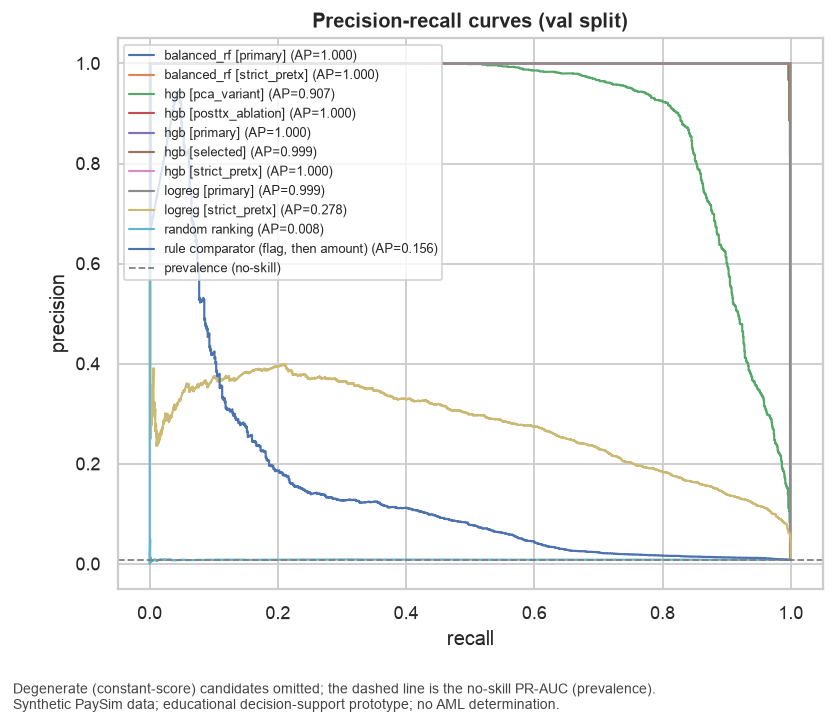
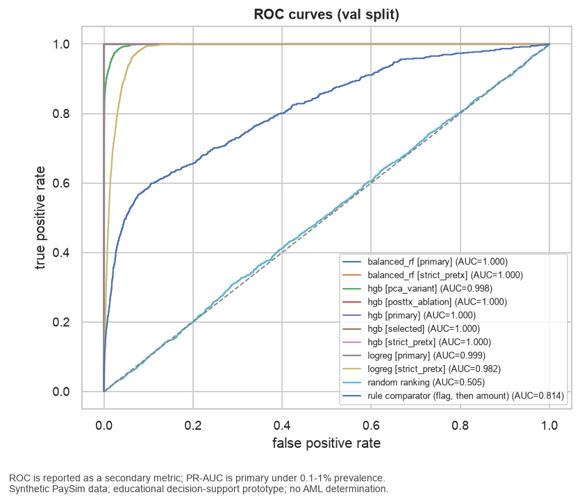
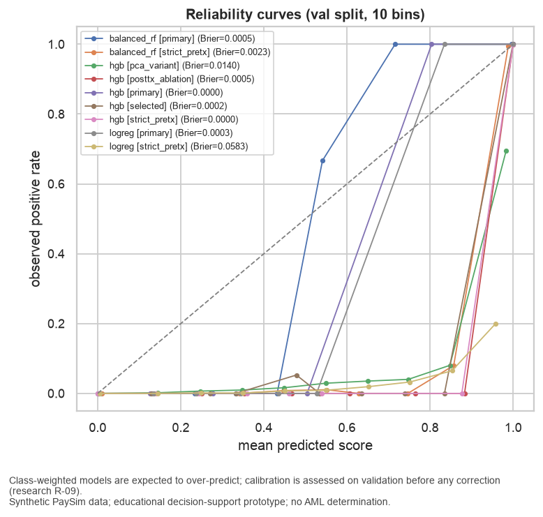
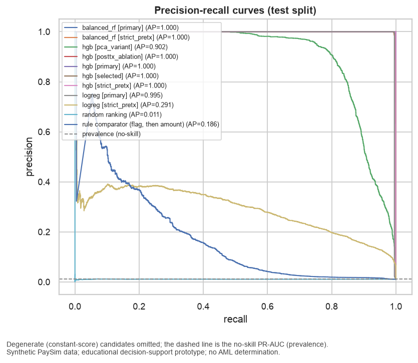
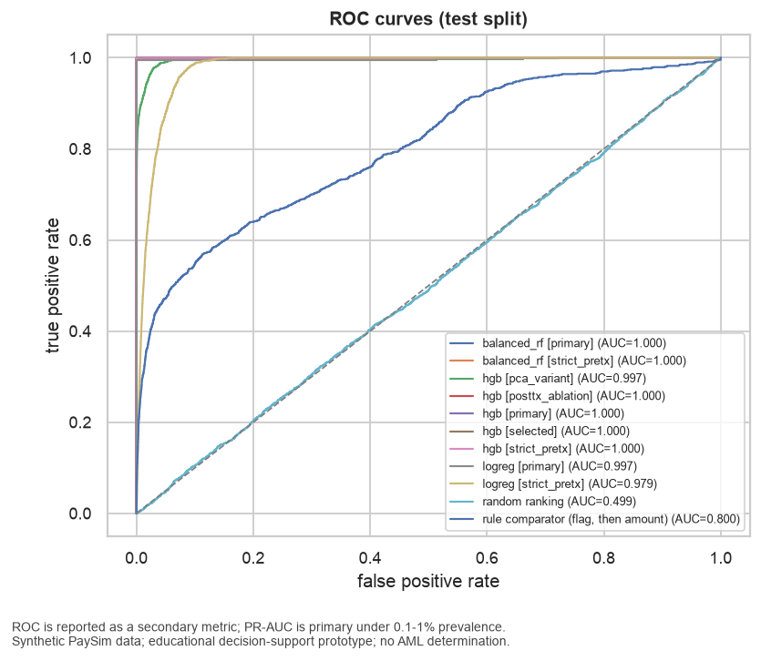
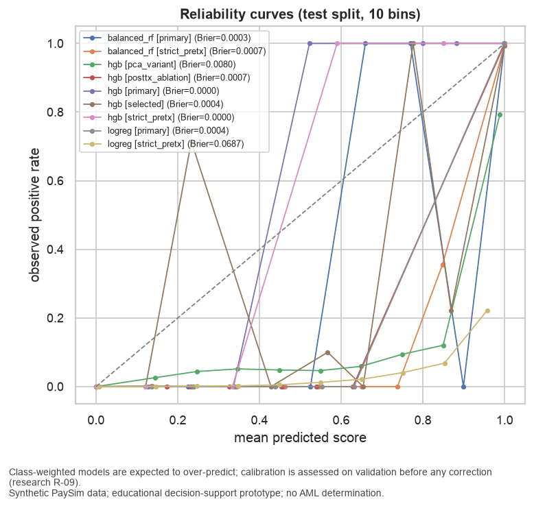

# Model Comparison

## Method

Every candidate is trained on the training split of its feature set and scored on the split named in each section; comparators need no training. Review period = 24 steps; primary K = 200; k_grid = [50, 100, 200, 300, 500]. Threshold metrics use 0.5 until the operating point is chosen on validation (Milestone 6). Accuracy appears last, next to the majority-class baseline, and is never a selection criterion (FR-007). PR-AUC is primary; the no-skill PR-AUC equals prevalence.

## Validation: headline metrics

| candidate [feature set] | PR-AUC | ROC-AUC | Recall@200 (mean/period) | Recall@200 (pooled) | Precision@200 (mean/period) | Brier | ECE | degenerate |
|---|---|---|---|---|---|---|---|---|
| balanced_rf [primary] | 1.0000 | 1.0000 | 0.8029 | 0.7979 | 1.0000 | 0.0004 | 0.0046 |  |
| hgb [posttx_ablation] | 1.0000 | 1.0000 | 0.8029 | 0.7979 | 1.0000 | 0.0007 | 0.0024 |  |
| hgb [primary] | 1.0000 | 1.0000 | 0.8029 | 0.7979 | 1.0000 | 0.0000 | 0.0000 |  |
| hgb [strict_pretx] | 1.0000 | 1.0000 | 0.8029 | 0.7979 | 1.0000 | 0.0000 | 0.0000 |  |
| balanced_rf [strict_pretx] | 1.0000 | 1.0000 | 0.8029 | 0.7979 | 1.0000 | 0.0008 | 0.0048 |  |
| hgb [selected] | 0.9990 | 0.9994 | 0.8029 | 0.7979 | 1.0000 | 0.0003 | 0.0006 |  |
| logreg [primary] | 0.9987 | 0.9992 | 0.8029 | 0.7979 | 1.0000 | 0.0003 | 0.0065 |  |
| hgb [pca_variant] | 0.9069 | 0.9972 | 0.7526 | 0.7500 | 0.9400 | 0.0070 | 0.0113 |  |
| logreg [strict_pretx] | 0.2776 | 0.9824 | 0.3117 | 0.3145 | 0.3942 | 0.0589 | 0.0893 |  |
| rule comparator (flag, then amount) | 0.1555 | 0.8142 | 0.1965 | 0.1995 | 0.2500 | 0.0077 | 0.0024 |  |
| random ranking | 0.0084 | 0.5050 | 0.0104 | 0.0106 | 0.0133 | 0.3335 | 0.4919 |  |
| dummy (chronological order) [primary] | 0.0083 | 0.5000 | 0.0650 | 0.0665 | 0.0833 | 0.0083 | 0.0075 | yes |
| dummy [strict_pretx] | 0.0083 | 0.5000 | 0.0650 | 0.0665 | 0.0833 | 0.0083 | 0.0075 | yes |

## Validation: Recall@K across the capacity grid (mean over review periods)

| candidate [feature set] | Recall@50 | Recall@100 | Recall@200 | Recall@300 | Recall@500 |
|---|---|---|---|---|---|
| balanced_rf [primary] | 0.2007 | 0.4015 | 0.8029 | 1.0000 | 1.0000 |
| hgb [posttx_ablation] | 0.2007 | 0.4015 | 0.8029 | 1.0000 | 1.0000 |
| hgb [primary] | 0.2007 | 0.4015 | 0.8029 | 1.0000 | 1.0000 |
| hgb [strict_pretx] | 0.2007 | 0.4015 | 0.8029 | 1.0000 | 1.0000 |
| balanced_rf [strict_pretx] | 0.2007 | 0.4015 | 0.8029 | 1.0000 | 1.0000 |
| hgb [selected] | 0.2007 | 0.4015 | 0.8029 | 0.9987 | 0.9993 |
| logreg [primary] | 0.2007 | 0.4015 | 0.8029 | 0.9988 | 0.9988 |
| hgb [pca_variant] | 0.2007 | 0.4007 | 0.7526 | 0.8720 | 0.9300 |
| logreg [strict_pretx] | 0.0719 | 0.1617 | 0.3117 | 0.4220 | 0.5787 |
| rule comparator (flag, then amount) | 0.0927 | 0.1352 | 0.1965 | 0.2351 | 0.3102 |
| random ranking | 0.0013 | 0.0026 | 0.0104 | 0.0130 | 0.0220 |
| dummy (chronological order) [primary] | 0.0457 | 0.0528 | 0.0650 | 0.0925 | 0.1513 |
| dummy [strict_pretx] | 0.0457 | 0.0528 | 0.0650 | 0.0925 | 0.1513 |

## Validation: Precision@K across the capacity grid (mean over review periods)

| candidate [feature set] | Precision@50 | Precision@100 | Precision@200 | Precision@300 | Precision@500 |
|---|---|---|---|---|---|
| balanced_rf [primary] | 1.0000 | 1.0000 | 1.0000 | 0.8356 | 0.5013 |
| hgb [posttx_ablation] | 1.0000 | 1.0000 | 1.0000 | 0.8356 | 0.5013 |
| hgb [primary] | 1.0000 | 1.0000 | 1.0000 | 0.8356 | 0.5013 |
| hgb [strict_pretx] | 1.0000 | 1.0000 | 1.0000 | 0.8356 | 0.5013 |
| balanced_rf [strict_pretx] | 1.0000 | 1.0000 | 1.0000 | 0.8356 | 0.5013 |
| hgb [selected] | 1.0000 | 1.0000 | 1.0000 | 0.8344 | 0.5010 |
| logreg [primary] | 1.0000 | 1.0000 | 1.0000 | 0.8344 | 0.5007 |
| hgb [pca_variant] | 1.0000 | 0.9983 | 0.9400 | 0.7289 | 0.4670 |
| logreg [strict_pretx] | 0.3667 | 0.4100 | 0.3942 | 0.3556 | 0.2923 |
| rule comparator (flag, then amount) | 0.4733 | 0.3433 | 0.2500 | 0.1989 | 0.1567 |
| random ranking | 0.0067 | 0.0067 | 0.0133 | 0.0111 | 0.0113 |
| dummy (chronological order) [primary] | 0.2333 | 0.1350 | 0.0833 | 0.0789 | 0.0770 |
| dummy [strict_pretx] | 0.2333 | 0.1350 | 0.0833 | 0.0789 | 0.0770 |

## Validation: threshold metrics at 0.5

| candidate [feature set] | threshold | precision | recall | F1 | FPR | TP | FP | FN | TN |
|---|---|---|---|---|---|---|---|---|---|
| balanced_rf [primary] | 0.5000 | 0.9967 | 1.0000 | 0.9983 | 0.0000 | 1,504 | 5 | 0 | 179,559 |
| hgb [posttx_ablation] | 0.5000 | 0.9477 | 1.0000 | 0.9731 | 0.0005 | 1,504 | 83 | 0 | 179,481 |
| hgb [primary] | 0.5000 | 1.0000 | 1.0000 | 1.0000 | 0.0000 | 1,504 | 0 | 0 | 179,564 |
| hgb [strict_pretx] | 0.5000 | 1.0000 | 0.9993 | 0.9997 | 0.0000 | 1,503 | 0 | 1 | 179,564 |
| balanced_rf [strict_pretx] | 0.5000 | 0.9284 | 1.0000 | 0.9629 | 0.0006 | 1,504 | 116 | 0 | 179,448 |
| hgb [selected] | 0.5000 | 0.9671 | 0.9973 | 0.9820 | 0.0003 | 1,500 | 51 | 4 | 179,513 |
| logreg [primary] | 0.5000 | 0.9967 | 0.9987 | 0.9977 | 0.0000 | 1,502 | 5 | 2 | 179,559 |
| hgb [pca_variant] | 0.5000 | 0.4764 | 0.9242 | 0.6287 | 0.0085 | 1,390 | 1,528 | 114 | 178,036 |
| logreg [strict_pretx] | 0.5000 | 0.0906 | 0.9820 | 0.1658 | 0.0826 | 1,477 | 14,834 | 27 | 164,730 |
| rule comparator (flag, then amount) | 0.5000 | 1.0000 | 0.0013 | 0.0027 | 0.0000 | 2 | 0 | 1,502 | 179,564 |
| random ranking | 0.5000 | 0.0084 | 0.5073 | 0.0166 | 0.5006 | 763 | 89,883 | 741 | 89,681 |
| dummy (chronological order) [primary] | 0.5000 | 0.0000 | 0.0000 | 0.0000 | 0.0000 | 0 | 0 | 1,504 | 179,564 |
| dummy [strict_pretx] | 0.5000 | 0.0000 | 0.0000 | 0.0000 | 0.0000 | 0 | 0 | 1,504 | 179,564 |

## Validation: accuracy (reported last, with prevalence)

| candidate [feature set] | accuracy | prevalence | majority-class accuracy (1 - prevalence) |
|---|---|---|---|
| balanced_rf [primary] | 1.0000 | 0.0083 | 0.9917 |
| hgb [posttx_ablation] | 0.9995 | 0.0083 | 0.9917 |
| hgb [primary] | 1.0000 | 0.0083 | 0.9917 |
| hgb [strict_pretx] | 1.0000 | 0.0083 | 0.9917 |
| balanced_rf [strict_pretx] | 0.9994 | 0.0083 | 0.9917 |
| hgb [selected] | 0.9997 | 0.0083 | 0.9917 |
| logreg [primary] | 1.0000 | 0.0083 | 0.9917 |
| hgb [pca_variant] | 0.9909 | 0.0083 | 0.9917 |
| logreg [strict_pretx] | 0.9179 | 0.0083 | 0.9917 |
| rule comparator (flag, then amount) | 0.9917 | 0.0083 | 0.9917 |
| random ranking | 0.4995 | 0.0083 | 0.9917 |
| dummy (chronological order) [primary] | 0.9917 | 0.0083 | 0.9917 |
| dummy [strict_pretx] | 0.9917 | 0.0083 | 0.9917 |

## Validation: curves

## Test (single-touch evaluation): headline metrics

| candidate [feature set] | PR-AUC | ROC-AUC | Recall@200 (mean/period) | Recall@200 (pooled) | Precision@200 (mean/period) | Brier | ECE | degenerate |
|---|---|---|---|---|---|---|---|---|
| hgb [primary] | 1.0000 | 1.0000 | 0.7568 | 0.7547 | 1.0000 | 0.0000 | 0.0000 |  |
| hgb [posttx_ablation] | 1.0000 | 1.0000 | 0.7568 | 0.7547 | 1.0000 | 0.0007 | 0.0023 |  |
| balanced_rf [strict_pretx] | 0.9997 | 1.0000 | 0.7568 | 0.7547 | 1.0000 | 0.0007 | 0.0043 |  |
| balanced_rf [primary] | 0.9997 | 1.0000 | 0.7568 | 0.7547 | 1.0000 | 0.0003 | 0.0038 |  |
| hgb [selected] | 0.9996 | 1.0000 | 0.7568 | 0.7547 | 1.0000 | 0.0004 | 0.0007 |  |
| hgb [strict_pretx] | 0.9995 | 0.9995 | 0.7568 | 0.7547 | 1.0000 | 0.0000 | 0.0000 |  |
| logreg [primary] | 0.9954 | 0.9971 | 0.7568 | 0.7547 | 1.0000 | 0.0004 | 0.0070 |  |
| hgb [pca_variant] | 0.9025 | 0.9971 | 0.7313 | 0.7302 | 0.9675 | 0.0080 | 0.0127 |  |
| logreg [strict_pretx] | 0.2908 | 0.9788 | 0.3539 | 0.3575 | 0.4738 | 0.0687 | 0.1022 |  |
| rule comparator (flag, then amount) | 0.1856 | 0.7998 | 0.3101 | 0.3142 | 0.4163 | 0.0101 | 0.0054 |  |
| random ranking | 0.0109 | 0.4990 | 0.1012 | 0.1038 | 0.1375 | 0.3334 | 0.4891 |  |
| dummy (chronological order) [primary] | 0.0109 | 0.5000 | 0.2076 | 0.2132 | 0.2825 | 0.0109 | 0.0102 | yes |
| dummy [strict_pretx] | 0.0109 | 0.5000 | 0.2076 | 0.2132 | 0.2825 | 0.0109 | 0.0102 | yes |

## Test (single-touch evaluation): Recall@K across the capacity grid (mean over review periods)

| candidate [feature set] | Recall@50 | Recall@100 | Recall@200 | Recall@300 | Recall@500 |
|---|---|---|---|---|---|
| hgb [primary] | 0.1892 | 0.3784 | 0.7568 | 1.0000 | 1.0000 |
| hgb [posttx_ablation] | 0.1892 | 0.3784 | 0.7568 | 1.0000 | 1.0000 |
| balanced_rf [strict_pretx] | 0.1892 | 0.3784 | 0.7568 | 0.9996 | 1.0000 |
| balanced_rf [primary] | 0.1892 | 0.3784 | 0.7568 | 0.9990 | 0.9995 |
| hgb [selected] | 0.1892 | 0.3784 | 0.7568 | 0.9995 | 1.0000 |
| hgb [strict_pretx] | 0.1892 | 0.3784 | 0.7568 | 0.9995 | 0.9995 |
| logreg [primary] | 0.1892 | 0.3784 | 0.7568 | 0.9967 | 0.9967 |
| hgb [pca_variant] | 0.1892 | 0.3784 | 0.7313 | 0.8815 | 0.9384 |
| logreg [strict_pretx] | 0.0876 | 0.1781 | 0.3539 | 0.4835 | 0.6324 |
| rule comparator (flag, then amount) | 0.1119 | 0.1993 | 0.3101 | 0.3869 | 0.4451 |
| random ranking | 0.0258 | 0.0507 | 0.1012 | 0.1385 | 0.1476 |
| dummy (chronological order) [primary] | 0.0701 | 0.1099 | 0.2076 | 0.3188 | 0.3600 |
| dummy [strict_pretx] | 0.0701 | 0.1099 | 0.2076 | 0.3188 | 0.3600 |

## Test (single-touch evaluation): Precision@K across the capacity grid (mean over review periods)

| candidate [feature set] | Precision@50 | Precision@100 | Precision@200 | Precision@300 | Precision@500 |
|---|---|---|---|---|---|
| hgb [primary] | 1.0000 | 1.0000 | 1.0000 | 0.8950 | 0.5870 |
| hgb [posttx_ablation] | 1.0000 | 1.0000 | 1.0000 | 0.8950 | 0.5870 |
| balanced_rf [strict_pretx] | 1.0000 | 1.0000 | 1.0000 | 0.8946 | 0.5870 |
| balanced_rf [primary] | 1.0000 | 1.0000 | 1.0000 | 0.8942 | 0.5868 |
| hgb [selected] | 1.0000 | 1.0000 | 1.0000 | 0.8946 | 0.5870 |
| hgb [strict_pretx] | 1.0000 | 1.0000 | 1.0000 | 0.8946 | 0.5867 |
| logreg [primary] | 1.0000 | 1.0000 | 1.0000 | 0.8921 | 0.5853 |
| hgb [pca_variant] | 1.0000 | 1.0000 | 0.9675 | 0.7904 | 0.5547 |
| logreg [strict_pretx] | 0.4700 | 0.4775 | 0.4738 | 0.4425 | 0.3942 |
| rule comparator (flag, then amount) | 0.6000 | 0.5350 | 0.4163 | 0.3575 | 0.2953 |
| random ranking | 0.1400 | 0.1375 | 0.1375 | 0.1371 | 0.1373 |
| dummy (chronological order) [primary] | 0.3850 | 0.3000 | 0.2825 | 0.3004 | 0.2512 |
| dummy [strict_pretx] | 0.3850 | 0.3000 | 0.2825 | 0.3004 | 0.2512 |

## Test (single-touch evaluation): threshold metrics at 0.5

| candidate [feature set] | threshold | precision | recall | F1 | FPR | TP | FP | FN | TN |
|---|---|---|---|---|---|---|---|---|---|
| hgb [primary] | 0.5000 | 1.0000 | 1.0000 | 1.0000 | 0.0000 | 2,120 | 0 | 0 | 192,015 |
| hgb [posttx_ablation] | 0.5000 | 0.9532 | 1.0000 | 0.9761 | 0.0005 | 2,120 | 104 | 0 | 191,911 |
| balanced_rf [strict_pretx] | 0.5000 | 0.9405 | 0.9995 | 0.9691 | 0.0007 | 2,119 | 134 | 1 | 191,881 |
| balanced_rf [primary] | 0.5000 | 0.9972 | 0.9991 | 0.9981 | 0.0000 | 2,118 | 6 | 2 | 192,009 |
| hgb [selected] | 0.5000 | 0.9751 | 0.9972 | 0.9860 | 0.0003 | 2,114 | 54 | 6 | 191,961 |
| hgb [strict_pretx] | 0.5000 | 1.0000 | 0.9991 | 0.9995 | 0.0000 | 2,118 | 0 | 2 | 192,015 |
| logreg [primary] | 0.5000 | 0.9943 | 0.9953 | 0.9948 | 0.0001 | 2,110 | 12 | 10 | 192,003 |
| hgb [pca_variant] | 0.5000 | 0.4994 | 0.9075 | 0.6442 | 0.0100 | 1,924 | 1,929 | 196 | 190,086 |
| logreg [strict_pretx] | 0.5000 | 0.1012 | 0.9844 | 0.1836 | 0.0965 | 2,087 | 18,529 | 33 | 173,486 |
| rule comparator (flag, then amount) | 0.5000 | 1.0000 | 0.0047 | 0.0094 | 0.0000 | 10 | 0 | 2,110 | 192,015 |
| random ranking | 0.5000 | 0.0107 | 0.4906 | 0.0210 | 0.5002 | 1,040 | 96,037 | 1,080 | 95,978 |
| dummy (chronological order) [primary] | 0.5000 | 0.0000 | 0.0000 | 0.0000 | 0.0000 | 0 | 0 | 2,120 | 192,015 |
| dummy [strict_pretx] | 0.5000 | 0.0000 | 0.0000 | 0.0000 | 0.0000 | 0 | 0 | 2,120 | 192,015 |

## Test (single-touch evaluation): accuracy (reported last, with prevalence)

| candidate [feature set] | accuracy | prevalence | majority-class accuracy (1 - prevalence) |
|---|---|---|---|
| hgb [primary] | 1.0000 | 0.0109 | 0.9891 |
| hgb [posttx_ablation] | 0.9995 | 0.0109 | 0.9891 |
| balanced_rf [strict_pretx] | 0.9993 | 0.0109 | 0.9891 |
| balanced_rf [primary] | 1.0000 | 0.0109 | 0.9891 |
| hgb [selected] | 0.9997 | 0.0109 | 0.9891 |
| hgb [strict_pretx] | 1.0000 | 0.0109 | 0.9891 |
| logreg [primary] | 0.9999 | 0.0109 | 0.9891 |
| hgb [pca_variant] | 0.9891 | 0.0109 | 0.9891 |
| logreg [strict_pretx] | 0.9044 | 0.0109 | 0.9891 |
| rule comparator (flag, then amount) | 0.9891 | 0.0109 | 0.9891 |
| random ranking | 0.4997 | 0.0109 | 0.9891 |
| dummy (chronological order) [primary] | 0.9891 | 0.0109 | 0.9891 |
| dummy [strict_pretx] | 0.9891 | 0.0109 | 0.9891 |

## Test (single-touch evaluation): curves

## Validation discussion (task T050, written 2026-09-05 after reviewing the tables and curves above)

All numbers below are validation-split figures (steps 409–552, 181,068 rows, 1,504 positives, six
review periods). No test-split number appears here; the test split stays locked until the operating
point is frozen (Milestone 6).

### 1. The simulator is almost perfectly separable, and that is the main finding

Every tree model on every non-PCA feature set reaches PR-AUC 1.0000 and ROC-AUC 1.0000:
`hgb` on `primary`, `strict_pretx`, `selected` and `posttx_ablation`, and `balanced_rf` on `primary`
(`balanced_rf` on `strict_pretx` is 0.9997). At the default 0.5 threshold, `hgb [primary]` makes one
false positive and zero false negatives across 181,068 validation rows. Logistic regression on the
`primary` set is close behind at 0.9987.

This is not evidence of AML capability. PaySim generates its positives from a small set of agent
rules (an account is drained by TRANSFER and CASH_OUT), so a handful of engineered features
reproduce the generator's own rule almost exactly: `amount_to_orig_balance_ratio` near 1,
`orig_zero_after_flag`, and the balance-arithmetic flags (eda_08, eda_09). Any model that can express
"ratio ≈ 1 and type ∈ {TRANSFER, CASH_OUT}" recovers the label. The comparison therefore says a lot
about the dataset and little about which learner would be best on real transactions.

### 2. The artifact ablation (research R-06) reads differently for trees and for the linear model

- For tree models the expected gap between `primary` and `strict_pretx` does **not** appear: `hgb`
  scores 1.0000 on both. The post-transaction artifact features are sufficient on their own
  (`posttx_ablation`, which contains only type plus the five batch-only features, also reaches
  1.0000) but they are not necessary: the pre-transaction interaction between type and the
  amount-to-balance ratio carries the same information for a non-linear learner.
- For logistic regression the gap is large: 0.9987 on `primary` versus 0.2599 on `strict_pretx`,
  with its `strict_pretx` PR curve peaking near 0.36 precision. A linear model cannot express the
  type-by-ratio interaction additively, so it needs the post-transaction flags to do the work.
- `hgb [pca_variant]` reaches 0.8998: rotating the numeric block into nine components mixes the
  ratio with unrelated variance and costs about 0.10 of PR-AUC and 0.07 of Recall@200. Components
  do not enter any further candidate (see `reports/pca_report.md`).

### 3. Recall@K is bounded by K on validation, not by the models

Validation periods hold between 216 and 272 positives, all above K = 200. The best possible mean
Recall@200 is therefore the mean of 200 / positives over the six periods, which is 0.8029; every
strong model hits exactly that ceiling with Precision@200 = 1.0000, meaning all 200 reviewed
transactions in every period are positives. The per-period recall for `hgb [primary]` ranges from
0.735 (272 positives) to 0.926 (216 positives) purely because of the positive count. At K = 300 and
K = 500 the strong models reach 1.0000 because K exceeds the positives; at K = 50 and K = 100 they
all sit at K / positives (0.2007 and 0.4015). Recall@K cannot separate the strong candidates on this
split; it does show that K = 200 binds, which is the intended operational reading.

### 4. Comparators

The rule comparator (flag, then amount) reaches PR-AUC 0.1555 and Recall@200 of 0.1965: amount
alone puts about one positive in five into the daily top 200, and its threshold row shows only two
flagged rows in the whole validation split (precision 1.0, recall 0.0013). Random ranking gives
PR-AUC 0.0084, equal to prevalence (0.0083), and Recall@200 of 0.0104. The dummy candidate's
constant scores rank as chronological order and give Recall@200 of 0.0650. Every learner except
`logreg [strict_pretx]` beats all three comparators by a wide margin; `logreg [strict_pretx]` still
beats them (0.2945 versus 0.1965 at K = 200).

### 5. Calibration

The reliability curves lie below the diagonal in the middle of the score range for every model:
class weighting inflates mid-range scores, as expected. Because the strong models push almost every
row to a score near 0 or 1, their Brier scores are tiny (`hgb [primary]` 0.0000, `logreg [primary]`
0.0003, `balanced_rf [primary]` 0.0005) and ECE is below 0.01 for all of them. `balanced_rf [primary]`
is the least calibrated of the strong models (ECE 0.0090; its 0.55–0.70 bins show observed rates of
0.66–1.00). Whether isotonic calibration fitted on validation helps is decided in Milestone 6 under
the configured tolerance (research R-09); ranking metrics are unaffected by a monotone map.

### 6. What this means for selection (Milestone 6)

PR-AUC and Recall@K cannot discriminate between `hgb` (any set), `balanced_rf [primary]` and
`logreg [primary]` on validation. The selection matrix must therefore lean on the other columns the
spec requires: calibration quality, explainability, inference and maintenance cost (fit times 31 s,
72 s and 18 s respectively on 5.99 million rows), feature-set honesty (`hgb [strict_pretx]` is
prediction-time safe and equally strong), and behaviour under the validation-to-test regime shift,
which only the single-touch test evaluation can show. The headline feature set remains `primary`
by project decision; the report will show `strict_pretx` beside it.

### 7. Caveats

- Six review periods is a small sample; per-period recall varies with the positive count alone.
- Perfect validation separability is a property of PaySim's generator and will not transfer to real
  banking data. Nothing here establishes real-world detection effectiveness.
- Threshold metrics use 0.5 pending the validation-chosen operating point.

## Test discussion (task T059, single-touch evaluation, written 2026-09-05 after the tables above)

The test split (steps 553–743, 194,135 rows, 2,120 positives, prevalence 1.09%) was scored exactly
once after the operating point was frozen; `data/processed/test_access.json` records the state and
would record any re-evaluation with a reason. Every run was refitted on the full training split with
its tuned parameters before scoring.

**Validation-to-test shift.** Prevalence rises from 0.83% to 1.09% and daily volume stays in the
low-volume regime. Rankings are stable: `hgb [primary]` and `hgb [posttx_ablation]` keep PR-AUC
1.0000 (95% CI [1.0000, 1.0000]); `balanced_rf` on both sets holds at 0.9997; `hgb [strict_pretx]`
moves from 1.0000 to 0.9995 [0.9986, 1.0000]; `hgb [selected]` from 0.9990 to 0.9996;
`logreg [primary]` from 0.9987 to 0.9954 [0.9922, 0.9977]. The linear model on the strict set
improves slightly (0.2776 → 0.2908) and the rule comparator improves from 0.1555 to 0.1856, both
because higher prevalence makes precision easier. No candidate degrades materially, so the regime
shift the split was designed to expose does not hurt tree models on this data.

**Recall@200 is again a K ceiling.** All strong models score 0.7568 (mean) / 0.7547 (pooled) with
Precision@200 = 1.0000, because every test period holds 240–280 positives. The dummy (chronological)
comparator rises to 0.2076 and random to 0.1012 only because day 31 contains 272 rows, all positives,
where any order scores 0.735. See `capacity_analysis.md`.

**Calibration on test.** The reliability curves keep the class-weighting signature (observed rate
below the diagonal in the middle bins), but the strong models place nearly all rows at scores near 0
or 1, so Brier stays tiny: `hgb [primary]` 0.0000 (3 × 10⁻⁶), `hgb [strict_pretx]` 0.0000,
`balanced_rf [primary]` 0.0003, `logreg [primary]` 0.0004. The validation-fitted isotonic
calibrator, used only for the displayed probability, gives Brier 2.8 × 10⁻⁶ and ECE 6 × 10⁻⁶ on test.

**Selected model at its operating point.** `hgb [primary]` at the frozen raw-score threshold 0.9719:
2,115 true positives, 5 false negatives, 0 false positives across 192,015 normals (recall 0.9976,
precision 1.0000). At the default 0.5 threshold it makes 0 errors of either kind on 194,135 rows.

**Caveats carried forward.** Eight review periods; one of them (day 31) is a partial day with 272
transactions. Perfect separation is a property of PaySim, not a transferable result. Bootstrap CIs
resample rows and therefore understate uncertainty about future periods.

---

_Educational decision-support prototype trained on synthetic PaySim data. Outputs are risk scores and review priorities that help human investigators decide what to review first. This system makes no fraud or AML determination and performs no automatic blocking, account closure, customer risk rating, or regulatory reporting. Results on synthetic data do not establish real-world detection effectiveness, fairness, or regulatory suitability._
