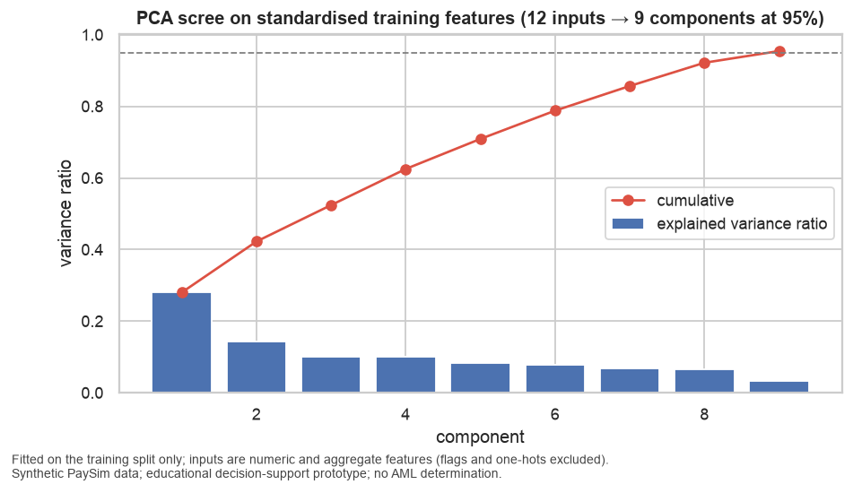
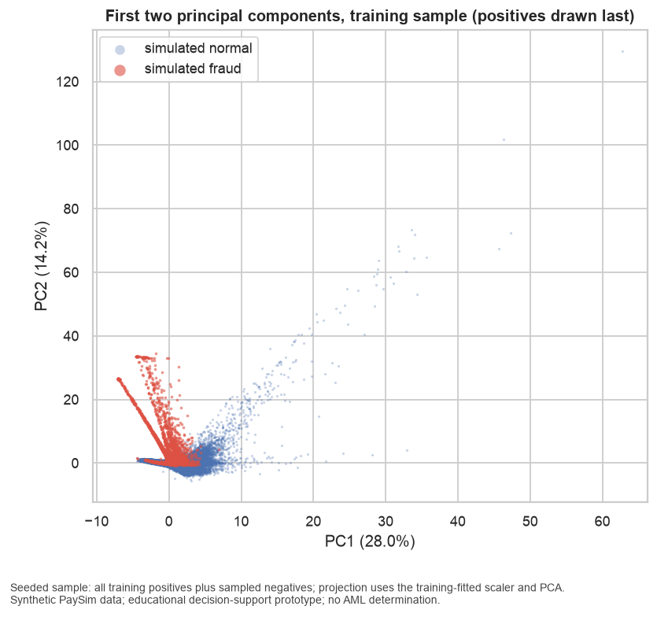

# PCA Report

## Role

Configured role: **diagnostic_and_visualization**. Components are a diagnostic of feature redundancy and a visualisation aid. They do not enter the primary model candidates. A `pca_variant` matrix (9 components plus type one-hot) is written for one documented experiment in Milestone 5.

## Inputs

12 standardised numeric/aggregate training features: `amount_bucket`, `log_amount`, `log_oldbalance_org`, `log_oldbalance_dest`, `amount_to_orig_balance_ratio`, `step_hour_of_day`, `orig_balance_delta`, `dest_balance_delta`, `orig_prior_txn_count`, `orig_prior_amount_sum`, `dest_prior_txn_count`, `dest_prior_amount_sum`

Fit scope: ['train'] (scaler and PCA fitted on training rows only).

## Explained variance (9 components reach the 0.95 target)

| component | variance ratio | cumulative |
|---|---|---|
| PC1 | 0.2803 | 0.2803 |
| PC2 | 0.1423 | 0.4226 |
| PC3 | 0.1017 | 0.5243 |
| PC4 | 0.1009 | 0.6253 |
| PC5 | 0.0839 | 0.7092 |
| PC6 | 0.0789 | 0.7881 |
| PC7 | 0.0689 | 0.8570 |
| PC8 | 0.0650 | 0.9220 |
| PC9 | 0.0327 | 0.9546 |

## Top loadings per component

| component | largest absolute loadings |
|---|---|
| PC1 | log_amount (+0.46), amount_bucket (+0.45), log_oldbalance_dest (+0.44), dest_prior_txn_count (+0.40) |
| PC2 | dest_balance_delta (+0.59), amount_to_orig_balance_ratio (+0.57), orig_balance_delta (+0.36), log_oldbalance_org (-0.34) |
| PC3 | orig_prior_txn_count (+0.69), orig_prior_amount_sum (+0.69), dest_prior_amount_sum (+0.10), dest_prior_txn_count (+0.09) |
| PC4 | dest_prior_amount_sum (+0.53), dest_prior_txn_count (+0.48), log_amount (-0.38), amount_bucket (-0.37) |
| PC5 | step_hour_of_day (+0.66), log_oldbalance_org (+0.49), orig_balance_delta (-0.43), amount_to_orig_balance_ratio (+0.27) |
| PC6 | step_hour_of_day (+0.69), log_oldbalance_org (-0.40), orig_balance_delta (+0.33), dest_prior_amount_sum (-0.25) |
| PC7 | orig_balance_delta (+0.72), log_oldbalance_org (+0.65), amount_to_orig_balance_ratio (-0.16), dest_balance_delta (+0.12) |
| PC8 | orig_prior_txn_count (+0.71), orig_prior_amount_sum (-0.71), log_oldbalance_org (-0.00), step_hour_of_day (-0.00) |
| PC9 | log_oldbalance_dest (+0.80), dest_prior_amount_sum (-0.44), amount_bucket (-0.27), log_amount (-0.26) |

## Figures

## Interpretation (task T041, written 2026-09-05 after reviewing the tables and figures above)

Nine components are needed to reach 95% of the variance of the 12 standardised numeric and
aggregate features, and the first two explain only 28.0% and 14.2%. Variance is spread evenly, so
the numeric block is not highly redundant apart from three known pairs: `log_amount`/`amount_bucket`
(both load +0.45 on PC1), the two destination aggregates (PC4), and the two origin aggregates, which
form components PC3 and PC8 on their own. Those origin aggregates are near-constant in raw units;
standardisation inflates them to unit variance, which is why they earn two components while
carrying no information (eda_07). This is a diagnostic confirmation that they belong out of the
model.

In the projection (`pca_02_projection.png`) positives concentrate along a narrow ray with negative
PC1 and PC2 rising to about 30. PC2 loads on `dest_balance_delta` (+0.59), `amount_to_orig_balance_ratio`
(+0.57) and `orig_balance_delta` (+0.36) against `log_oldbalance_org` (−0.34): it is the
"amount moves the whole origin balance to the destination" direction seen in `eda_09`. Normals spread
along positive PC1 (large amounts, funded destinations with prior activity). The classes overlap near
the origin, so two components separate only the extreme positives.

## Do components enter any model?

No. The configured role is diagnostic and visualisation. The primary candidates use raw engineered
features because:

- the artifact ablation (research R-06) needs artifact-driven and behavioural features kept separate,
  and every component mixes both (PC2 blends the balance deltas with the ratio);
- SHAP and PDP explanations on raw features are readable by investigators; explanations on
  components are not;
- tree ensembles gain nothing from an orthogonal rotation of inputs.

A `pca_variant` matrix (9 components plus the type one-hot; fit scope `['train']`) is written so
Milestone 5 can run one documented experiment and report whether the rotation costs or gains
anything. No performance claim is made here.

---

_Educational decision-support prototype trained on synthetic PaySim data. Outputs are risk scores and review priorities that help human investigators decide what to review first. This system makes no fraud or AML determination and performs no automatic blocking, account closure, customer risk rating, or regulatory reporting. Results on synthetic data do not establish real-world detection effectiveness, fairness, or regulatory suitability._
